# til
> Today I Learned
- Collect & record my daily learning. 
- Tech + product + business. 

---

# PROGRESS

## 20250731
- EKS - Fluentbit - Opensearch (logging)
  - https://github.com/RekhuGopal/PythonHacks/tree/main/Kubernetes_logging_with_OpenSearch_FluentBit
  - https://youtu.be/3sMGLmSzCjc?si=Pp9_awM2PBAPr3a2

## 20250729
- AWS - create `https` ingress for EKS (with domain name, Route 53, CNAME)
  - https://youtu.be/5XpPiORNy1o?si=2SU23xR48yoELaG3&t=852
- AWS `cert manager` & `TLS` for EKS
  - https://youtu.be/xwiRjimKW9c?si=IB0wcAfhlzS6-YOZ&t=226

## 20250725
- Online `CIDR` calculator
  - https://mxtoolbox.com/subnetcalculator.aspx
  - https://youtu.be/aRXg75S5DWA?si=YZr6gYU3R3g9FvBE&t=366

## 20250721
- K8S monitor tool:
  - https://k8slens.dev/

## 20250710
- k8s yaml syntax/term explanation
  - https://youtu.be/X48VuDVv0do?si=IqCjtU9raPxYscN9&t=4077

## 20250709

# Docker 中的掛載（Mount）教學 ?

當我們說「掛載（**mount**）」在 Docker 中，指的是將**主機（host）的檔案系統資料夾**掛載進 **容器（container）**中，讓容器可以讀取或寫入這些資料，就像這些檔案是容器的一部分。

---

## 📦 Docker 掛載（Volume / Bind Mount）有什麼用？

- 保留資料（即使容器被刪除也不會消失）✅  
- 與容器外部交換資料（如：程式碼、設定檔、日誌）📁  
- 減少映像大小（不需要將資料寫死在 image）⬇️

---

## 🧱 兩種常見掛載方式

### 1. 🔗 Bind Mount（綁定掛載）

> 把主機上的目錄或檔案**直接映射**到容器內路徑。

```bash
docker run -v /host/path:/container/path my-image
```

📌 例如：

```bash
docker run -v $(pwd)/logs:/app/logs my-image
```

- `/app/logs` 在容器中實際存取的是主機的 `./logs` 資料夾
- 常用於：**開發時**同步程式碼、日誌、設定檔等

---

### 2. 📦 Docker Volume（管理式 Volume）

Docker 自己管理的一塊資料區，存放於 `/var/lib/docker/volumes`

```bash
docker volume create my-vol
docker run -v my-vol:/data my-image
```

📌 特性：

- 路徑抽象化，不依賴主機目錄
- 多個容器可共用
- 適合 **生產環境**中儲存資料庫、持久資料等

---

## 📄 用法範例

### 1️⃣ 把主機的程式碼掛進容器（開發用）

```bash
docker run -it --rm \
  -v $(pwd)/my-app:/app \
  -w /app \
  python:3.10 \
  python main.py
```

### 2️⃣ 建立一個持久的 volume 來保存資料

```bash
docker volume create airflow-db
docker run -v airflow-db:/opt/airflow apache/airflow:2.9.1
```

---

## 🧠 補充：Volume 掛載語法（長格式）

也可以使用 `--mount`（比較清楚，但稍微冗長）：

```bash
docker run --mount type=bind,source=/host/data,target=/app/data my-image
```

或

```bash
docker run --mount type=volume,source=my-vol,target=/data my-image
```

---

## ✅ 小結：掛載（mount）是什麼？

| 類型         | 說明                             | 適合用途               |
|--------------|----------------------------------|------------------------|
| Bind mount   | 把主機檔案/目錄直接映射進容器     | 開發、同步程式碼         |
| Docker volume| Docker 管理的匿名或具名 volume     | 生產環境、資料持久化     |

---


## 20250704

### ✅ L1, L2, L3 Constructors in AWS CDK

In AWS CDK, constructs are organized into three levels:

---

### 🔹 L1 (Level 1) - CFN Resources
- Also called **"CloudFormation-only"** or **"CFN constructs"**
- Direct **1:1 mapping** to CloudFormation resources
- Names always start with `Cfn` (e.g., `CfnBucket`, `CfnInstance`)
- Very **low-level** and require detailed configuration
- **Example:** `aws_s3.CfnBucket`

---

### 🔸 L2 (Level 2) - AWS Constructs
- **Higher-level abstractions** with sensible defaults
- Handle much of the **boilerplate and complexity**
- Automatically implement **AWS best practices**
- Easier and safer to use than L1 constructs
- **Example:** `aws_s3.Bucket` (instead of `CfnBucket`)

---

### 🔺 L3 (Level 3) - Patterns
- The **highest-level** abstractions in CDK
- Combine multiple L1/L2 constructs into **predefined architectural patterns**
- Great for building common infrastructure setups quickly
- **Example:** `aws_ecs_patterns.ApplicationLoadBalancedFargateService`


## 20250703
- DB: Optimistic Lock
	- https://api.rubyonrails.org/v8.0.2/classes/ActiveRecord/Locking/Optimistic.html
- DB: Pessimistic Lock
   - https://api.rubyonrails.org/v8.0.2/classes/ActiveRecord/Locking/Pessimistic.html

## 20250701
- AWS DMS (data migration service)
   - https://aws.amazon.com/tw/dms/
   - https://docs.aws.amazon.com/zh_tw/dms/latest/userguide/Welcome.html
   - https://docs.aws.amazon.com/zh_tw/dms/latest/userguide/CHAP_Task.CDC.html
   - https://github.com/ksmin23/my-aws-cdk-examples/tree/main/dms
   - https://github.com/ksmin23/my-aws-cdk-examples/tree/main/dms-serverless
- CDC (Change Data Capture)
  - https://docs.databricks.com/aws/en/dlt/what-is-change-data-capture
  - https://en.wikipedia.org/wiki/Change_data_capture
  - https://learn.microsoft.com/zh-tw/sql/relational-databases/track-changes/about-change-data-capture-sql-server?view=sql-server-ver17

## 20250629
- Claude code setting
  - https://techmoon.xyz/claude-code-best-practices-guide/

## 20250617
- Install `Redis cluster` on AWS EC2, install django as testing app
  - https://imehboob.medium.com/step-by-step-guide-to-deploy-redis-cluster-in-aws-to-achieve-high-availability-part-2-93d96afdb2b4

## 20250614

- SAGA - distributed transaction
	- 分散式交易（Distributed Transaction）Saga Pattern 是一種設計模式， 用來管理跨多個微服務或資料庫的長時間交易，避免使用傳統的兩階段提交（2PC），從而提高系統的可用性與擴展性。

⸻

✅ Saga Pattern 是什麼？

Saga 是將一個分散式交易拆分成 一連串本地交易（local transaction），每個本地交易完成後，會觸發下一步。如果某一步失敗，則會觸發補償動作（compensating transaction），將前面已成功的操作「回滾」。

⸻

✅ Saga Pattern 的兩種實作方式：

方式	概念	適用情境
Choreography（編排）	每個服務自己監聽事件並觸發下一步	微服務之間耦合度低、流程簡單
Orchestration（協調）	有一個中央協調器控制整個交易流程	較複雜的交易流程，需要可視性


⸻

✅ 範例（訂單服務）

假設你在電商平台下單，這會涉及以下服務：
	1.	建立訂單（Order Service）
	2.	扣庫存（Inventory Service）
	3.	扣款（Payment Service）

正常流程：

Order Created → Inventory Reserved → Payment Successful

如果付款失敗，補償操作：

→ Payment Failed → 取消庫存保留 → 取消訂單


⸻

✅ Saga 優點：
	•	無需使用分散式鎖或兩階段提交（2PC）
	•	更好地支援微服務架構
	•	易於水平擴展
	•	有彈性的錯誤恢復方式

⸻

❗ Saga 缺點與挑戰：
	•	補償邏輯需手動實作，較複雜
	•	資料暫時可能不一致（eventual consistency）
	•	開發測試成本較高
	•	無法涵蓋所有強一致性需求

⸻

✅ 適合用 Saga 的場景：
	•	訂單處理系統
	•	金流系統的異步流程
	•	訂閱/取消訂閱服務
	•	有跨服務的業務流程但不要求強一致性

⸻

# The Saga Pattern for Distributed Transactions

The **Saga pattern** is a crucial design pattern used in distributed systems, particularly in **microservices architectures**, to maintain data consistency when a single business operation spans across multiple services and their respective databases.

---

## Why Saga?

In a microservices environment, each service manages its own data. This makes traditional ACID (Atomicity, Consistency, Isolation, Durability) transactions, which are great for single-database operations, impractical for business processes that involve multiple services. Imagine placing an order: it might touch an Order Service, Payment Service, and Inventory Service. A single "all or nothing" transaction across these independent services is often not feasible due to the complexities of distributed systems like network latency and service failures.

This is where the Saga pattern shines. Instead of one monolithic transaction, a saga breaks down a distributed transaction into a **sequence of local transactions**. Each local transaction is handled by a single service and updates only that service's database.

---

## Core Concepts

* **Sequence of Local Transactions:** A saga is a series of independent, atomic operations, each completed within a single service's scope.
* **Event-Driven Communication:** After a service successfully completes its local transaction, it publishes an event (or sends a message). This event acts as a trigger for the next step in the saga.
* **Compensating Transactions:** This is the cornerstone of the Saga pattern. If any step within the saga fails, **compensating transactions** are initiated. These are inverse operations designed to undo the changes made by any *preceding successful local transactions*, effectively rolling back the entire distributed transaction to a consistent state.

---

## Benefits of Using Saga

* **Data Consistency in Distributed Systems:** Achieves eventual consistency across multiple services without relying on complex, tightly coupled two-phase commit protocols.
* **Fault Tolerance:** If a service fails during a saga, compensating transactions ensure that the system can recover and maintain a consistent data state.
* **Scalability and Decoupling:** Services remain independent, allowing them to scale individually without being constrained by a global transaction manager.
* **Long-Running Transactions:** Sagas are well-suited for business processes that may take an extended period to complete.

---

## Types of Saga Coordination

There are two primary ways to coordinate a saga:

### 1. Choreography-based Saga

* **Decentralized:** Each service directly participates by publishing events and listening for events from other services. There's no central coordinator.
* **How it works:** Service A completes its transaction and publishes an event. Service B, listening for that event, performs its transaction and publishes another event, and so on.
* **Pros:** Simpler for less complex sagas; less prone to a single point of failure.
* **Cons:** Can become challenging to manage and debug as the number of services and steps grows; harder to get an overall view of the saga's progress.

### 2. Orchestration-based Saga

* **Centralized:** A dedicated "orchestrator" service (often implemented as a state machine) manages and directs the flow of the entire saga.
* **How it works:** The orchestrator sends commands to individual services, instructing them on what to do. Services respond with events indicating success or failure. The orchestrator then determines the next step or triggers compensating transactions if necessary.
* **Pros:** Clearer separation of concerns; easier to monitor and manage complex sagas; simplifies error handling and compensating logic.
* **Cons:** The orchestrator can become a single point of failure or a bottleneck if not designed carefully.

---

## Example Scenario: E-commerce Order

Let's illustrate with a customer placing an order:

1.  **Order Service:**
    * **Local Transaction 1:** Creates the order and saves it to its database.
    * **Event:** Publishes "Order Created."
2.  **Payment Service:**
    * Listens for "Order Created."
    * **Local Transaction 2:** Processes payment.
    * **Event:** Publishes "Payment Processed" (on success) or "Payment Failed" (on failure).
3.  **Inventory Service:**
    * Listens for "Payment Processed."
    * **Local Transaction 3:** Reserves items in inventory.
    * **Event:** Publishes "Items Reserved" (on success) or "Inventory Shortage" (on failure).
4.  **Shipping Service:**
    * Listens for "Items Reserved."
    * **Local Transaction 4:** Arranges shipping.

### What if a step fails (e.g., Payment fails)?

* The Payment Service publishes a "Payment Failed" event.
* The Order Service (or the orchestrator, if present) receives this event.
* **Compensating Transaction:** The Order Service then performs a compensating action to "cancel" or "undo" the initial order creation (e.g., marks the order as failed, or removes it).

---

## Important Considerations for Saga Implementation

* **Idempotency:** All operations within the saga, especially compensating transactions, should be **idempotent**. This means performing them multiple times should have the same effect as performing them once, which is crucial for retries and robust error handling.
* **Monitoring and Tracing:** Comprehensive monitoring and tracing are essential to track the progress of a saga and quickly diagnose any issues that arise.
* **Complexity:** While powerful, implementing sagas can introduce significant complexity compared to traditional transactions, particularly when designing compensating actions and handling diverse failure scenarios.

---


## 20250612
- Webhook
  - https://systemdesignschool.io/problems/webhook/solution
  - Stripe: https://docs.stripe.com/webhooks
  - Shopify: https://shopify.dev/docs/apps/build/webhooks
  - GitHub: https://docs.github.com/en/developers/webhooks-and-events/about-webhooks

## 20250611
- Async in python
  - https://docs.llamaindex.ai/en/stable/getting_started/async_python/

## 20250607
- golang intro
  - https://www.forevergame.org/golang/?fbclid=IwY2xjawKwy6tleHRuA2FlbQIxMQBicmlkETFyR0RRRWpYdXRBWHYzTGNWAR45zcBCCuirWRYH8WQi3GySpygpv8pdJ9CcEufQik9J9jxIzDgAZdw4_JEPoQ_aem_cI6n5YGVIrIwDhUuYou96w

- `2 phases commit` VS `TC/C`  transactions

- There are multiple approaches for handling distributed transactions, especially when multiple services or databases are involved. Two of the most discussed ones are:

⸻

✅ 1. Two-Phase Commit (2PC)

🔗 What is it?

A classic consensus protocol that ensures all participants (e.g., databases or services) agree to commit or abort a transaction.

📦 Phases:

Phase 1: Prepare
	•	The coordinator sends a PREPARE request to all participants.
	•	Each participant:
	•	Executes the transaction up to the commit point.
	•	Locks necessary resources.
	•	Responds READY (vote to commit) or NO (vote to abort).

Phase 2: Commit / Abort
	•	If all respond READY, coordinator sends COMMIT.
	•	If any respond NO, it sends ABORT.
	•	Participants act accordingly.

✅ Pros:
	•	Strong consistency across services.
	•	Easy to reason about.

❌ Cons:
	•	Blocking: If coordinator crashes after Phase 1, participants may be stuck holding locks.
	•	No built-in recovery or compensation.
	•	Slow: involves multiple network round-trips and locks.

⸻

✅ 2. Try-Confirm/Cancel (TCC)

🔁 What is it?

A business-level, application-managed protocol to simulate transactions across distributed systems using compensating actions.

📦 Phases:

Phase 1: Try
	•	Reserve resources.
	•	Do tentative operations (e.g., freeze funds, reserve stock).
	•	Must be idempotent.

Phase 2: Confirm
	•	Finalize the reserved actions (e.g., actually deduct funds, ship item).

Phase 3: Cancel
	•	Roll back the tentative actions (e.g., unfreeze funds).
	•	Must also be idempotent.

✅ Pros:
	•	Non-blocking: No locks held after try phase.
	•	More resilient to partial failures.
	•	Great for business transactions (e.g., e-commerce, payments).

❌ Cons:
	•	More complex: requires developer to implement try, confirm, and cancel.
	•	Harder to reason about failure cases and compensation logic.
	•	Needs strong idempotency guarantees.

⸻

🔄 Summary Comparison

| Feature                    | 2PC (Two-Phase Commit)       | TCC (Try-Confirm/Cancel)              |
|---------------------------|------------------------------|----------------------------------------|
| Coordination Level        | Database / Middleware        | Application / Business Logic           |
| Locking                   | Yes (can block resources)    | No (tentative operations only)         |
| Compensation              | Not built-in                 | Explicit cancel logic required         |
| Use Case                  | Distributed DB transactions  | Business logic across services         |
| Failure Handling          | Complex and blocking         | More flexible, with compensation       |
| Performance               | Slower due to blocking       | Faster, non-blocking                   |
| Scalability               | Limited                      | Good for microservices                 |
| Example                   | XA transactions              | Booking, payments, order management    |

⸻


⸻

## 🔧 When to Use What?

### ✅ Use 2PC:
- For **strongly consistent distributed databases** with native **XA support**.
- In **tightly-coupled internal systems** where blocking locks and strict ACID properties are acceptable.

### ✅ Use TCC:
- For **loosely-coupled microservices** architectures.
- When transactions involve **user actions**, **payments**, **bookings**, etc.
- When **eventual consistency** is acceptable but **compensation logic** is required.

⸻


## 20250605
- Why `API gateway` ?
  - https://systemdesignschool.io/primer#core-design-challenges
  - when you have dozens, or even hundreds, of microservices, exposing each one directly to clients can lead to several problems:
    - Inconsistent Interfaces, Increased Latency, Security Concerns, Traffic spikes
    - An API Gateway solves these issues, by acting as a single entry point for all API requests. It routes requests to the appropriate services, handles cross-cutting concerns like authentication, and even helps optimize performance with caching and rate limiting. Think of it as a traffic cop that directs and controls the flow of requests in your system.
   
- API gateway
  - Request Handling: Clients send API requests to the gateway instead of directly to backend services
  - Routing: The gateway then inspects the request and determines which backend service it needs to forward the request to
  - Cross-Cutting Features: While processing requests, the gateway can perform a variety of tasks:
	- Authentication: Ensures the request comes from a valid user or system
	- Rate Limiting: Caps the number of requests a client can make in a specific time frame to protect backend services
	- Caching: Serves frequent requests from a cache instead of hitting backend services, reducing latency
	- Logging and Monitoring: Tracks request details for debugging or usage analytics
  - Response Aggregation: For some use cases, the gateway might fetch data from multiple backend services and combine the responses into a single payload for the client
  - API Gateways not only simplify how clients interact with backend services, but also centralize management for features like security, traffic control, and monitoring, making systems easier to scale and maintain.

- API gateway VS Load balancer

| Feature                       | **Load Balancer**                                           | **API Gateway**                                                 |
| ----------------------------- | ----------------------------------------------------------- | --------------------------------------------------------------- |
| **Primary Role**              | Distribute traffic across multiple backend servers          | Manage and route API requests from clients to services          |
| **Level**                     | Network/Transport Layer (L4) or Application Layer (L7)      | Application Layer (L7 only)                                     |
| **Core Function**             | Balances traffic to ensure availability and fault tolerance | Routes, authenticates, throttles, transforms API requests       |
| **Understands HTTP APIs?**    | Only at L7 (HTTP-aware load balancers)                      | Yes — built for HTTP APIs                                       |
| **Smart Routing**             | Basic (round-robin, IP hash, etc.)                          | Advanced (e.g., path-based `/users`, method-based `POST /auth`) |
| **Security Features**         | Usually minimal (SSL termination, basic filtering)          | Built-in auth, rate limiting, request validation, CORS, etc.    |
| **Aggregation/Orchestration** | ❌ No                                                        | ✅ Can aggregate multiple services into one response             |
| **Example Tools**             | AWS ELB, NGINX, HAProxy, Envoy                              | Kong, Apigee, Amazon API Gateway, Zuul, Spring Cloud Gateway    |


- A Load Balancer is like a traffic cop that distributes cars (requests) evenly across multiple lanes (servers) so that no one lane gets jammed.
  
- An API Gateway is like a concierge desk that:

  - Authenticates your request
  - Decides which internal service should serve you
  - May modify the request/response
  - Keeps track of usage, limits abuse, etc.
 
- Can we use both ? -- yes, they are often used together
  
```
                 +---------------------+
                 |     Load Balancer   |
                 +---------------------+
                        | forwards to
+-------------------------------------------------------+
|                  API Gateway(s)                      |
|  /auth -> Auth Service                                |
|  /user -> User Service                                |
|  /billing -> Billing Service                          |
+-------------------------------------------------------+
                        | calls downstream microservices

```


  
## 20250603
- Cache strategy, general pattern for sys design interview
  - https://systemdesignschool.io/primer#core-design-challenges
- Sys design course
   - video: https://www.youtube.com/@SystemDesignSchool
   - course: https://systemdesignschool.io/primer

## 20250527

1. Spring boot transaction per level
2. ACID in db
3. feign use which design pattern 
4. ribbon use which design pattern
5. redis Sentinel mode explain
	- 哨兵模式用於監控 Redis 系統，哨兵會監控 Master 是否正常運行。當 Master 出現故障或下線時，哨兵會將其所屬的其中一個 Slave 升格為 Master，並將其他的 Slave 指向新的 Master。
	- https://hackmd.io/@tienyulin/redis-master-slave-replication-sentinel-cluster
	- https://redis.io/learn/operate/redis-at-scale/high-availability/understanding-sentinels
6.  Redis Distributed Lock 
7.  explain optimistic lock vs pessimistic lock in DB 
8. msg queue mode
	- ack or send without checking ...
9. spring cloud explain, which components you used ?


## 20250525
- practicing web scraping site
- **[http://books.toscrape.com/](http://books.toscrape.com/)**
- **[https://quotes.toscrape.com/](https://quotes.toscrape.com/)**


## 20250525
- Uber [MoneyCon 2019] Reliable Processing in a Streaming Payment System
- https://youtu.be/5TD8m7w1xE0?si=ituYBgX-iSecIsRe
- HTTP VS SSE
✅ 基本概念比較

特性	HTTP（Request/Response）	SSE（Server-Sent Events）
資料流向	客戶端向伺服器請求，伺服器回應一次	伺服器主動推送資料給客戶端
連線方式	短連線，一次請求一次回應	長連線，持續開啟並推送
協定	HTTP 1.1 / 2	HTTP（Text-based stream）
雙向通訊	❌ 否（僅 client → server）	❌ 否（僅 server → client）
用途	傳統網頁、API 請求	即時通知、即時資料更新
支援度	廣泛支援（所有瀏覽器）	廣泛支援（除了 IE 不完全支援）
輕量程度	較輕	輕量（比 WebSocket 更簡單）
維護連線	每次重新連接	持續連線，斷線會自動重連

⸻

✅ 使用情境

場景	建議技術
表單提交、API 請求	HTTP
即時股票報價、聊天室訊息推送	SSE（或 WebSocket）
即時通知系統（例如後台更新提醒）	SSE
雙向遊戲對戰、語音/視訊通訊	WebSocket


⸻

✅ 範例：SSE 實作（Node.js）

Server（Express）:

app.get('/events', (req, res) => {
  res.setHeader('Content-Type', 'text/event-stream');
  res.setHeader('Cache-Control', 'no-cache');
  res.setHeader('Connection', 'keep-alive');

  setInterval(() => {
    res.write(`data: ${new Date().toISOString()}\n\n`);
  }, 1000);
});

Client（HTML + JavaScript）:

<script>
  const evtSource = new EventSource('/events');
  evtSource.onmessage = (e) => {
    console.log('Received:', e.data);
  };
</script>


⸻

✅ 總結建議
	•	✅ HTTP：適合傳統請求/回應模型。
	•	✅ SSE：適合單向即時推送（通知、系統事件）。
	•	✅ WebSocket：適合雙向即時互動（遊戲、協作工具）。

## 20250515
- Java spring boot Docker `multi-stage build`
   - https://kucw.io/blog/springboot-docker-image/
   - only use the `last built image` so can have smaller fize size

## 20250501
- CDK TS example
  - https://github.com/aws-samples/aws-cdk-examples/tree/main/typescript
  - chat app stack
    - https://github.com/aws-samples/aws-cdk-examples/tree/main/typescript/api-websocket-lambda-dynamodb

## 20250329
- google dynamic-rendering (web scraping for dynamic from js)
   - Dynamic Rendering（動態渲染）是一種技術，專門用來解決 JavaScript 渲染問題，讓 Googlebot 和其他爬蟲 更容易索引 JavaScript 驅動的網站（如單頁應用 SPA）。
   - Google 於 2022 年宣布將逐步淘汰 Dynamic Rendering，因為 Googlebot 已經能夠更好地解析 JavaScript。官方建議改用 SSR（伺服器端渲染）或 Hydration（混合渲染） 來提升 SEO。
   - https://developers.google.com/search/docs/crawling-indexing/javascript/dynamic-rendering?hl=zh-tw
   - https://web.dev/articles/rendering-on-the-web?hl=zh-tw#server-side

## 20250322
- HTTP 301 VS 302 redirect

|  | **301 Redirect** | **302 Redirect** |
|---|---|---|
| **定義** | 永久重定向（Permanent Redirect） | 臨時重定向（Temporary Redirect） |
| **意義** | 告訴瀏覽器與搜尋引擎，原本的 URL 永久搬到新的位置 | 告訴瀏覽器與搜尋引擎，原本的 URL 暫時搬到新的位置 |
| **SEO 影響** | 搜尋引擎會將原網址的權重轉移到新網址上 | 不會將 SEO 權重傳遞，因為是暫時的 |
| **瀏覽器行為** | 會快取結果，下次請求直接走新網址 | 不會快取，每次都先請原網址再轉跳 |
| **使用情境** | 網站永久搬家、更改網址結構 | 網站維護、活動頁面、A/B 測試暫時跳轉 |

---

- 簡單總結：
  - **301**：永久搬家，適合正式轉址。
  - **302**：暫時改道，適合短期用途。

## 20250318
- Linkedin API
  - https://github.com/eracle/linkedin
  - https://learn.microsoft.com/en-us/linkedin/

## 20250316
- SSTable (save which key saved at which  tables)
  - https://ithelp.ithome.com.tw/m/articles/10243418

## 20250312
- Claude artifacts
  - https://youtu.be/EWvNQjAaOHw?si=uBXzmapItK1N-VkA&t=4244
  - https://madewithclaude.com/
  - https://medium.com/@simon3458/claude-artifacts-application-1-55713bb4214e

## 20250309
- Chatgpt
  - thinking model start from `o` (e.g. 01, o3-mini...)
  - https://youtu.be/EWvNQjAaOHw?si=PwnYazMY7Mf2doVw&t=1590

## 20250228
- AI coding tool
  - https://blog.google/technology/developers/gemini-code-assist-free/
   - example cmd:
      - https://github.com/yennanliu/SpringPlayground/pull/193#pullrequestreview-2650437679
  - https://www.cursor.com/
  - https://github.com/features/copilot
     - copilot code review
        - https://docs.github.com/en/copilot/using-github-copilot/code-review/configuring-coding-guidelines

- OpenID Connect (OIDC)
  - https://hennge.com/tw/blog/what-is-openid-connect.html
  - https://learn.microsoft.com/zh-tw/entra/identity-platform/v2-protocols-oidc
  - https://shuninjapan.medium.com/%E6%B7%B1%E5%85%A5%E6%B7%BA%E5%87%BA-openid-connect-%E4%B8%80-8701bbf00958

## 20250131
- `BUD` optimization
   - https://dev.to/coderjay06/the-b-u-d-technique-5ann
   - Bottlenecks
   - Unnecessary Work
   - Duplicated Work

## 20241229
- AWS `VPC(Virtual Private Cloud)`
  - https://godleon.github.io/blog/AWS/AWS-SOA-VPC/

## 20241221
- Selenium IDE, Grid (node) - e2e test
  - https://tech-blog.cymetrics.io/posts/nick/selenuim/
  - https://www.selenium.dev/documentation/grid/
  - https://chromewebstore.google.com/detail/selenium-ide/mooikfkahbdckldjjndioackbalphokd?hl=en&pli=1

## 20241208
- Spring boot `redis` cache
  - https://docs.spring.io/spring-data/redis/reference/redis/redis-cache.html
  - https://www.tpisoftware.com/tpu/articleDetails/1525
  - https://chikuwa-tech-study.blogspot.com/2023/08/spring-boot-using-cache-and-redis.html
  - https://www.baeldung.com/spring-boot-redis-cache

## 20241207
- how to check `console.log` in pop up window
- 1. Open the Popup Window:
    - Trigger the popup window in your application, or open it manually if you have its URL.
- 2. Right-Click in the Popup:
  - In the popup window, right-click anywhere in the content.
- 3. Select “Inspect”:
  - From the context menu, choose “Inspect”.
- 4. Switch to the Console Tab:
      - In the DevTools that open, navigate to the “Console” tab to view the logs.

## 20241123
- Spring boot : `@RequestBody` VS `@Payload`
  - https://stackoverflow.com/questions/22069844/what-is-the-difference-between-a-request-payload-and-request-body
  - https://www.51cto.com/article/786465.html
  - https://docs.spring.io/spring-framework/docs/current/javadoc-api/org/springframework/messaging/handler/annotation/Payload.html

## 20241122
- DB N+1 Problem
   - https://docs.sentry.io/product/issues/issue-details/performance-issues/n-one-queries/
   - https://hackmd.io/@were1122was/BkUpHXuAq

## 20241116
- Integration test (e2e) ref:
  - https://github.com/kafbat/kafka-ui/blob/main/e2e-tests/src/test/java/io/kafbat/ui/smokesuite/SmokeTest.java

## 20241105
- git large file storage
  - https://git-lfs.com/

## 20241103
- Allow YouTube embeds in README
  - https://githubvideo.com/

## 20241031
- Django saas
  - https://ithelp.ithome.com.tw/users/20161866/ironman/7404?page=1
- 循序圖 (Sequence Diagram)
  - https://medium.com/@jean-huang/%E5%AD%B8%E6%9C%83%E5%BE%AA%E5%BA%8F%E5%9C%96-sequence-diagram-%E5%9F%BA%E7%A4%8E%E6%A6%82%E5%BF%B5-%E6%95%99%E5%AD%B8-%E5%AF%A6%E4%BE%8B-ad7472f6550f

### 20241017
- `Django` ORM : models.ManyToManyField
    - Django will automatically create `intermedia` table for many-to-many relationship management
    - https://medium.com/my-back-end-life/django-orm-%E6%A8%A1%E5%9E%8B%E5%B1%A4-manytomany-%E5%A4%9A%E5%B0%8D%E5%A4%9A-34dc9faef65c
    - https://docs.djangoproject.com/en/5.1/topics/db/examples/many_to_many/

### 20241005
- Docker : pass env variable to docker env
  - https://release.com/blog/how-to-set-docker-compose-environment-variables#:~:text=Passing%20an%20environment%20variable%20from%20the%20host&text=Save%20the%20file%20and%20run,%26%26%20docker%20compose%20up%20again.
  - https://docs.docker.com/compose/how-tos/environment-variables/set-environment-variables/

### 20240929
- Java TreeMap `FloorKey()`
  - java.util.TreeMap.floorKey() 方法傳回小於或等於給定鍵的最大鍵，或如果沒有該鍵，則傳回 null。
  - https://www.yxjc123.com/post/v0i7dl
  - https://www.geeksforgeeks.org/treemap-floorkey-in-java-with-examples/

### 20240923
- python test : `flexmock`
   - https://docs.python.org/zh-tw/3/library/unittest.mock-examples.html
   - https://pypi.org/project/flexmock/
   - https://wsfdl.com/python/2015/06/02/Python%E7%9A%84%E6%B5%8B%E8%AF%95%E4%B9%8Bmock.html
   - https://flexmock.readthedocs.io/en/latest/start/

### 20240922
- Rx Java `fromCallable` example:
- Callable Implementation: The lambda expression () -> sendEmail() is replaced by an anonymous inner class that implements Callable<SmtpResponse>. The call() method returns the result of the sendEmail() method.
- fromCallable: The fromCallable(callable) method creates an Observable from the Callable object.
```java
/** V1 : lambda expression */
import static rx.Observable.fromCallable;

Observable<SmtpResponse> rxSendEmail(Ticket ticket) {
    // Create a synchronous Observable
    return fromCallable(() -> sendEmail());
}

/** V2 : WITHOUY lambda expression */
import static rx.Observable.fromCallable;
import java.util.concurrent.Callable;

Observable<SmtpResponse> rxSendEmail(Ticket ticket) {
    // Create a Callable object that calls sendEmail()
    Callable<SmtpResponse> callable = new Callable<SmtpResponse>() {
        @Override
        public SmtpResponse call() throws Exception {
            return sendEmail();
        }
    };

    // Create a synchronous Observable from the Callable
    return fromCallable(callable);
}


/**  equivalent code of lambda expression above */
Callable<SmtpResponse> callable = new Callable<SmtpResponse>() {
    @Override
    public SmtpResponse call() throws Exception {
        return sendEmail();
    }
};

Observable<SmtpResponse> observable = Observable.fromCallable(callable);
```


### 20240908
- Rx Java `fromCallable`:
   - https://blog.csdn.net/u010784887/article/details/79320856
   - https://blog.csdn.net/dingshuhong_/article/details/51088069
   - https://blog.51cto.com/u_16099261/7079805
   - [code example](https://github.com/yennanliu/JavaHelloWorld/blob/main/dev_projects/RxJava/RxJava/src/main/java/com/yen/Util/FileUtil.java#L48)
  ```java
  // example code
   return Single.fromCallable(
            () ->
                //  NOTE !! : java.nio.file.Files
                Files.list(Paths.get(dir))
                    .filter(file -> !Files.isDirectory(file))
                    .map(
                        file -> {
                          System.out.println(
                              "file = " + file + " filename = " + file.getFileName());
                          return file;
                        })
                    .collect(Collectors.toList()))
        .onErrorReturn(
            e -> {
              System.out.println("(RX) get file list exception: " + e.getMessage());
              return List.of(); // return an empty list if an error occurs
            });
  ```

### 20240901
- `lombok.SneakyThrows`:
  - https://www.cnblogs.com/acmaner/p/13967688.html
  - https://github.com/hantsy/spring-reactive-sample/blob/master/schedule/src/main/java/com/example/demo/Application.java#L18
  - 在java的異常體系中Exception異常有兩個分支，一個是運行時異常RuntimeException，一個是編譯時異常，在Exception下的所有非RuntimeException異常，例如IOException、SQLException等；所有的運行時異常不捕獲，編譯時異常是一定要捕獲，否則編譯會報錯。 `@SneakyThrows就是利用了這個機制，將目前方法拋出的異常，包裝成RuntimeException，騙過編譯器，讓呼叫點可以不用顯示處理異常資訊`。


### 20240830
- `Guice` : java dependency injection tool
  - https://github.com/google/guice/wiki/Injections
  - https://www.baeldung.com/guice
  - https://www.digitalocean.com/community/tutorials/google-guice-dependency-injection-example-tutorial
  - https://jimwayne.blogspot.com/2015/09/guice-dependency-imjection.html
  - https://blog.csdn.net/cunchi4221/article/details/107477193
  - https://peter0930260535.medium.com/java%E5%AD%B8%E7%BF%92%E7%AD%86%E8%A8%98-%E6%83%B3%E4%BA%86%E8%A7%A3google-guice-framework-%E5%85%88%E4%BE%86%E8%AA%8D%E8%AD%98dependency-injection-1c6acbdcaf9d
  - https://www.tutorialspoint.com/guice/guice_quick_guide.htm
  - https://github.com/mvpjava/google-guice-tutorials
  - https://medium.com/javarevisited/dependency-injection-using-google-guice-framework-97c3ca5a5d82
  - https://github.com/eugenp/tutorials/tree/master/di-modules/guice

### 20240824
- spring boot SQL logging level
  - https://github.com/yennanliu/SpringPlayground/blob/main/webFluxPoc/src/main/resources/application.yaml#L9
  ```
  logging:
  level:
    org:
      springframework:
        r2dbc: debug
  ```
- R2DBC client : `DatabaseClient`
   - https://github.com/yennanliu/SpringPlayground/blob/main/webFluxPoc/src/test/java/com/yen/webFluxPoc/R2DBCTest.java#L115
   

### 20240822
- Java `@inject`
  - https://blog.51cto.com/u_16175497/7155587
  - https://www.cnblogs.com/yjmyzz/p/j2ee-cdi-inject.html
  - https://blog.csdn.net/qq_34120041/article/details/53672199

### 20240818
- Bazel - build tool
  - https://bazel.build/?hl=zh-tw
  - https://bazel.build/start/java?hl=zh-tw
  - https://earthly.dev/blog/build-java-projects-with-bazel/
  - https://github.com/gautamraj/bazel-java

### 20240813
- Spring boot `SSE` (Server-Sent Events)
  - https://github.com/CodingChaozhang/spring_boot_practice_demo/blob/master/springboot_sse/Spring%20boot%E6%95%B4%E5%90%88SSE%E5%AE%9E%E7%8E%B0%E6%9C%8D%E5%8A%A1%E5%99%A8%E5%AE%9E%E6%97%B6%E6%8E%A8%E9%80%81%E6%B5%81%E4%BF%A1%E6%81%AF.md
  - https://www.baeldung.com/spring-server-sent-events
  - https://medium.com/codimis/what-is-server-sent-event-sse-and-how-to-use-it-in-java-spring-boot-7f4ffa828882
  - SSE VS websocket
    - https://youtu.be/xUux3Ycjh7U?si=2FmjgXG0iBE6NUTl&t=1141


### 20240812
- Protobuf
  - https://www.wdbyte.com/tool/protobuf/
  - https://www.tizi365.com/archives/367.html
  - https://github.com/Byron4j/CookBook/blob/master/Protobuf/ProtobufTutorial/Protobuf%E5%9F%BA%E7%A1%80%E6%95%99%E7%A8%8B.md

### 20240811
- Java grpc
  - https://github.com/yennanliu/til/blob/master/doc/grpc_vs_http.md
  - https://youtu.be/qEB3yFzETVs?si=rx2bn9HEsftZj2VQ
  - https://youtu.be/l1SxNef-vsA?si=kSa0qF9nXBlTlbr7

### 20240729
- 背壓 (back pressure)
   - https://youtu.be/N-c1OV3s-Tk?si=BU0bdNCEaR2hQoBC&t=918

### 20240728
- `Function` - java Lambda expression
  - https://youtu.be/H-ijsS-pfgQ?si=AL7Oqp-7hPmnVyIi
- Reactive Relational Database Connectivity (`R2DBC`)
  - https://r2dbc.io/
  - https://spring.io/projects/spring-data-r2dbc

### 20240727
- Servlet（Server Applet)
   - https://zh.wikipedia.org/zh-tw/Java_Servlet
   - Servlet（Server Applet），全稱Java Servlet。是用Java編寫的伺服器端程式。其主要功能在於互動式地瀏覽和修改資料，生成動態Web內容。狹義的Servlet是指Java語言實現的一個介面，廣義的Servlet是指任何實現了這個Servlet介面的類別，一般情況下，人們將Servlet理解為後者。
  - Servlet執行於支援Java的應用伺服器中。從實現上講，Servlet可以回應任何類別型的請求，但絕大多數情況下Servlet只用來擴充基於HTTP協定的Web伺服器。
- Java JUC `ExecutorService`: `submit() VS execute()`
  - https://www.cnblogs.com/handsomeye/p/6225033.html
  - execute()和submit()方法的差異：
    - 1. 接收的參數不一樣
    - 2. submit()有回傳值，而execute()沒有
  - 例如，有個validation的task，希望該task執行完後告訴我它的執行結果，是成功還是失敗，然後繼續下面的操作。
    - 3. submit()可以進行Exception處理;

### 20240718
- java `Class<?>`
  - https://github.com/yennanliu/JavaHelloWorld/blob/main/src/main/java/dev/ClassType.java#L38

### 20240708
- Spring boot `Qualifier`
   - https://kucw.io/doc/springboot/8/
   - https://blog.csdn.net/qq78442761/article/details/114572648
   ```
   @Qualifier 的用途，是去指定要注入的 Bean 的「名字」是什麼，進而解決同時有兩個同樣類型的 Bean 存在的問題
   ``` 
- Spring boot thread pool
   - https://blog.csdn.net/u010986241/article/details/138205146
   - https://github.com/yennanliu/SpringPlayground/pull/158/commits/aeba8fa68973e4ca7439e0563a2e28a15497d4ae


### 20240705
- java `Future.cancel`
  - https://my.oschina.net/nipin/blog/795485
  - https://wenku.csdn.net/answer/5a6647277c684b3c912f20f177fb5f1a
- java `newScheduledThreadPool`
  - https://www.cnblogs.com/ZXF6/p/14012036.html
  - https://www.jianshu.com/p/a21081cdc1d9
- java `ExecutorService`
  - https://ithelp.ithome.com.tw/m/articles/10207656

### 20240702
- Java get thread memory usage
  - https://blog.csdn.net/xlxxcc/article/details/51121324
  ```bash
  udo jstack -l 14949
  ```

### 20240530
- IntelliJ compile project as jar
  - https://matthung0807.blogspot.com/2022/08/intellij-build-executable-jar.html

### 20240527
- RX Java
  - https://ithelp.ithome.com.tw/users/20141418/ironman/4617
  - https://www.baeldung.com/rx-java
  - https://eric-hisuyi.medium.com/%E4%BB%8B%E7%B4%B9-rxjavar-6374a90f55a8
  - https://juejin.cn/post/6844903656878243847
  - https://www.youtube.com/watch?v=7mbjhNCWqvs&list=PLZ3FH0lcV0117kiek3g-qiQDkO4ezy_Ro
  - https://youtu.be/EExlnnq5Grs?si=fDg8PI4BDW4EmqaQ
  - https://github.com/WebDevSquad/reactive-java-workshop/tree/master
- GCP VM auto-scaling
  - https://kejyuntw.gitbooks.io/google-cloud-platform-learning-notes/content/google-compute-engine/auto-scaling/auto-scaling-README.html

### 20240526
- `jps -l` show running java progress
    - https://javaguide.cn/java/jvm/jdk-monitoring-and-troubleshooting-tools.html#jps-%E6%9F%A5%E7%9C%8B%E6%89%80%E6%9C%89-java-%E8%BF%9B%E7%A8%8B

### 20240524
- When MySQL index failed
  - https://www.51cto.com/article/702691.html
  - https://xiaolincoding.com/mysql/index/index_lose.html#where-%E5%AD%90%E5%8F%A5%E4%B8%AD%E7%9A%84-or
- Why redis is fast?
   - https://blog.csdn.net/CSDN2497242041/article/details/120755188
   - https://boilingfrog.github.io/2022/01/07/%E4%B8%BA%E4%BB%80%E4%B9%88redis%E7%9A%84%E6%9F%A5%E8%AF%A2%E6%AF%94%E8%BE%83%E5%BF%AB/
- Redis部署模式
   - 主從複製模式 (Master-Slave Replication)
   - 哨兵模式 (Sentinel)
   - 叢集模式 (Cluster)
     - https://hackmd.io/@tienyulin/redis-master-slave-replication-sentinel-cluster

### 20240620
- SSL (Secure Sockets Layer)
  - https://www.cloudflare.com/zh-tw/learning/ssl/what-is-ssl/
- Flask + SSL
  - https://medium.com/@charming_rust_oyster_221/flask-%E9%85%8D%E7%BD%AE-https-%E7%B6%B2%E7%AB%99-ssl-%E5%AE%89%E5%85%A8%E8%AA%8D%E8%AD%89-36dfeb609fa8
  - https://blog.miguelgrinberg.com/post/running-your-flask-application-over-https
- Flask + socketIO
  - https://medium.com/@charming_rust_oyster_221/%E4%BD%BF%E7%94%A8-flask-socketio-%E5%AE%8C%E6%88%90-websocket-%E9%9B%99%E5%90%91%E9%80%9A%E8%A8%8A-49fd734f52ae
- IntelliJ format code with `google java code format plugin`
  - https://stackoverflow.com/questions/42979700/how-to-configure-google-java-code-formatter-in-intellij-idea-17
  - https://github.com/yennanliu/utility_shell/blob/master/intellij/intellij_command.sh#L32
  ```
  # step 1) install plugin
  # step 2) enable plugin in whole project
  # step 3) go to java dir / file, press "Option + Command + L" format code ( if do on dir, then can format all files under dir at once)
  ```
  - extra config : https://github.com/google/google-java-format/blob/master/README.md#intellij-jre-config

### 20240530
- Java : `LinkedHashMap` - hashMap with ordering feature
  - https://yanglukuan.github.io/2017/09/05/java/Java%E9%9B%86%E5%90%88%E6%A1%86%E6%9E%B6%E4%B9%8BLinkedHashMap%E8%AF%A6%E8%A7%A3/
  - https://docs.oracle.com/javase/8/docs/api/java/util/LinkedHashMap.html
  - https://www.baeldung.com/java-linked-hashmap
  - https://doc.yonyoucloud.com/doc/wiki/project/java-collection/linkedhashmap.html#:~:text=LinkedHashMap%20%E6%98%AFHashMap%20%E7%9A%84%E4%B8%80%E4%B8%AA,null%20%E5%80%BC%E5%92%8Cnull%20%E9%94%AE%E3%80%82

- Java : `Entry` - static internal class, for creating a single linked list (example : for LinkedHashMap)
    - https://blog.csdn.net/weixin_44874132/article/details/113367441
    - https://blog.csdn.net/yaomingyang/article/details/78748130
  
### 20240522
- Node js update Mysql client for Mysql 8.x.x
  - use `mysql2` instead of `mysql` client lib
  - https://www.npmjs.com/package/mysql2
  - https://www.npmjs.com/package/@types/mysql
  - https://blog.csdn.net/Mr_Bobcp/article/details/135937091

### 20240423
- K8S basic
  - https://youtu.be/E8NuVrhsCfg?si=aZcEv4uPmgbwzRLs&t=270
  - <p>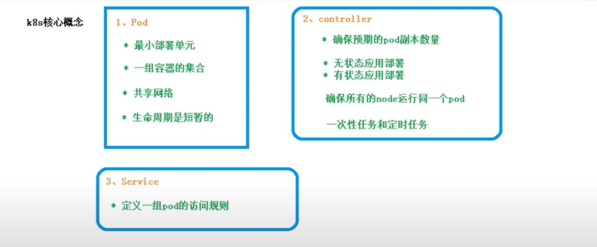</p>


### 20240422
- VS Code change theme
  - https://blog.csdn.net/qq_21237549/article/details/121515693
- VS code enable TS syntax checks inline
  - https://stackoverflow.com/questions/43908813/how-to-setup-vscode-to-show-typescript-error-inline
  - Steps
    - 1. Edit in setting.json : "editor.hover.enabled": true
    - 2. Settings > TypeScript › Validate: Enable
```json
# .vscode/settings.json
{
    "files.autoSave": "afterDelay",
    "editor.hover.enabled": true
}
```

### 20240417
- AWS RDS Mysql 5.x -> 8.x Upgrade
  - https://aws.amazon.com/cn/blogs/china/amazon-rds-for-mysql-5-7-to-8-0-upgrade-guide/
  - https://www.wake.wiki/archives/mysql57%E5%8D%87%E7%BA%A7%E5%88%B0mysql80%E7%9A%84%E5%AE%9E%E8%B7%B5%E5%88%86%E4%BA%AB -- check script
  - https://dev.mysql.com/doc/refman/8.0/en/upgrading.html -- official doc
  - https://downloads.mysql.com/archives/shell/ - download validate script

### 20240414
- Spring boot create modules under module
  - https://youtu.be/zisQrnBHvn0?si=l53lvIr4Ba978Msl&t=437

### 20240411
- Spring security auth with cookie, token
 -  https://youtu.be/GP5dAxqcO54?si=hc39rO8Py6rWl-58
 - <p>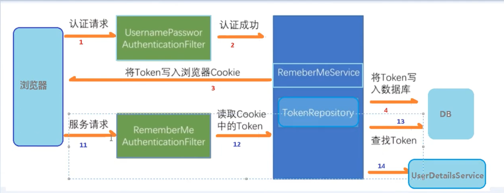</p>
 - <p>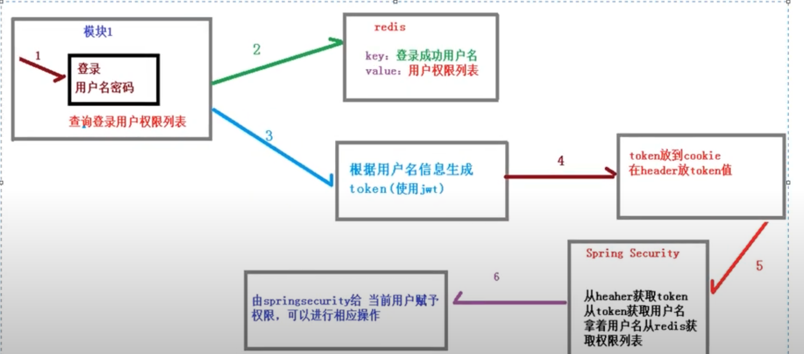</p>


### 20240408
- Spring security auth user from DB (custom userid, pwd)
  - https://www.youtube.com/watch?v=JhX1pv1iCFk&list=PLmOn9nNkQxJEnBjOMEXPLRjoTRNvhHIl2&index=8
  - https://youtu.be/HCJH6I5egJk?si=hig7yhJEfPMomAEl
- Spring security custom config (哪些endpoints可被訪問, 跳轉路徑..)
  - https://youtu.be/UWkOQZzAumw?si=KDwX0-1VVQB4yOXW&t=490

### 20240404
- IntelliJ 在 3rd party library source code 加斷點
    - https://youtu.be/uNdIUa_gEVY?si=mhBgwmZF8RSJLs0P&t=470

### 20240401
- AWS Cloudwatch - Slack integration
   - https://medium.com/verybuy-dev/%E5%B0%87-aws-cloudwatch-alarms-%E7%99%BC%E4%BD%88%E5%88%B0-slack-c283959a90ca
   - https://www.youtube.com/watch?v=ox_HJ8w7FPI
     - code : https://github.com/antonputra/tutorials/tree/main/lessons/122
   - msg format
     - https://github.com/assertible/lambda-cloudwatch-slack

### 20240315
- Express js auto generates Swagger doc, and populate
  - https://blog.csdn.net/weixin_48390984/article/details/131962926

### 20240314
- add swagger to NodeJS
  - https://dev.to/desmondsanctity/documenting-nodejs-api-using-swagger-4klp 

### 20240308
- Terraform build ECS service
  - EC2
    - https://spacelift.io/blog/terraform-ecs
  - Fargete
    - https://erik-ekberg.medium.com/terraform-ecs-fargate-example-1397d3ab7f02

### 20240305
- AWS Terraform create app runner with ECR
 - https://medium.com/kocsistem/how-to-deploy-docker-image-to-aws-app-runner-with-terraform-5048eecff047
 - https://prashant-48386.medium.com/terraform-deploy-docker-image-on-aws-apprunner-from-ecr-repository-8ed5423bf3d4

### 20240226
- RDS Mysql upgrade
  - https://aws.amazon.com/cn/blogs/china/amazon-rds-for-mysql-5-7-to-8-0-upgrade-guide/
  - https://aws.amazon.com/cn/blogs/china/amazon-rds-for-mysql-5-7-to-8-0-pre-check/
  - https://blog.bitipcman.com/rds-mysql-57-to-8-major-version-upgrade/
  - https://docs.aws.amazon.com/zh_tw/AmazonRDS/latest/UserGuide/USER_UpgradeDBInstance.MySQL.html

### 20240222
- Spring boot `mockMvc` test controller
   - https://youtu.be/es_fTKyfI4w?si=0i4y2DVyQrNYKeUw&t=1726

### 20240217
- Python scrapy 爬蟲框架
  - https://www.runoob.com/w3cnote/scrapy-detail.html
  - https://www.youtube.com/watch?v=fnwvYAtCFko
  - https://medium.com/seaniap/python%E7%B6%B2%E9%A0%81%E7%88%AC%E8%9F%B2-scrapy%E7%9A%84%E5%AE%89%E8%A3%9D%E8%88%87%E4%BD%BF%E7%94%A8%E5%85%A5%E9%96%80-1-878598d7e0e1
- Spring boot redis lock 3rd party pkg
   - https://github.com/kekingcn/spring-boot-klock-starter
   - https://www.tw511.com/a/01/51578.html

### 20240215
- Spring @Configuration 介紹
  - https://www.youtube.com/watch?v=YkY__WrqejM&list=PLSGSXGjRyTbYqL_tsaFvsyqc0sNDv4j2g&index=26
- Java 常用名詞中英對照
  - https://www.cnblogs.com/harry335/p/5366481.html
  - https://blog.csdn.net/cwdysg/article/details/60952558
- Java 對象 (object) VS 實例 (instance)
  - `實例是對象的實例化`, Car.java是對象, 而 Car car1 = new Car(), car1 是實例
  - https://blog.csdn.net/jinheng_/article/details/109029982
- Spring boot add a custom query in JpaRepository
 ```java
    // Define custom query native sql query with name param
    @Query(value= "select * from employees e where e.first_name =:firstName and e.last_name = :lastName", 
    nativeQuery = true )
    Employee findByNativeSQLNameParam(@Param("firstName") String firstName, @Param("lastName") String lastName);
 ```
 - https://mohosinmiah1610.medium.com/spring-boot-unit-testing-repository-layer-492bd004d417

### 20240214
- JDWP : java遠程調用測試
 - https://youtu.be/Z70NBYFYl0s?si=jZ8-SLuIlKqhcJ-V
 - https://www.jianshu.com/p/4b322505087f
 - https://qsli.github.io/2018/08/12/jdwp/

### 20240212
- 股票除權息
  - https://www.sinotrade.com.tw/richclub/aiinvest/-5ea7edfd0d95d31484fdead5
  - https://www.sinotrade.com.tw/richclub/aiinvest/-62bbe71461e0f7202caa5570

### 20240211
- Jmeter makes POST request
  - https://github.com/yennanliu/utility_shell/tree/master/jmeter/pic

### 20240210
- Postman pressure test
  - Right-click "collections" and select "run collection" (NOT click endpoint), then ...
  - https://juejin.cn/post/7108288696025088008

### 20240126
- Zeppelin Flink interpreter setting
    - https://www.cnblogs.com/shine-rainbow/p/zeppelin-an-zhuang-ji-pei-zhihive-hespark-jie-shi.html

### 20240120:
- Postman : pressure test
  - https://blog.csdn.net/qq_43842093/article/details/125016545
  - https://apifox.com/apiskills/postman-pressure-testing-guide/
  - https://hackmd.io/@mko123654/HkJZiE689

### 20240119
- Web : 會話控制方式:
  - token
  - session
  - cookie
  - [ref](https://www.youtube.com/watch?v=UeENe6tys_U&list=PLmOn9nNkQxJGOPF4yPJ_H8lyn73KBcPtP&index=168)
  - [cookie VS session](https://www.youtube.com/watch?v=qUKeEzl1wPI&list=PLmOn9nNkQxJGOPF4yPJ_H8lyn73KBcPtP&index=178)
  - [sesssion intro](https://www.youtube.com/watch?v=lzFRXiipArg&list=PLmOn9nNkQxJGOPF4yPJ_H8lyn73KBcPtP&index=177)

### 20240117
- TS transaction library : TypeORM
  - https://blog.csdn.net/qq_33270001/article/details/121181295
  - https://hackmd.io/@yygg/rJPQmsLG2?utm_source=preview-mode&utm_medium=rec

### 20240114

- Stock 技術分析 : KD指標(Stochastic Oscillator)
    - https://www.cmoney.tw/learn/course/technicals/topic/484
    - https://www.oanda.com/bvi-ft/lab-education/technical_analysis/use_kd/
    - https://rich01.com/what-is-kd-indicator/

### 20240113

- Java 受檢例外（Checked Exception), 執行時期例外（Runtime Exception）

  - 受檢例外（Checked Exception)
    - 在某些情況下例外的發生是可預期的，例如使用輸入輸出功能時，可能會由於硬體環境問題，而使得程式無法正常從硬體取得輸入或進行輸出，這種錯誤是可預期發生的，像這類的例外稱之為「受檢例外」（Checked Exception），對於受檢例外編譯器會要求您進行例外處理，
  
  - 執行時期例外（Runtime Exception
    - 像 NumberFortmatException 例外是「執行時期例外」（Runtime exception），也就是例外是發生在程式執行期間，並不一定可預期它的發生，編譯器不要求您一定要處理，對於執行時期例外若沒有處理，則例外會一直往外丟，最後由 JVM 來處理例外，JVM 所作的就是顯示例外堆疊訊息，之後結束程式。

  - Thoughts
    - 如果您在方法中會有例外的發生，而您並不想在方法中直接處理，而想要由呼叫方法的呼叫者來處理，則您可以使用 "throws" 關鍵字來宣告這個方法將會丟出例外，例如 java.ioBufferedReader 的 readLine() 方法就聲明會丟出 java.io.IOException。使用 "throws" 聲明丟出例外的時機，通常是工具類別的某個工具方法，因為作為被呼叫的工具，本身並不需要將處理例外的方式給定義下來，所以在方法上使用"throws"聲明會丟出例外，由呼叫者自行決定如何處理例外是比較合適的，您可以如下使用 "throws" 來丟出例外：

  - Ref
    - https://github.com/JustinSDK/JavaSE6Tutorial/blob/master/docs/CH10.md

### 20240112
- JS Promise
    - https://www.runoob.com/js/js-promise.html
    - https://www.runoob.com/nodejs/nodejs-mongodb.html

### 20240109
- VSCode NodeJs 語法提示
    - https://blog.csdn.net/honeycandys/article/details/123489268
    - https://juejin.cn/s/vscode%20nodejs%E4%BB%A3%E7%A0%81%E6%8F%90%E7%A4%BA

### 20240107
- Steps when FE loads HTML (how many requests FE sends to BE ??)
  - https://www.youtube.com/watch?v=mw0fcq3V5rQ&list=PLmOn9nNkQxJGOPF4yPJ_H8lyn73KBcPtP&index=55
    - get HTML
    - get CSS
    - get pic
    - get JS

### 20240106
- Zeppelin SDK + Flink
    - https://www.laitimes.com/article/1pl86_1vmmq.html
    - https://github.com/apache/zeppelin/tree/master/zeppelin-client-examples/src/main/java/org/apache/zeppelin/client/examples - example code
    - https://lrting.top/backend/7737/
    - https://lrting.top/backend/8097/

### 20240103

- InnoDB
  - 是MySQL和MariaDB的資料庫引擎之一，最初由MySQL AB發行。InnoDB由Innobase Oy公司所開發，2006年五月時由甲骨文公司併購。與傳統的ISAM與MyISAM相比，InnoDB的最大特色就是支援了ACID相容的事務（Transaction）功能，類似於PostgreSQL
  - [wiki](https://zh.wikipedia.org/zh-tw/InnoDB#:~:text=InnoDB%EF%BC%8C%E6%98%AFMySQL%E5%92%8CMariaDB,%EF%BC%89%E5%8A%9F%E8%83%BD%EF%BC%8C%E9%A1%9E%E4%BC%BC%E6%96%BCPostgreSQL%E3%80%82)
  - Other Mysql engine : MyISAM

### 20231230
- Spring boot `@bean`
    - 在用@Configuration修飾class後, 在方法上使用`@bean`, 則該方法會自動被註冊入Spring容器, 進行IOC管理(inverse of control)
    - e.g. @Configuration類似於xml文件的配置, 而@bean類似於xml文件裡的配置k-v
    - https://blog.51cto.com/u_15067225/2900410
    - https://blog.csdn.net/z69183787/article/details/108105329
    - https://youtu.be/BXjMbUVs0rY?si=uRgcgOF5grj1MPtb&t=548
- Zookeeper distribution lock client library written in Java - curator
    - https://github.com/yennanliu/curator

### 20231225
- Cache 三大現象
  - 緩存穿透
  - 緩存擊穿
  - 緩存雪崩

### 20231222
- Spring boot exclude sub lib in pom dep
    - [code example](https://github.com/timebusker/spring-boot/blob/master/spring-boot-5-Async/pom.xml#L22)
- Spring boot async (multi thread)
  - https://github.com/timebusker/spring-boot/blob/master/spring-boot-5-Async/src/main/java/cn/timebusker/config/TaskExecutorConfig.java
  - https://zhuanlan.zhihu.com/p/134636915
  - https://www.cnblogs.com/rhy2103/p/16596219.html

### 20231220
- Flink
  - checkpoint
  - checkpoint VS save point ?
    - https://zhuanlan.zhihu.com/p/79526638
    - https://cloud.tencent.com/developer/article/1780677
  - job manager VS task manager
    - job manager ~= master
    -  task manager ~= worker manager
    - https://nightlies.apache.org/flink/flink-docs-master/zh/docs/concepts/flink-architecture/
    - https://nightlies.apache.org/flink/flink-docs-master/zh/docs/try-flink/flink-operations-playground/#:~:text=%E4%B8%80%E4%B8%AAFlink%20%E9%9B%86%E7%BE%A4%E6%80%BB%E6%98%AF,%E7%BB%84%E6%88%90%E4%BA%86%E4%B8%80%E4%B8%AAFlink%20Job%E3%80%82
- Kafka
  - 資料不遺漏 實現方式?
    - via `Ack`
    - [ref](https://github.com/yennanliu/CS_basics/blob/master/doc/faq/kafka/faq_kafka.md#3-how-kafka-avoid-data-missing-)
  - Topic or partition can have ordering ?
    - ONLY partition ordering (Topic is NOT ordering, or lost parallism), but cusumer can consume in ordering
    - https://www.cnblogs.com/yisany/p/14736360.html
  - `Exactly once` 底層實現方式? (Idempotence + Transaction)
    - 冪等性 Idempotence
    - 事務性 Transaction
    - <p>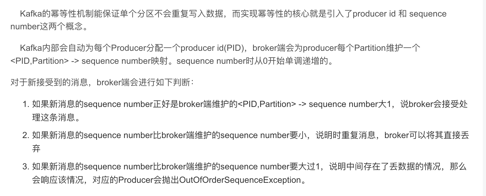</p>
    - <p>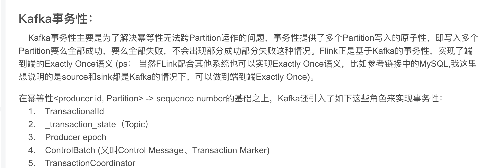</p>
    - <p>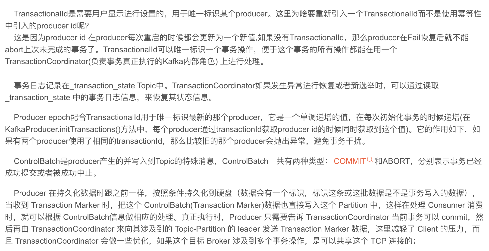</p>
    - https://www.lixueduan.com/posts/kafka/10-exactly-once-impl/
    - https://blog.csdn.net/zc19921215/article/details/108466393#:~:text=Kafka%E5%B9%82%E7%AD%89%E6%80%A7%EF%BC%9A,number%E8%BF%99%E4%B8%A4%E4%B8%AA%E6%A6%82%E5%BF%B5%E3%80%82
    - https://github.com/yennanliu/CS_basics/blob/master/doc/faq/kafka/faq_kafka.md#2-how-does-kafka-implement-exactly-once-
- Redis
  - pros and cons
    - pros:
      - 資料儲存在內存， 讀寫速度快，效能優異
      - 支援資料持久化，便於資料備份、恢復
      - 支援簡單的事務，操作滿足原子性
      - 支援String、List、Hash、Set、Zset五種資料類型，滿足多場景需求
      - 支持主從複製，實現讀寫分離，分擔讀的壓力
      - 支援哨兵機制，實現自動故障轉移
      - 效能極高 – Redis能讀的速度是110000次/s,寫的速度是81000次/s 。
      - 豐富的資料類型 – Redis支援二進位案例的 Strings, Lists, Hashes, Sets 和 Ordered Sets 資料類型運算。
      - 原子 – Redis的所有操作都是原子性的，同時Redis也支援對幾個操作全併後的原子性執行。
      - 豐富的特性 – Redis也支援 publish/subscribe, 通知, key 過期等等特性。
    - cons:
      - 資料儲存在內存，主機斷電則資料遺失
      - 儲存容量受到實體記憶體的限制，只能用於小資料量的高效能操作
      - 線上擴容比較困難，系統上線時必須確保有足夠的空間
      - 用於快取時，易出現’緩存雪崩‘，’快取擊穿‘等問題
      - 單執行緒 – Redis的所有操作都是單執行緒的，這會導致在高並發的情況下，Redis會成為效能的瓶頸。
      - 不支援複雜的查詢 – Redis雖然提供了豐富的資料類型，但還是不支援複雜的查詢。
      - 資料不是真正的刪除，而是被清除 – Redis刪除某個key後，會立即釋放內存，但是對於大key來說，內存釋放會比較慢。

    - https://worktile.com/kb/p/34706
    - https://ibatis.io/2iDF34
  - redis 上鎖 command
- DB
  - 上鎖 command
    - https://www.xiaolincoding.com/mysql/lock/mysql_lock.html#%E8%A1%A8%E7%BA%A7%E9%94%81
    - https://medium.com/@martin87713/mysql-lock-55ca187e4af2
  - Mysql鎖類型: (都是悲觀鎖)
    - 全局鎖
      ```sql
      # sql
      # lock
      flush tables with read lock
      # unlock
      unlock tables
      ```
    - 表鎖
      ```sql
      # lock
      #lock tables user read;
      LOCK TABLE T WRITE;
      # unlock
      #unlock tables
      UNLOCK table;
      ```
    - 行鎖
      ```sql
      select ... for update;
      ```
    - 讀寫鎖
  - 複合index, example create_time + user_id, 如果只有user_id 在where condition, 仍會有索引效果?
   -> NO,  如果 1)非使用全部複合index or 2)where 條件並非從左綴索引開始, 則複合index不發揮作用
   - 複合索引遵循最左匹配原則，只有索引中最左列匹配到，下一列才有可能被匹配。 如果左邊欄位使用的是非等值查詢，則索引右邊的欄位將不會被查詢使用，也不會被排序使用。
   - https://www.begtut.com/mysql/mysql-composite-index.html
   - https://blog.csdn.net/riemann_/article/details/94840416
   - https://www.cnblogs.com/lijiaman/p/14364171.html
   - 
- BE
  - 分庫transaction 如何設計? 實現?
  - 死鎖問題如何發生? 解決方式?
    - https://note.dolyw.com/database/01-MySQL-Lock.html#_6-3-%E5%A6%82%E4%BD%95%E9%98%B2%E6%AD%A2%E6%AD%BB%E9%94%81
  - DB isolcation ? 不同層級?

### 20231218
- Spring boot: `@Component`
   - Spring 啟動後, 會掃描, 初始化該類的無參數構造方法, 並將初始化後的instance放入spring容器
   - so the instance can be injected to the container (if NOT bean, service, controller...)
   - https://youtu.be/dcmhIij3eNM?si=NW2Z4wW_5t6_HitP&t=113
   - https://youtu.be/V5iKz8HPiI4?si=r28o--dQURuUW494&t=395
- Spring boot : `@PostConstruct`
   - 保證該方法在無參數構造方法初始化後 立刻執行 (e.g. @Component -> @PostConstruct)
   - https://youtu.be/dcmhIij3eNM?si=3KKKz3ldEPE0_RFo&t=122
```java
// java

@Component
public class ZKClient{

   @PostConstruct
   public void init(){
  }
}
```

### 20231212
- Java Spring boot OAuth2 login with google
  - https://www.codejava.net/frameworks/spring-boot/oauth2-login-with-google-example
  

### 20231211
- Java : Sorting, Comparable VS Comparator
 - https://www.pkslow.com/archives/java-sorting
 - https://openhome.cc/zh-tw/java/collection/comparator/
 - https://blog.csdn.net/dl962454/article/details/112731217

### 20231209

- Java distribution lock POC
  - Redis
  - MySQL
  - Zookeeper
  - other 3rd party tools

- Java CDC(Change Data Capture) POC
    - https://medium.com/@systemdesignbychk/system-design-demystifying-change-data-capture-cdc-in-event-driven-microservices-using-debezium-7ed24336bc5a
    - https://cloud.tencent.com/developer/article/1483833?fbclid=IwAR1IavrHB41EBjTavtrkIJUSLb1S6o4bKippEKl0L9u65vvwC4VlYPfiPLE
    - https://github.com/confluentinc/demo-change-data-capture

### 20231206

1. mybatis 帶入變數方式? 差別
  - #{}和${}的區別是什麼？
    #{}是預編譯處理，${}是字元串替換。
    Mybatis在處理#{}時，會將sql中的#{}替換為?號，調用PreparedStatement的set方法來賦值；
    Mybatis在處理${}時，就是把${}替換成變數的值。
    使用#{}可以有效的防止SQL註入，提高系統安全性。
    https://www.zendei.com/article/70565.html
  - 批量插入語法?
  -  Mybatis VS Hibernate ?
    Hibernate屬於全自動ORM映射工具，使用Hibernate查詢關聯對象或者關聯集合對象時，可以根據對象關係模型直接獲取，所以它是全自動的。而Mybatis在查詢關聯對象或關聯集合對象時，需要手動編寫sql來完成，所以，稱之為半自動ORM映射工具。

2. redis, Zookeeper 實現分散式鎖

3. websocket實現原理
  - https://www.readfog.com/a/1662980721344614400
  - https://github.com/abbshr/abbshr.github.io/issues/22

4. 如何偵測死鎖? 看什麼metrics ? cmd ?
5. 實現 thread 方式? 如何讓資源獨享?
6. java網路框架? Netty運作方式?
7. 分庫分表方式?
8. http 連線斷開 步驟? (client <-> server)
    - 4 hands shake
    ```
    1. client 發起請求
    2. server 接受請求
    3. server 斷開連接
    4. client 斷開連接
    ```
    - https://blog.csdn.net/myzksky/article/details/80451051

9. redis 支持數據結構?
    - https://segmentfault.com/a/1190000040102333
    - https://javaguide.cn/database/redis/redis-data-structures-01.html
    - basic : string、list、hash、set、sorted set
    - 也支援更高階資料結構, e.g.：HyperLogLog、Geo、BloomFilter

10. 慢查詢? 如何優化?

11. String, StringBuilder, StringBuffer差別, 使用場景?  哪ㄧ個可以用在thread安全?
  
  - https://www.runoob.com/w3cnote/java-different-of-string-stringbuffer-stringbuilder.html
  - https://www.readfog.com/a/1633579016528171008
  - https://c.biancheng.net/view/5822.html
  
  - String VS StringBuffer 主要性能區別：`String 是不可變的對象, 因此在每次對String
    類型進行改變的時候，都會產生一個新的String 對象，然後將指針指向新的String對象`，所以經常改變內容的
    字串最好不要用String ，因為每次產生物件都會對系統效能產生影響，特別當記憶體中無引用物件多了以後， JVM 的GC
    就會開始運作，效能就會降低。

  - 使用 StringBuffer 類別時，每次都會對 StringBuffer 物件本身進行操作，而不是產生新的物件並更改物件引用。 
    所以多數情況下推薦使用 StringBuffer ，特別是字串物件經常改變的情況。

  -  use case
    - 如果要操作少量的數據，用String
    - 單線程操作大量數據，用StringBuilder
    - 多線程操作大量數據，用StringBuffer。

12. java 如何實現比較二個String是否相等 ?

### 20231205
- Redis pros and cons
  - https://prosconslab.com/articles/32/13-advantages-and-disadvantages-of-redis
    - https://bbs.huaweicloud.com/blogs/366040
    - https://juejin.cn/post/7029622373699551245
- 分散式交易 (Distributed Transactions)
    - https://rickhw.github.io/2020/05/16/DistributedSystems/Distributed-Transactions/
    - https://hackmd.io/@KingTheseus/distributed_transaction
    - https://medium.com/brobridge/%E6%B7%BA%E8%AB%87%E5%BE%AE%E6%9C%8D%E5%8B%99%E6%9E%B6%E6%A7%8B%E4%BA%A4%E6%98%93%E5%AF%A6%E7%8F%BE-b6b531b2503a
 - Java how to init Optional
    - https://www.developer.com/java/java-optional-object/#:~:text=You%20can%20create%20an%20Optional,if%20the%20value%20is%20null.
    - https://www.baeldung.com/java-optional
    - https://www.ruoxue.org/java-147-initialize-optional-in-java/

### 20231129
- Spring boot read files under /resources
    - https://www.cnblogs.com/caicz/p/17301789.html
    - [example](https://github.com/yennanliu/SpringPlayground/blob/main/springWarehouse/src/main/java/com/yen/springWarehouse/controller/DownloadController.java#L107)
    ```java
    // java
    // exmaple
    File file = new File("src/main/resources/" + downloadUrl);
    ```

### 20231128
- RedisTemplate basic API (Java redis client)
    - https://ost.51cto.com/posts/2333

### 20231127
- Fix using Swagger 2.x
  - // Fix using Swagger 2.x : https://blog.51cto.com/u_15740726/5540690
  - [commit](https://github.com/yennanliu/SpringPlayground/commit/a130670214eaa15e51705a00acafff97c939bba0)

### 20231124
- Spring boot redirect : RedirectView
    - https://matthung0807.blogspot.com/2021/02/spring-boot-redirect-url.html
    - https://blog.csdn.net/cyan20115/article/details/106551434
    - [example code](https://github.com/DenimMazuki/URLShortener/blob/master/src/main/java/urlshortener/app/controller/URLController.java#L43)
- Jackson : json <--> java class instance
    - https://cloud.tencent.com/developer/article/1704523
- Jedis : java lib for Redis
    - https://www.jianshu.com/p/a1038eed6d44
    - https://www.cnblogs.com/-beyond/p/10991139.html

### 20231123
- Common security issue when web development
 - XSS (Cross-site scripting)
 - SQL Injection
 - CSRF
 - ClickJacking
 - Open Redirect
 - DOS
 - Insecure Direct Object Reference Vulnerability
 - https://www.cloudflare.com/zh-tw/learning/security/what-is-web-application-security/
 - https://medium.com/starbugs/%E8%BA%AB%E7%82%BA-web-%E5%B7%A5%E7%A8%8B%E5%B8%AB-%E4%BD%A0%E4%B8%80%E5%AE%9A%E8%A6%81%E7%9F%A5%E9%81%93%E7%9A%84%E5%B9%BE%E5%80%8B-web-%E8%B3%87%E8%A8%8A%E5%AE%89%E5%85%A8%E8%AD%B0%E9%A1%8C-29b8a4af6e13
  

### 20231122
- Spring boot : @PathVariable VS @RequestParam
- https://www.baeldung.com/spring-pathvariable
- https://www.baeldung.com/spring-requestparam-vs-pathvariable

```
// example

// -------------------
// 1) PathVariable
// -------------------

@GetMapping("/foos/{id}")
@ResponseBody
public String getFooById(@PathVariable String id) {
    return "ID: " + id;
}

-> endpoint
http://localhost:8080/spring-mvc-basics/foos/abc
----
ID: abc

// -------------------
// 2) RequestParam
// -------------------

@GetMapping("/foos")
@ResponseBody
public String getFooByIdUsingQueryParam(@RequestParam String id) {
    return "ID: " + id;
}


-> endpoint

http://localhost:8080/spring-mvc-basics/foos?id=abc
----
ID: abc
```
  
### 20231121
- TCP VS UDP
    - https://nordvpn.com/zh-tw/blog/tcp-udp-bijiao/#:~:text=TCP%20%E6%9C%89%E9%8C%AF%E8%AA%A4%E6%AA%A2%E6%9F%A5%E5%92%8C,%E6%9C%8D%E5%8B%99%EF%BC%8C%E4%BE%8B%E5%A6%82FTP%20%E6%AA%94%E6%A1%88%E5%82%B3%E8%BC%B8%E3%80%82

 - Java concurrency example: bank
    - https://www.unlogged.io/post/java-concurrency-unlocked-a-comparative-guide-to-synchronization-tools

### 20231118
- Java mockito
    - @Mocks VS @InjectMocks
        - https://matthung0807.blogspot.com/2018/08/mockito-mockinjectmocks.html
        - https://juejin.cn/post/7056621888088309790

### 20231117
- Java : Dependency Injection (DI)
    - https://matthung0807.blogspot.com/2019/08/java-dependency-injection.html
    - https://www.digitalocean.com/community/tutorials/java-dependency-injection-design-pattern-example-tutorial

### 20231116
- junit.jupiter : fix "null pointer" error when use @Before
  - https://stackoverflow.com/questions/61692036/setup-function-is-throwing-nullpointerexception-when-using-beforeeach-in-juni
  ```
   *    -> so, do below
   *      - 1) add annotaiton : @ExtendWith(MockitoExtension.class)
   *      - 2) use @BeforeEach
  ```

### 20231114
- Java : throw exception VS try-catch
    ```
  1.throw 是語句拋出一個異常，如throw new Exception();他不處理異常，直接拋出異常；

  2.throws是表示方法拋出異常，需要呼叫者來處理，如果不想處理就一直向外拋，最後會有jvm來處理；
  
  3.try catch 是自己來捕捉別人拋出的異常，然後在catch裡面去處理。
    ```
    - https://www.cnblogs.com/JamesWang1993/p/9066593.html#:~:text=1.throw%20%E6%98%AF%E8%AF%AD%E5%8F%A5%E6%8A%9B,%E5%9C%A8catch%E9%87%8C%E9%9D%A2%E5%8E%BB%E5%A4%84%E7%90%86%E3%80%82
    - https://blog.csdn.net/ztx114/article/details/78251126
    - https://openhome.cc/zh-tw/java/exception/throw/  - Some consideration

### 20231113
- Java : try-with-resource VS try-catch-final ?
    - try-with-resource: prefer, code more elegant, resource closing already implemented automatically
  - https://javaguide.cn/java/basis/syntactic-sugar.html#try-with-resource
- JS SocketJS: common API (e.g. Stomp.over,....)
    - https://www.twblogs.net/a/5c03de16bd9eee728baac84b
- CAS (Compare And Swap) 算法
  - https://javaguide.cn/java/concurrent/java-concurrent-questions-02.html#%E5%A6%82%E4%BD%95%E5%AE%9E%E7%8E%B0%E4%B9%90%E8%A7%82%E9%94%81
  - 實現樂觀鎖(Optimistic lock)
  - compare expected val and actual val, ONLY update if they are the same

### 20231112
- Redis GUI App
    - https://github.com/RedisInsight/RedisInsight
    - https://redis.com/redis-enterprise/redis-insight/#insight-form
    - https://redis.io/resources/tools/ - list

### 20231107
- Spring @Configuration
  - recognized as config class, setup get bean method in it, then bean will be auto injected by Spring boot when app run 
  - https://youtu.be/17Igk4Podd4?si=LxQ353ybO4j4MjVz&t=767

### 20231106
- Software testing
    - Unit test
    - Functional test
    - Integration test
    - end-to-end test
    - https://moduscreate.com/blog/an-overview-of-unit-integration-and-e2e-testing/
    - https://www.twilio.com/blog/unit-integration-end-to-end-testing-difference

### 20231104
- STOMP (Simple Text Oriented Message Protocol)
  - A WebSocket implementation by Spring boot
    - https://blog.csdn.net/qq_21294185/article/details/130657375
    - https://blog.csdn.net/u013749113/article/details/131455579

### 20231103
- CSS grid
  - https://www.youtube.com/watch?v=fYcz3FUqv7M

### 20231009
- Java spring boot :  `object references an unsaved transient instance - save the transient instance before flushing` error
    - https://blog.csdn.net/wsaicyj/article/details/123966389
  ```java
  // java
  // example
  @ManyToOne(cascade = CascadeType.PERSIST)
  ```
  
### 20231008
- Java design pattern
  - 適配器模式 (Adapter Pattern)
    - 創造一個適配器 ，它用於實現上面的接口，但是所有的方法都是空方法 ，這樣，我們就可以轉而定義自己的類來繼承下面這個類即可
    - https://www.readfog.com/a/1639984655800307712
    - https://www.runoob.com/design-pattern/adapter-pattern.html
    - https://youtu.be/r4fdPmZuzmY?si=GmePG_JsutE60l0I&t=1320

### 20231006
- Ways do Client-Server bi communication
  - Comet
  - Web socket

- Web socket
  - WebSocket 是 HTML5 開始提供的一種在單個 TCP 連線上進行全雙工通訊的協定。
  - WebSocket 使得使用者端和伺服器之間的資料交換變得更加簡單，允許伺服器端主動向使用者端推播資料。在 WebSocket API 中，瀏覽器和伺服器只需要完成一次握手，兩者之間就直接可以建立永續性的連線，並進行雙向資料傳輸。
  - 在 WebSocket API 中，瀏覽器和伺服器只需要做一個握手的動作，然後，瀏覽器和伺服器之間就形成了一條快速通道。兩者之間就直接可以資料互相傳送。
  - 簡單的說，就是一次握手，持續通訊。
  - Ref
    - https://tw511.com/a/01/16646.html
    - https://www.syscom.com.tw/ePaper_New_Content.aspx?id=368&EPID=194&TableName=sgEPArticle
    - https://github.com/yennanliu/SpringPlayground/tree/main/springChatRoom
    - https://spring.io/guides/gs/messaging-stomp-websocket/

- Comet
  - Long Polling
  - Streaming

### 20231005
- Javascript print class info instead of "Object"
    - https://stackoverflow.com/questions/41336663/console-logresult-prints-object-object-how-do-i-get-result-name
  ```javascript
  // javascript
  // example
  console.log(JSON.stringify(myClass)))
  ```
- React Hook (useState, useEffect ...)
    - https://medium.com/vita-for-one/react-hooks-%E5%AD%B8%E7%BF%92%E7%AD%86%E8%A8%98-usestate-useeffect-usecontext-b11c33e69bea#:~:text=useEffect%20%E6%B8%85%E7%90%86%E6%A9%9F%E5%88%B6,%E7%A8%AE%E6%98%AF%E9%9C%80%E8%A6%81%E6%B8%85%E7%90%86%E7%9A%84%E3%80%82
    - https://medium.com/vita-for-one/react-hooks-%E5%AD%B8%E7%BF%92%E7%AD%86%E8%A8%98-usestate-useeffect-usecontext-b11c33e69bea#:~:text=useEffect%20%E6%B8%85%E7%90%86%E6%A9%9F%E5%88%B6,%E7%A8%AE%E6%98%AF%E9%9C%80%E8%A6%81%E6%B8%85%E7%90%86%E7%9A%84%E3%80%82
    - https://www.readfog.com/a/1642414651295764480

### 20231001
- Java
  - create SDK and import to project
    - https://blog.csdn.net/u012814856/article/details/113665071
    - https://www.cnblogs.com/h--d/p/13060688.html
    - https://learn.temporal.io/getting_started/java/
    - https://zhuanlan.zhihu.com/p/407358702
  - Arrays.asList VS new ArrayList()
      - https://www.baeldung.com/java-arrays-aslist-vs-new-arraylist#:~:text=asList%20method%20returns%20a%20type,the%20add%20and%20remove%20methods.
  - Continue VS break VS pass
      - https://www.digitalocean.com/community/tutorials/how-to-use-break-continue-and-pass-statements-when-working-with-loops-in-python-3

### 20230903
- Hibernate : “Detached Entity Passed to Persist” Error
  - https://www.baeldung.com/hibernate-detached-entity-passed-to-persist
    - https://blog.csdn.net/Lancis/article/details/128560064
    - code demo:
        - https://github.com/yennanliu/SpringPlayground/blob/assignment-dev-03--FE-view-dev/springAssignmentSystem/backend/SpringAssignmentSystem/src/main/java/com/yen/SpringAssignmentSystem/domain/Assignment.java#L36

### 20230901
- Spring boot security + JWT
  - https://yanbin.blog/springboot-security-jwt-token-how-to-abcs/
    - https://jwt.io/
    - https://jwt.io/introduction
    - code demo
        - https://github.com/yennanliu/SpringPlayground/blob/main/springBasics/springBootBasic1/src/main/java/com/yen/SpringBootPart1/controller/AuthController.java

### 20230819
- Zipkin Spring Cloud
    - Zipkin is an application that monitors and manages the Spring Cloud Sleuth logs of your Spring Boot application.
    - Trace spring app request
  - https://youtu.be/Cm75_MIo_aY?t=626
  - https://www.1ju.org/spring-cloud/tracing-services-with-zipkin
      - https://www.tpisoftware.com/tpu/articleDetails/2682

### 20230816
- VPC peering via CDK
  - https://blog.purple-technology.com/cross-account-vpc-peering-with-aws-cdk/
- Subnet type
    - https://docs.aws.amazon.com/zh_tw/vpc/latest/userguide/configure-subnets.html
- CDK VPC peering video
    - https://www.youtube.com/watch?v=puUpjHWW44c

### 20230814
- VPC peering
  - https://docs.aws.amazon.com/zh_tw/vpc/latest/peering/create-vpc-peering-connection.html
  - https://docs.aws.amazon.com/zh_tw/vpc/latest/peering/create-vpc-peering-connection.html#same-account-same-region
  - https://docs.aws.amazon.com/zh_tw/vpc/latest/peering/vpc-peering-routing.htmlhttps://docs.aws.amazon.com/zh_tw/vpc/latest/userguide/VPC_Route_Tables.html
  - https://rdpapa.tw/2022/09/10/aws-vpc-peering/
  - https://www.kmp.tw/post/awsvpcpeering/
  - https://medium.com/@1000lin/aws-network-planning-d1424e171846
- VPC peering debug
    - https://docs.aws.amazon.com/vpc/latest/peering/troubleshoot-vpc-peering-connections.html
    - https://docs.aws.amazon.com/vpc/latest/reachability/what-is-reachability-analyzer.html
- Create new VPC can be used by redshift ?
    - https://repost.aws/knowledge-center/vpc-redshift-associate
- VPC terms
  - VPC (Virtual Private Cloud): 在實務上我們會將需要獨立的環境(網段)，用VPC區隔開來。例如: vpc-sit、vpc-uat、vpc-prod、vit-workspace
  - Subnet : Subnet就是在VPC的網段下，再細分不同的子網段。Subnet可區分為Public、Private和Vpn-Only三種，在subnet的Route Table中，能將流量route到Internet Gateway的屬於Public Subnet；如果只能將流量route到Virtual Private Gateway就是Vpn-Only Subnet； 否則就是Private Subnet
      - Internet Gateway : Internet Gateway可以attach在vpc上，為該vpc提供向外access internet的能力。
        - NAT Gateway : NAT Gateway扮演了讓Private Subnet可以透過Net Address Translation間接向外訪問Internet的能力；也就是Source NAT。
        - Route Tables : 每個subnet都有一個Route Table，來決定Traffics的流向。
        - Peering Connection : 二個獨立的VPC之間，若需要互相溝通，則需要建立Peering Connection，在本文的範例中，將用來打通vpc-workspace和vpc-sit之間的流量。

### 20230811
- Build BI System from Scratch -- Kinesis firehose s3 prefix
  - https://catalog.us-east-1.prod.workshops.aws/workshops/a861fb26-12b0-4669-b3c3-ae1def49735d/en-US/build-analytics-system/kinesis-data-firehose

### 20230809
- Spark stream + kinesis
  - https://baixin.ink/2018/08/02/spark-streaming-kinesis/

### 20230808
- Spring integration test
  - https://youtu.be/lh1oQHXVSc0?t=1483
    - https://testcontainers.com/

### 20230804
- Cloudwatch -> Kinesis
  - https://repost.aws/zh-Hant/knowledge-center/cloudwatch-logs-stream-to-kinesis
- Akka send to Kinesis
    - https://github.com/Trigl/kinesis-producer
    - https://blog.csdn.net/Trigl/article/details/80475966
    - https://baixin.ink/2018/05/23/akka-study/
- connect to my Amazon Redshift cluster
    - My cluster can't be accessed by an Amazon Elastic Compute Cloud (Amazon EC2) instance that is in a different VPC
    - https://repost.aws/knowledge-center/cannot-connect-redshift-cluster

### 20230802
- SQL cross join
  ```sql
  -- sql
  SELECT .. FROM table_A, table_B
  ```
  - https://www.sqlshack.com/sql-cross-join-with-examples/
  - https://launchschool.com/books/sql/read/joins
  - https://www.experts-exchange.com/questions/23880407/select-from-table-a-table-b.html

### 20230731
- Java : equals() VS ==
  - https://zhuanlan.zhihu.com/p/338350987
  - https://blog.csdn.net/william_munch/article/details/115373117

### 20230726
- Route53 + API
    - https://cloudbytes.dev/aws-academy/cdk-api-gateway-with-custom-domain
    - https://github.com/rehanhaider/aws-cdk-code-samples/tree/main/apigw_route53

### 20230723
- Maven package all dependency in jar
  - https://docs.aws.amazon.com/lambda/latest/dg/java-package.html
  - https://github.com/yennanliu/LambdaHelloWorld/blob/master/lab4/KinesisClient/pom.xml#L85
```
<!-- maven.xml -->
      <plugin>
        <groupId>org.apache.maven.plugins</groupId>
        <artifactId>maven-shade-plugin</artifactId>
        <version>3.2.2</version>
        <configuration>
          <createDependencyReducedPom>false</createDependencyReducedPom>
        </configuration>
        <executions>
          <execution>
            <phase>package</phase>
            <goals>
              <goal>shade</goal>
            </goals>
          </execution>
        </executions>
      </plugin>
```

### 20230722
- Spring boot security social login: Github, Google
  - https://youtu.be/us0VjFiHogo
 - Spring boot security - in memory user setup
    - https://youtu.be/66DtzkhBlSA?t=515
 - AWS Lambda calculates concurrent
    - https://docs.aws.amazon.com/zh_tw/lambda/latest/dg/lambda-concurrency.html
    - https://docs.aws.amazon.com/zh_tw/lambda/latest/dg/burst-concurrency.html
- 什麼場景（不）適合使用Lambda
  - https://www.51cto.com/article/704630.html

### 20230721
- Metabase environment variables
  - https://www.metabase.com/docs/latest/configuring-metabase/environment-variables

### 20230717
- Metabase connects to DB in VPC
  - https://www.metabase.com/docs/latest/installation-and-operation/creating-RDS-database-on-AWS#decouple-your-rds-database-from-the-elastic-beanstalk-deployment
- Setup subnet in redshift console for using existing VPC
  - https://stackoverflow.com/questions/59451752/cant-access-my-vpc-in-aws-console-for-creating-my-redshift-cluster
  - https://docs.aws.amazon.com/redshift/latest/mgmt/getting-started-cluster-in-vpc.html
  - https://docs.aws.amazon.com/redshift/latest/mgmt/enhanced-vpc-enabling-cluster.html
- NAT gateways
  - https://docs.aws.amazon.com/vpc/latest/userguide/vpc-nat-gateway.html

### 20230715
- Step func workshop
  - https://catalog.workshops.aws/stepfunctions/en-US/basics/hello-world/step-1

### 20230710
- Redshift
  - COPY JSON to a table
    - https://docs.aws.amazon.com/redshift/latest/dg/copy-usage_notes-copy-from-json.html
      - https://www.bmc.com/blogs/amazon-redshift-copy-json-data/
        - Monitoring Amazon Redshift using CloudWatch metrics
          - https://docs.aws.amazon.com/redshift/latest/mgmt/metrics-listing.html#redshift-metrics
        - troubleshoot high or full disk usage with Amazon Redshift
          - https://repost.aws/knowledge-center/redshift-high-disk-usage
        - Policy allow Redshift spectrum query s3
          - https://repost.aws/zh-Hant/knowledge-center/redshift-resolve-access-denied-errors
          - https://www.youtube.com/watch?v=yClHAALFXRk
  
- URL VS URI
  - https://codingbeginner01.com/difference-between-uri-and-url/
    - https://www.cnblogs.com/blknemo/p/13198506.html#:~:text=URI%E5%92%8CURL%E7%9A%84%E5%8C%BA%E5%88%AB%20%E2%9F%B3&text=%E7%BB%9F%E4%B8%80%E8%B5%84%E6%BA%90%E6%A0%87%E8%AF%86%E7%AC%A6(Uniform,%E8%B5%84%E6%BA%90%E5%90%8D%E7%A7%B0%E7%9A%84%E5%AD%97%E7%AC%A6%E4%B8%B2%E3%80%82

### 20230705
- CDK create Postgre creds
    - https://blog.phillipninan.com/provision-an-rds-instance-using-the-aws-cdk-and-secrets

### 20230630
- Share S3 with Redshift in different AWS account
    - How do I COPY or UNLOAD data from Amazon Redshift to an Amazon S3 bucket in another account?
  - https://repost.aws/knowledge-center/redshift-s3-cross-account
  - https://repost.aws/zh-Hans/knowledge-center/redshift-s3-cross-account
    - https://stackoverflow.com/questions/36730820/copy-to-redshift-from-another-accounts-s3-bucket

### 20230627
- Spring Cloud AWS
  - https://youtu.be/RN8N3AA6Drw
    - https://awspring.io/
  - https://spring.io/projects/spring-cloud-aws
- Airflow setup ssh conn
  - https://3lexw.medium.com/apache-airflow-2-1-%E5%9F%BA%E7%A4%8E%E6%95%99%E5%AD%B8-3-%E7%94%A8-ssh-%E9%80%A3%E7%B5%90%E4%B8%80%E5%88%87-%E5%86%8D%E5%8A%A0%E9%BB%9E-operator-954384eac36a
  - https://docs.aws.amazon.com/zh_tw/mwaa/latest/userguide/samples-ssh.html
- Airflow XCom, xcom_pull, xcom_push
  - https://docs.astronomer.io/learn/airflow-passing-data-between-tasks?tab=traditional#example-dag-using-xcoms
- Spring JDBC connection pool
  - https://medium.com/learning-from-jhipster/14-%E6%B7%B1%E5%85%A5-jdbc-connection-pool-%E4%B8%A6%E5%B0%8E%E5%85%A5-h2-db-939adee9c50
  - https://www.baeldung.com/spring-boot-hikari
      - https://www.progress.com/tutorials/jdbc/jdbc-jdbc-connection-pooling

### 20230626
- Mapping docker port
  - https://docs.docker.com/network/
```
Flag value  Description
-p 8080:80  Map TCP port 80 in the container to port 8080 on the Docker host.
```

### 20230626
- Elastic search
  - Nested type
    - https://youtu.be/VsbIy4itz5U?t=263
      - https://www.elastic.co/guide/en/elasticsearch/reference/current/nested.html
          - https://opster.com/guides/elasticsearch/data-architecture/elasticsearch-nested-field-object-field/

### 20230623
- Airflow Docker compose
  - https://towardsdatascience.com/setting-up-apache-airflow-with-docker-compose-in-5-minutes-56a1110f4122
- Kinesis dynamic partition keys
  - https://catalog.us-east-1.prod.workshops.aws/workshops/32e6bc9a-5c03-416d-be7c-4d29f40e55c4/en-US/lab-3/lab3-1-jq-partitioner/lab3-1-2-create-fh 

### 20230620
- Spring boot
  - Controller makes HTTP call to the other endpoint (inside it)
      - https://youtu.be/08mo8sMVZnE?t=1020

### 20230619
- Specify an Amazon S3 Destination for the Delivery Stream (Kinesis)
  - https://docs.aws.amazon.com/AWSCloudFormation/latest/UserGuide/aws-resource-kinesisfirehose-deliverystream.html
- firehose namespace (Kinesis -> s3)
  - https://docs.aws.amazon.com/firehose/latest/dev/s3-prefixes.html

### 20230616
- squash commits via IntelliJ
  - https://www.jetbrains.com/help/idea/edit-project-history.html#squash-commits

### 20230609
- Redshift Spectrum external tables add partition
  - https://docs.aws.amazon.com/redshift/latest/dg/c-spectrum-external-tables.html

### 20230607
- Lambda : Passing data between Lambdas with AWS Step Functions 
  - https://medium.com/@tturnbull/passing-data-between-lambdas-with-aws-step-functions-6f8d45f717c3

### 20230605
- Bulder pattern
  - https://www.digitalocean.com/community/tutorials/builder-design-pattern-in-java
  - https://howtodoinjava.com/design-patterns/creational/builder-pattern-in-java/
  - https://refactoring.guru/design-patterns/builder/java/example
- Spring boot - Swagger config
  - https://youtu.be/MmVu0sGF8vE?t=123

### 20230601
- S3 bucket size monitoring - console, cloudwatch, shell script
  - https://aws.amazon.com/blogs/storage/find-out-the-size-of-your-amazon-s3-buckets/#:~:text=3.,stored%20in%20an%20S3%20bucket.

### 20230530
- AWS eventbridge
  - https://docs.aws.amazon.com/step-functions/latest/dg/cw-events.html
- AWS lambda return status
- AWS Step function run EMR spark-submit
  - https://stackoverflow.com/questions/63025604/emr-spark-job-with-python-code-through-aws-lambda
- Redshift spectrum
  - https://aws.amazon.com/blogs/big-data/amazon-redshift-spectrum-extends-data-warehousing-out-to-exabytes-no-loading-required/

### 20230529
- Init scala spark project with IntelliJ
  - https://sparkbyexamples.com/spark/spark-setup-run-with-scala-intellij/
  - https://medium.com/@Sushil_Kumar/setting-up-spark-with-scala-development-environment-using-intellij-idea-b22644f73ef1
- P90, P99
  - https://juejin.cn/post/7057415444109459487
  - https://stackoverflow.com/questions/12808934/what-is-p99-latency


### 20230526
- Spark
  - generate schema from case class
    - https://kb.databricks.com/data/schema-from-case-class
  - StructType with ArrayType in nested structure
    - https://sparkbyexamples.com/spark/spark-array-arraytype-dataframe-column/

### 20230524
- EMR
  - aws command run EMR notebook
    - https://docs.aws.amazon.com/emr/latest/ManagementGuide/emr-managed-notebooks-headless-cli.html
  - databricks spark-redshift lib
    - https://github.com/databricks/spark-redshift
- VPC peering
  - https://docs.aws.amazon.com/vpc/latest/peering/what-is-vpc-peering.html
  - https://stackoverflow.com/questions/44968000/connection-timed-out-exception-with-spark-redshift-on-emr
  - https://docs.databricks.com/external-data/amazon-redshift.html
  - https://docs.databricks.com/administration-guide/cloud-configurations/aws/vpc-peering.html#programmatic-peering

### 20230524
- EMR, Lambda
  - Lambda run EMR job
    - https://www.startdataengineering.com/post/trigger-emr-spark-job-from-lambda/
    - https://docs.aws.amazon.com/prescriptive-guidance/latest/patterns/launch-a-spark-job-in-a-transient-emr-cluster-using-a-lambda-function.html
  - Step function run EMR job
    - https://aws.amazon.com/tw/blogs/big-data/run-a-data-processing-job-on-amazon-emr-serverless-with-aws-step-functions/

### 20230523
- EMR
  - load external jar in EMR studio (notebook)
    - https://stackoverflow.com/questions/57473914/adding-external-jars-in-emr-notebooks
    ```
    // V1
    // notebook
    %%configure -f
    {
        "conf": {
      "spark.jars":"file:///usr/share/aws/redshift/jdbc/RedshiftJDBC.jar,file:///usr/share/aws/redshift/spark-redshift/lib/spark-redshift.jar,file:///usr/share/aws/redshift/spark-redshift/lib/spark-avro.jar,file:///usr/share/aws/redshift/spark-redshift/lib/minimal-json.jar"
        }
    }
    
    // V2
    // notebook
    %%configure -f
    {
        "conf": {
      "spark.jars": "s3://YOUR_BUCKET/YOUR_DRIVER.jar"
        }
    }
    ```
  - dump data to EMR
    - https://aws.amazon.com/cn/blogs/china/new-amazon-redshift-integration-with-apache-spark/
- Spark
  - flatten array within a Dataframe in Spark
    - https://stackoverflow.com/questions/55479530/flatten-array-within-a-dataframe-in-spark
    ```scala
    // scala spark
    scala> val nested = spark.read.option("multiline",true).json("nested.json")
    nested: org.apache.spark.sql.DataFrame = [array: array<struct<a:string,b:bigint,c:string,d:string,e:bigint>>]
    ```

### 20230519
- AWS Lambda
  - install, deploy, use 3rd party libraries in Lambda py script
    - https://docs.aws.amazon.com/zh_tw/lambda/latest/dg/python-package.html

### 20230517
- Python
  - Logging facility for Python
    - https://docs.python.org/3/library/logging.html#logrecord-attributes

### 20230515
- Spark
  - read s3 and save to Redshift
    - https://aws.amazon.com/blogs/big-data/simplify-and-speed-up-apache-spark-applications-on-amazon-redshift-data-with-amazon-redshift-integration-for-apache-spark/
- Vue
  - negelect format error when build
    - update `.eslintignore`
    - https://blog.csdn.net/qq_34814495/article/details/107990319
    - https://blog.csdn.net/weixin_51169222/article/details/121329741

### 20230513
- Java
  - Multiply a String by an Integer (duplicate String N times)
    - https://stackoverflow.com/questions/26875877/how-to-multiply-a-string-by-an-integer
    ```java
    // java
        private static String multiplyString(String str, int multiplier){
      StringBuilder sb = new StringBuilder();
      for (int i = 0; i < multiplier; i++) {
          sb.append(str);
      }
      return sb.toString();
        }
    ```
  - Reverse String
    - https://stackoverflow.com/questions/49126461/java-reverse-string-method
    ```java
    // java
        public static String reverseString(String str) {
      return new StringBuilder(str).reverse().toString();
        }
    ```

### 20230509
- AWS Lambda
  - Lambda call API and write to S3
    - https://www.startdataengineering.com/post/pull-data-from-api-using-lambda-s3/
  - Processing large payloads with Amazon API Gateway asynchronously
    - https://dev.to/aws-builders/processing-large-payloads-with-amazon-api-gateway-asynchronously-1m4f

### 20230508
- Python
  - time-machine
    - https://pypi.org/project/time-machine/
  - testing
    - https://realpython.com/pytest-python-testing/
    - https://realpython.com/python-testing/

### 20230505
- Python
  - Decorator
    - https://realpython.com/primer-on-python-decorators/#further-reading
  - Test on decorator
    - https://pythonin1minute.com/how-to-test-decorators-in-python/
### 20230430
- ELK
  - Macbook M1 install ELK docker
    - https://stackoverflow.com/questions/65962810/m1-mac-issue-bringing-up-elasticsearch-cannot-run-jdk-bin-java
    ```bash
    docker run -p 9200:9200 -p 9300:9300 -e "discovery.type=single-node" docker.elastic.co/elasticsearch/elasticsearch:7.10.2
    ```
### 20230428
- Python
  - How To Use the `__str__()` and `__repr__()` Methods in Python
    - https://www.digitalocean.com/community/tutorials/python-str-repr-functions
    - The __str__() method returns a human-readable, or informal, string representation of an object.
    - The __repr__() method returns a more information-rich, or official, string representation of an object. This method is called by the built-in repr() function. If possible, the string returned should be a valid Python expression that can be used to recreate the object. 
    - Note that str() and repr() return the same value, because str() calls __repr__() when __str__() isn’t implemented.
    ```python
    # python
    # implement a class with __repr__()
    
    class Ocean:

        def __init__(self, sea_creature_name, sea_creature_age):
      self.name = sea_creature_name
      self.age = sea_creature_age

        def __str__(self):
      return f'The creature type is {self.name} and the age is {self.age}'

        def __repr__(self):
      return f'Ocean(\'{self.name}\', {self.age})'

    c = Ocean('Jellyfish', 5)

    print(str(c))
    print(repr(c))
    ```

### 20230424
- Redshift spectrum update with s3 partition
  - https://stackoverflow.com/questions/66280160/redshift-partition-external-table-by-part-of-a-string
  - https://docs.aws.amazon.com/redshift/latest/dg/c-spectrum-external-tables.html#c-spectrum-external-tables-partitioning
  - partition
    - https://blog.csdn.net/weixin_45914070/article/details/108835860
    - https://mazimou.com/p/1028648551407645222.html
  - Create external schema
    - https://docs.aws.amazon.com/redshift/latest/dg/r_CREATE_EXTERNAL_SCHEMA.html

### 20230420
- JWT (Json web tokens)
  - JSON web token (JWT), pronounced "jot", is an open standard (RFC 7519) that defines a compact and self-contained way for securely transmitting information between parties as a JSON object. Again, JWT is a standard, meaning that all JWTs are tokens, but not all tokens are JWTs.
  - Because of its relatively small size, a JWT can be sent through a URL, through a POST parameter, or inside an HTTP header, and it is transmitted quickly. A JWT contains all the required information about an entity to avoid querying a database more than once. The recipient of a JWT also does not need to call a server to validate the token.
  - https://medium.com/%E4%BC%81%E9%B5%9D%E4%B9%9F%E6%87%82%E7%A8%8B%E5%BC%8F%E8%A8%AD%E8%A8%88/jwt-json-web-token-%E5%8E%9F%E7%90%86%E4%BB%8B%E7%B4%B9-74abfafad7ba
  - https://jwt.io/
  - https://auth0.com/docs/secure/tokens/json-web-tokens
  - https://www.metabase.com/docs/latest/people-and-groups/authenticating-with-jwt#enabling-jwt-authentication
  - https://github.com/metabase/sso-examples
<p></p>

### 20230417
- SSL/TLS certificate
  - https://aws.amazon.com/tw/what-is/ssl-certificate/
- Cloudfront - Lambda@Edge function (Viewer request, Origin request, Origin response, Viewer response)
  - https://docs.aws.amazon.com/AmazonCloudFront/latest/DeveloperGuide/lambda-cloudfront-trigger-events.html
  - request and response 
    - https://docs.aws.amazon.com/zh_tw/AmazonCloudFront/latest/DeveloperGuide/lambda-generating-http-responses.html

### 20230319
- Deep copy, shallow copy
  - https://youtu.be/iJmOIzo4kL0?t=268
  - https://youtu.be/PU74J-hk7xg?t=1
  <p></p>
  <p></p>

### 20230316
- AWS
  - CDK
    - [update CDK online directly](https://docs.aws.amazon.com/AWSCloudFormation/latest/UserGuide/using-cfn-updating-stacks-direct.html)

### 20230315
- AWS
  - VPC subnet, CIDR
    - https://docs.aws.amazon.com/zh_tw/vpc/latest/userguide/configure-subnets.html
    - https://docs.aws.amazon.com/zh_tw/vpc/latest/userguide/vpc-subnets-commands-example.html
    - https://ithelp.ithome.com.tw/articles/10234482

### 20230314
- AWS RDS
  - VPC
    - https://docs.aws.amazon.com/zh_tw/AmazonRDS/latest/UserGuide/USER_VPC.WorkingWithRDSInstanceinaVPC.html
    - https://docs.aws.amazon.com/zh_tw/AmazonRDS/latest/UserGuide/USER_VPC.Scenarios.html
    - https://docs.aws.amazon.com/zh_tw/AmazonRDS/latest/UserGuide/CHAP_Tutorials.WebServerDB.CreateVPC.html

### 20230313
- CDK
  - Port mapping
    - https://cloud.tencent.com/developer/ask/sof/947933
    - https://stackoverflow.com/questions/69739519/cdk-fargate-map-subdomain-to-different-container-port

### 20230312
- Typescript
  - ? in attr name
    ```typescript
    // typescript
    let a{name: string, age: number};
    let b{name: string, age?: number}; // age attr for b is optional
    
    // test
    b = {name: 'iori'};
    ```
    - https://youtu.be/aUxOW6Rirhs?t=314
  - readonly
    - https://youtu.be/tA5AzJBevzo?t=838
  - class constructor : this
    - https://youtu.be/BA7IvQGBB-k?t=373
  - extends
    - https://youtu.be/K0MQLF-qH2g?t=512
  - override
    - https://youtu.be/K0MQLF-qH2g?t=1171
  - super
    - https://youtu.be/UDBhubQGmVs?t=26
    - https://youtu.be/UDBhubQGmVs?t=361 : important!!, super used in constructor
  - generic type
    - https://youtu.be/Al44tYBPy_0?t=512

### 20230310
- how to solve "The maximum number of addresses has been reached" for AWS VPC Elastic IP addresses?
  - Go to https://us-east-1.console.aws.amazon.com/servicequotas/home/services/ec2/quotas and search for "IP". Then, choose "EC2-VPC Elastic IPs".
  - https://stackoverflow.com/questions/71807998/how-to-resolve-the-maximum-number-of-addresses-has-been-reached-for-aws-vpc-el

### 20230309
- CDK
  - constructor
    - https://towardsthecloud.com/aws-cdk-construct
    - https://github.com/aws/aws-cdk/discussions/23839

### 20230304
- Java
  - volatile
    - `Java volatile 關鍵字作用是，使系統中所有線程對該關鍵字修飾的變量共享可見，可以禁止線程的工作內存對volatile修飾的變量進行緩存。`
    - https://www.baeldung.com/java-volatile
    - https://jenkov.com/tutorials/java-concurrency/volatile.html
    - https://zhuanlan.zhihu.com/p/151289085
    - https://blog.csdn.net/u012723673/article/details/80682208
    - https://cloud.tencent.com/developer/article/1803803
    - https://zhuanlan.zhihu.com/p/145902867
    - example
      - https://youtu.be/TpdPsCGsFVk?t=151
      ```java
      // java, Singleton double check (use volatile)
      public class Singleton{
        // NOTE here
        private static volatile Singleton singleton;
        private Singleton(){};
        public static Singleton getInstance(){
          if(singleton == null){
            synchronized(Singleton.class){
              if (singleton == null){
                  singleton = new Singleton();
                }
            }
          }
          
          return singleton;
        }
      }
      
      ```

### 20230301
- AWS CloudFront
  ```
  Amazon CloudFront 是一種內容交付網路 (CDN)，可加速向最終使用者交付靜態和動態 Web 內容。`
  CloudFront 透過稱為邊緣節點的全球資料中心網路交付內容。當最終使用者請求您使用 CloudFront 提供的內容時，該請求將被路由至距離最終使用者最近且延遲最低的邊緣節點。
  ```
  - https://aws.amazon.com/tw/cloudfront/getting-started/
  - https://docs.aws.amazon.com/zh_tw/AmazonCloudFront/latest/DeveloperGuide/GettingStarted.html
  - tutorial
    - https://ithelp.ithome.com.tw/articles/10192080
      - step 1) set S3 bucket as NON public
      - step 2) go to S3 bucket set up "Bucket policy" as below
      - step 3) then create cloudfront distribution with "Originaccess control settings (recommended)"
        - https://github.com/yennanliu/til/blob/master/doc/pic/cloud-front1.png
        - [Example S3 bucket policy that allows read-only access to a CloudFront OAC](https://docs.aws.amazon.com/AmazonCloudFront/latest/DeveloperGuide/private-content-restricting-access-to-s3.html#private-content-oac-permission-to-access-s3)
    ```json
       {
        "Version": "2008-10-17",
        "Id": "PolicyForCloudFrontPrivateContent",
        "Statement": [
      {
          "Sid": "AllowCloudFrontServicePrincipal",
          "Effect": "Allow",
          "Principal": {
        "Service": "cloudfront.amazonaws.com"
          },
          "Action": "s3:GetObject",
          "Resource": "arn:aws:s3:::yen-test-20230413/*",
          "Condition": {
        "StringEquals": {
            "AWS:SourceArn": "arn:aws:cloudfront::77777777777:distribution/EUPA2IOLE7S30"
        }
          }
      }
        ]
    }
    ```
  - video
    - https://www.youtube.com/watch?v=Vr4N_ZA-uGo

### 20230226
- Spring boot
  - logic deletion
    - https://github.com/yennanliu/SpringPlayground/blob/main/springEcommerceGuli/backend/EcommerceGuli/gulimall-product/src/main/java/com/yen/gulimall/product/entity/CategoryEntity.java#L47
  - print SQL in log
    - https://github.com/yennanliu/SpringPlayground/blob/main/springEcommerceGuli/backend/EcommerceGuli/gulimall-product/src/main/resources/application.yml#L34
### 20230225
- Spring boot
  - Entity add field NOT exists in DB table:
    - `@TableField(exist = false)`
    - [code](https://github.com/yennanliu/SpringPlayground/blob/dev-016-be-3-layer-prod-data-query/springEcommerceGuli/backend/EcommerceGuli/gulimall-product/src/main/java/com/yen/gulimall/product/entity/CategoryEntity.java#L63)
    - https://youtu.be/5aWkhC7plsc?t=646
  ```java
  // java
  @TableField(exist = false)
  private List<CategoryEntity> children;
  ```

### 20230222
- Java
  - Spring @Async VS CompletableFuture
    - https://cloud.tencent.com/developer/article/1686016
    - https://spring.io/guides/gs/async-method/

### 20230214
- Java
  - Future VS Promise, CompletableFuture ... (async call)
    - https://popcornylu.gitbooks.io/java_multithread/content/async/cfuture.html
                - https://cloud.tencent.com/developer/article/1845416
                - https://www.liaoxuefeng.com/wiki/1252599548343744/1306581182447650
                - https://www.readfog.com/a/1633195577082744832
- Spring boot
  - JpaRepository
    - JpaRepository 是作為 Repository 應用的一種繼承的「抽象介面」，他允許我們可以透過介面的使用，就直接與資料庫進行映射與溝通。
    - https://medium.com/learning-from-jhipster/20-controller-service-repository%E7%9A%84%E5%BB%BA%E7%AB%8B-1-jparepository-%E7%9A%84%E4%BD%BF%E7%94%A8-6606de7c9d41
    - https://ithelp.ithome.com.tw/articles/10194906
- Redshift
  - data sharing
    - https://www.wellarchitectedlabs.com/sustainability/300_labs/300_optimize_data_pattern_using_redshift_data_sharing/
    - https://docs.aws.amazon.com/redshift/latest/dg/considerations.html
    - [ref code](https://github.com/yennanliu/Redshift-poc/tree/main/lab5)

### 20230212
- Map Reduce
  - Reduce
  ```
  // syntax:
  // array.reduce(function(total, currentValue, currentIndex, arr), initialValue)
  // or
  // array.reduce(callback[, initialValue]);
  function(total, currentValue, index, arr): It is a required parameter used to run for each array element. It contains four parameters which are listed below:
  - total: It is the required parameter used to specify an initialValue or the previously returned value of a function.
  - currentValue: It is the needed parameter and is used to determine the value of a current element.
  - currentIndex: It is the optional parameter used to specify an array index of the current element.
  - arr: It is the optional parameter used to determine an array object the current element belongs to.
    initialValue: The optional parameter specifies the value to be passed to the function as an initial value.
  ```
  ```javascript
  // javascript
  // example:
  const data = [5, 10, 15, 20, 25];

  const res = data.reduce((total,currentValue) => {
    return total + currentValue;
  });

  console.log(res); // 75
  ```
  - https://appdividend.com/2022/03/08/javascript-reduce/
  - https://github.com/yennanliu/JS_Playground/blob/master/es6/map_reduce.html#L31

### 20230210
- [Implementing Stripe-like Idempotency Keys in Postgres](https://brandur.org/idempotency-keys?fbclid=IwAR0qoNeFHfGfcnLzD2ZrxGGCw9v07rf6xYzsRUgY_yaIOqpsh-dxx104TCs)

### 20230209
- LDAP (Lightweight Directory Access Protocol)
  - https://itman.pixnet.net/blog/post/26817279
  - https://www.okta.com/identity-101/what-is-ldap/
  - https://blog.poychang.net/ldap-introduction/
- Others
  - [the-technology-behind-githubs-new-code-search](https://github.blog/2023-02-06-the-technology-behind-githubs-new-code-search/)

### 20230208
- Message queue
  - TTL: time to live
    - https://youtu.be/xDK72L-XZps?t=455
    - msg survive time

### 20230207
- Distribution system
  - 分布式事務方案 (Distribution transaction)
    - 2PC (2 phase commit) (XA)
    - 3PC (3 phase commit) (automated TCC)
    - TCC (Try, Commit, and Cancel (TCC))
    - Local Messaging
    - Transactional Messaging
    - Best-effort Notification
    - Ref
      - https://youtu.be/fBGmuUdNejM
      - https://www.alibabacloud.com/blog/an-in-depth-analysis-of-distributed-transaction-solutions_597232#:~:text=Try%2C%20Commit%2C%20and%20Cancel%20(,%2C%20commit%2C%20and%20cancel%20interfaces.
      - https://medium.com/@dongfuye/the-seven-most-classic-solutions-for-distributed-transaction-management-3f915f331e15
      - https://betterprogramming.pub/a-tcc-distributed-transaction-made-easy-with-go-c0a38d2a8c44
      - https://www.dtm.pub/
    - TCC
      - <p>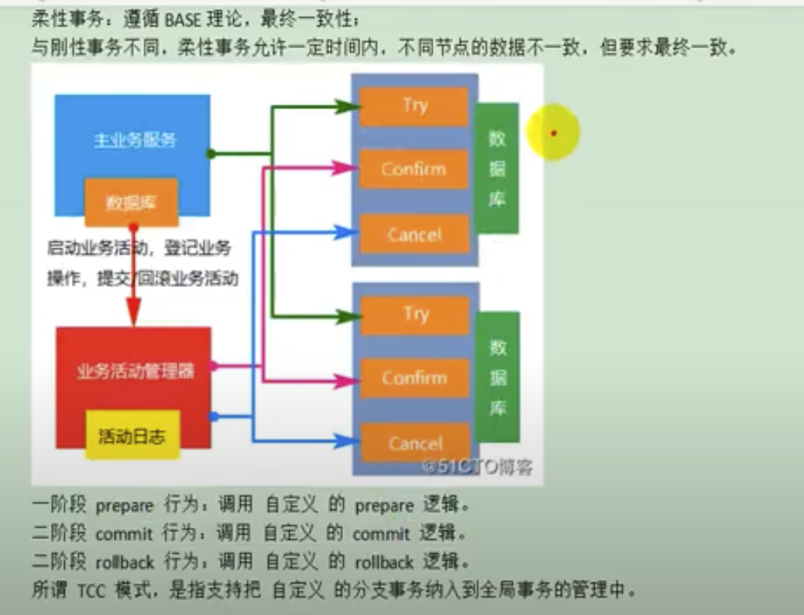</p>
- Metadata discover
  - https://datahubproject.io/
- IntelliJ create test from a class directly
  - https://youtu.be/kyWllXOGMWQ?t=472

### 20230205
- Java
  - 本地事務隔離級別, 傳播行為
    - https://youtu.be/Z-sR0K5dVPw?t=944

### 20230203
- 驗證(Authentication)與授權(Authorization)
  ```
  Authentication（驗證）：確認使用者是否真的是其所宣稱的那個人的過程。
  Authorization（授權）：根據使用者的角色來授予應有的權限。
  ```
    - https://youtu.be/L8M_eXV0OVk?si=4Ce72KAIBAzdN9Kw&t=33
      - Authentication : can access the App (software)
        - example : can access a friend's house
      - Authorization : can use the function in an App
          - example : can access rooms in the house
  - https://matthung0807.blogspot.com/2018/03/authenticationauthorization.html
  - https://www.ithome.com.tw/voice/134389
  - https://www.onelogin.com/learn/authentication-vs-authorization#:~:text=Authentication%20and%20authorization%20are%20two,authorization%20determines%20their%20access%20rights.

### 20230201
- Redshift
  - optimazation
    - https://zhuanlan.zhihu.com/p/398754264
    - https://blog.csdn.net/awschina/article/details/121759986
    - https://www.infoq.cn/article/yudaymzeokmbr3zgwxag
    - https://aws.amazon.com/cn/blogs/china/overview-of-ten-amazon-redshift-performance-tuning-techniques/
    - https://docs.aws.amazon.com/zh_cn/redshift/latest/dg/c-optimizing-query-performance.html
  - table design
    - https://aws.amazon.com/cn/blogs/china/amazon-redshift-table-design-databasedata/
  - `sharding, partition, ordering, design ideas` !!!
    - https://aws.amazon.com/cn/blogs/china/amazon-redshift-table-design-databasedata/

### 20230126
- Docker
  - docker container connect to local mysql (macbook)
    - https://juejin.cn/post/6965008009009315848
    - https://blog.csdn.net/JosephThatwho/article/details/103128794
    - https://www.cnblogs.com/aaabbbcccddd/p/14405804.html
- Redshift 
  - Intro
    - http://www.ilongda.com/knowledge/paper/redshift.html
    - https://www.infoq.cn/article/3e09axb8glwhswiskfix
  - WLM queue assignment rules
    - https://docs.aws.amazon.com/redshift/latest/dg/cm-c-wlm-queue-assignment-rules.html

### 20230125
- gitignore
  - negelect all files with below name (spring boot)
  -  https://youtu.be/4NLgelF5-rk?t=546
  -  https://github.com/yennanliu/SpringPlayground/blob/main/.gitignore#L36
```bash
**/mvnw
**/mvnw.cwd
**/.idea
**/.mvn
**/.iml
**/.cmd
**/target/
.idea
```

### 20230124
- Java spring boot/cloud
  - Idea intelliJ : Create multiple modules under a project
    - https://blog.csdn.net/wangmx1993328/article/details/121189232

### 20230121
- Java spring boot + RabbitMQ
  - json serialize / deserialize
    - https://youtu.be/8x4G7rRb9zo?t=624

### 20230114
- Java spring boot : multi thread pool
  - ref1
    - https://youtu.be/c134eGL062g?t=1603
    - https://youtu.be/c134eGL062g?t=2323
    - https://youtu.be/KeDhbCdmIvs?t=61
    - https://youtu.be/s9nJeXOD0C8?t=144
  - code
    - https://github.com/yennanliu/SpringPlayground/tree/main/springAdvance/springThreadPool

### 20230108
- Java
  - ThreadLocal : share data in the same thread
    - https://youtu.be/dop2UFz4am4?t=1198
    - https://kucw.github.io/blog/2018/7/java-thread-local/
- Linux
  - Access-Control list (ACL)
    - https://youtu.be/0vYydtG1Xi4?t=1517
    - `ownwer group others`
    - R: read
    - W : write
    - X : execute
    - modfiy ACL via `chmod`

### 20221213
- HTML
  - Nu HTML checker
    - https://validator.w3.org/nu/#textarea
    - https://stackoverflow.com/questions/56667637/getting-nullpointerexception-while-converting-html-to-pdf-using-java-and-itext7
- DB
  - partial index
    - https://docs.postgresql.tw/the-sql-language/index/partial-indexes
    - https://blog.csdn.net/neweastsun/article/details/113096327

### 20221211
- MySQL
  - `group_concat()` function
    - https://www.yiibai.com/mysql/group_concat.html#:~:text=GROUP_CONCAT%20%E5%87%BD%E6%95%B0%E8%BF%94%E5%9B%9E%E4%BA%8C%E8%BF%9B%E5%88%B6%E6%88%96,%E5%8F%98%E9%87%8F%E6%9D%A5%E6%89%A9%E5%B1%95%E6%9C%80%E5%A4%A7%E9%95%BF%E5%BA%A6%E3%80%82
    - https://www.footmark.com.tw/news/database/mysql/mysql-group-concat-json/
    - https://www.w3resource.com/mysql/aggregate-functions-and-grouping/aggregate-functions-and-grouping-group_concat.php
    - https://youtu.be/k9i6bOMt4rg?t=500

### 20221130
- Java
  - sort double list
    - https://stackoverflow.com/questions/16252269/how-to-sort-a-list-arraylist
    ```java
    // java
    testList.sort((a, b) -> Double.compare(b, a));
    ```

### 20221129
- SQL
  - compress SQL code
    - https://tool.lu/sql/
    - https://www.toolnb.com/tools-lang-zh-TW/sqlFormat.html
  - Mysql text type : TEXT, TINYTEXT, MEDIUMTEXT, LONGTEXT
    - https://www.analyticsvidhya.com/blog/2020/11/guide-data-types-mysql-data-science-beginners/#:~:text=LONGTEXT%20can%20store%20the%20maximum,LONGTEXT%20takes%204%2DBytes%20overhead.
    - https://blog.csdn.net/youcijibi/article/details/80673811
    ```sql
    # mysql cmd
    alter table my_db.my_table modify sql_template LONGTEXT
    ```

### 20221115
- Sringboot Java
  -  ObjectMapper : json <--> Java Object transformation
    - https://kucw.github.io/blog/2020/6/java-jackson/
    - https://tw.gitbook.net/jackson/jackson_objectmapper.html

### 20221114
- AWS S3 token expire with IAM, access key...
  - https://aws.amazon.com/premiumsupport/knowledge-center/presigned-url-s3-bucket-expiration/
  - https://stackoverflow.com/questions/57511301/load-data-from-s3-the-provided-token-has-expired

### 20221111
- Millisecond to day/hour/min..
  - https://www.calculateme.com/time/milliseconds/to-days/900000

### 20221105
- Java
  - super()
  - https://github.com/yennanliu/SpringPlayground/blob/main/courses/springBoot_springCloud_%E9%A0%82%E7%B4%9A%E9%96%8B%E7%99%BC_src_code/chapter04-efence/src/main/java/com/wudimanong/efence/exception/ServiceException.java#L11
  ```java
  // java
      public ServiceException(Integer code, String message) {
    super(message); // TODO: double check this
    this.code = code;
      }

  ```
  - Spring boot
    - @ExceptionHandler(Exception.class)
    - @ControllerAdvice
    - https://github.com/yennanliu/SpringPlayground/blob/main/courses/springBoot_springCloud_%E9%A0%82%E7%B4%9A%E9%96%8B%E7%99%BC_src_code/chapter04-efence/src/main/java/com/wudimanong/efence/exception/GlobalExceptionHandler.java#L23

### 20221105
- Java
  - generic type
    - https://www.runoob.com/java/java-generics.html
    ```
    java 中泛型标记符：
    
    E - Element (在集合中使用，因为集合中存放的是元素)
    T - Type（Java 类）
    K - Key（键）
    V - Value（值）
    N - Number（数值类型）
    ？ - 表示不确定的 java 类型
    ```
  - stream
    - https://mycollegenotebook.medium.com/java-stream-%E7%AD%86%E8%A8%98-%E4%B8%8A-34df0e282fc8
    - https://mycollegenotebook.medium.com/java-stream-%E7%AD%86%E8%A8%98-%E4%B8%8B-d8fc2d227e16
    - https://tw511.com/a/01/22301.html

### 20221104
- Spring boot
  ```java
  // java
  @Target({METHOD, FIELD, ANNOTATION_TYPE, CONSTRUCTOR, PARAMETER}) // TODO : double check it
  @Retention(RUNTIME)
  @Documented
  @Constraint(validatedBy = {EnumValue.EnumValueValidator.class})
  ```
- Java
  - Class<?>
  

### 20221102
- Java
  - `Collectors.groupingBy`
  ```java
      Map<String, List<MyReport>> monthReportMap = myReport.stream()
        .collect(Collectors.groupingBy(MyReport::getOwnerGroupKey));
  ```
  - https://github.com/yennanliu/JavaHelloWorld/blob/e3f4dc87ddbe034d5ae1eff09ea209478596e7fc/src/main/java/dev/StreamTest1.java#L60

### 20221029
- Java
  - parse object (whatever type) to json
    - https://youtu.be/wGtcsi65arQ?t=494
    - https://blog.csdn.net/xuexi_gan/article/details/114915890
    - https://www.runoob.com/w3cnote/fastjson-intro.html
    ```java
    // java
    Map<String, List<Catelog2Vo>> result = JSON.parseObject(CatelogJSON, new TypeReference<Map<String, List<Catelog2Vo>>>() {} );
    ```

### 20221028
- Java
  - `@Import` annotation
    - https://www.itread01.com/article/1532997860.html
    - https://blog.csdn.net/tuoni123/article/details/80213050
    - https://www.jianshu.com/p/6b2f672e2446
    - https://blog.csdn.net/qq_52496081/article/details/121833395
- AWS
  - S3 presignedURL max expire time
    - https://docs.aws.amazon.com/AmazonS3/latest/API/sigv4-query-string-auth.html
      - Provides the time period, in seconds, for which the generated presigned URL is valid. For example, 86400 (24 hours). This value is an integer. The minimum value you can set is 1, and the maximum is 604800 (seven days).
      - A presigned URL can be valid for a maximum of seven days because the signing key you use in signature calculation is valid for up to seven days.
    - https://stackoverflow.com/questions/24014306/aws-s3-pre-signed-url-without-expiry-date
    - https://docs.amazonaws.cn/en_us/AmazonS3/latest/userguide/ShareObjectPreSignedURL.html
    
### 20221024
- Java
  - Jshell (java REPL)
    - https://docs.oracle.com/javase/9/jshell/introduction-jshell.htm
    - https://www.tpisoftware.com/tpu/articleDetails/1089 

### 20221023
- System monitoring
  - Skywalking
    - https://dubbo.apache.org/zh/docs/v2.7/admin/ops/skywalking/#:~:text=%E5%88%86%E5%B8%83%E5%BC%8F%E8%B7%9F%E8%B8%AA-,Apache%20Skywalking%20%E7%AE%80%E4%BB%8B,%E9%97%B4%E5%85%B3%E7%B3%BB%E4%BB%A5%E5%8F%8A%E6%9C%8D%E5%8A%A1%E6%8C%87%E6%A0%87%E3%80%82
    - https://juejin.cn/post/7002389720315461640
    - https://www.jianshu.com/p/ffa7ddcda4ab
  - General
    - https://www.youtube.com/watch?v=6pquxpmk4R8&list=PLmOn9nNkQxJEwPjhNwGliP_bw3RjkgFCf&index=141
    - <p>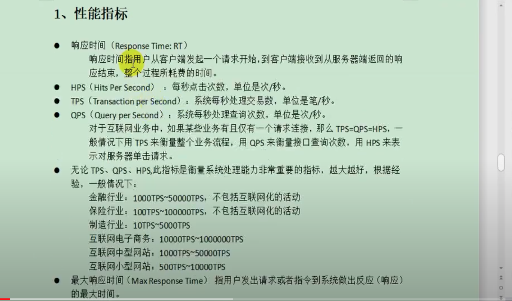</p>
    - <p>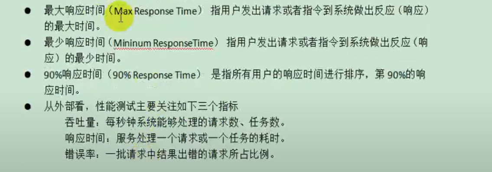</p>

### 20221022
- Java
  - Java Collectors toMap()
    - https://www.baeldung.com/java-collectors-tomap
    - https://vimsky.com/zh-tw/examples/usage/collectors-tomap-method-in-java-with-examples.html
    - https://youtu.be/lq-xGkEm140?t=693
    ```java
    // java
    data.stream().collect(Collectors.toMap( k -> k.getId(), v -> {return v.gatValue()} )) 
    ```
- Nginx conf
  - <p></p>

### 20221019
- Java
  - x == null VS x.equals(null)
  - can also use `spring StringUtils.isEmpty` check if empty
    - https://docs.spring.io/spring-framework/docs/current/javadoc-api/org/springframework/util/StringUtils.html

### 20221013
- Spring boot
  - Pinpoint
    - https://pinpoint-apm.github.io/pinpoint/2.1.0/main.html
    - https://blog.csdn.net/it_lihongmin/article/details/124160500
    - https://www.jianshu.com/p/03dc1377f137

### 20221004
- Spring boot
  - MapStruct
    - `XXXDTO <----> XXXVO <----> XXXBO <----> ....` transformation
    - https://www.tpisoftware.com/tpu/articleDetails/2443
    - https://springboot.io/t/topic/4162
    - https://www.itread01.com/details/MnRvMA==.html

### 20221003
- Java
  - [netty](https://netty.io/)
  - [dubbo apache](https://dubbo.apache.org/en/)

### 20220929
- sdkman
  - https://sdkman.io/

### 20220927
- Java
  - Stream map op (get collections of Stream map result)
        - 
  - Ref
    - video
      - https://www.youtube.com/watch?v=PFtMlUlCZgY&list=PLmOn9nNkQxJEwPjhNwGliP_bw3RjkgFCf&index=81
      - https://www.youtube.com/watch?v=7JOhxs7lYbE&list=PLmOn9nNkQxJEwPjhNwGliP_bw3RjkgFCf&index=80
    - code
      - https://github.com/yennanliu/JavaHelloWorld/blob/main/src/main/java/dev/StreamMapTest.java
  ```java
  // java
  List<String> brand_list = car_list.stream().map(x -> {
            String brand = x.getBrand();
            return brand;
        }).collect(Collectors.toList());
  ```

### 20220919
- Spring boot
  - user-defined general exceptions
    - https://www.youtube.com/watch?v=UT9lRWUwDGQ&list=PLmOn9nNkQxJEwPjhNwGliP_bw3RjkgFCf&index=68

### 20220915
- Spring boot
  - `this` VS `self`

### 20220915
- Spring boot
  - `@Transactional` (事務性)
    - https://www.tpisoftware.com/tpu/articleDetails/2741
    - https://www.readfog.com/a/1637926921197162496
    - https://kknews.cc/zh-tw/code/9ggzjq8.html
    - https://www.marcobehler.com/guides/spring-transaction-management-transactional-in-depth
    - https://www.gushiciku.cn/pl/givy/zh-tw

### 20220914
- Mybatis plus lambda
  - https://www.796t.com/content/1541640975.html
  - https://blog.csdn.net/m0_37034294/article/details/82917234
  - https://blog.csdn.net/liuxing201122013/article/details/120874343
- Spring booot
  - `consumes, produces` in RequestMapping
    - https://medium.com/@lemonchen/requestmapping-%E8%A8%BB%E8%A7%A3%E4%B8%ADconsumes-produces-%E5%B7%AE%E5%88%A5-d0a9a79fdbb8
    - https://blog.csdn.net/jaryle/article/details/72965885
- HTTP
  - MIME TYPE
    - https://topic.alibabacloud.com/tc/a/network-what-is-mime-type_1_38_30917192.html
    - https://www.796t.com/p/616463.html
- Eng soft skill
  - [An Elegant Puzzle: Systems of Engineering Management](https://www.amazon.com/dp/1732265186/ref=as_sl_pc_as_ss_li_til?tag=danlebrero-20&linkCode=w00&linkId=a91305ee2692c674733bd592ec7c897d&creativeASIN=1732265186)
  - [Staff Engineer: Leadership beyond the management track ](https://www.amazon.com/Staff-Engineer-Leadership-beyond-management-ebook/dp/B08RMSHYGG)
  - [will larson twitter](https://twitter.com/Lethain)

### 20220912
- Spring boot
  - `Validation`, `valid`
    - https://bingdoal.github.io/backend/2021/10/spring-boot-validate-request-body-and-nest-validate/
    - https://bingdoal.github.io/backend/2021/10/spring-boot-validation-customize-validator-and-annotation/
    - https://morosedog.gitlab.io/springboot-20190403-springboot20/
  - `切面導向程式設計（Aspect Oriented Programming，AOP`
    - https://chikuwa-tech-study.blogspot.com/2021/06/spring-boot-aop-introduction.html
    - https://ithelp.ithome.com.tw/articles/10279178
    - https://medium.com/appxtech/spring-aop%E7%99%BD%E8%A9%B1%E6%96%87-%E6%B7%BA%E8%AB%87spring-aop%E7%9A%84%E5%AD%B8%E7%BF%92%E5%88%86%E4%BA%AB-1985489d008
  - `AOP` terms
    - https://ithelp.ithome.com.tw/articles/10270418
    - @Aspec : 用於標記切面類別。
    - @Pointcut : 標記切入點。
    - @Before : 在切入點開始處執行。
    - @After : 在切入點結尾處執行。
    - @AfterReturning : 在切入點傳回(return)內容後執行，用於對傳回內容進行一些加工處理。
    - @Around : 在切入點前後執行，並可控制何時執行切入點本身的內容。
    - @AfterThrowing : 當切入點拋出例外後執行。
- Scala
  - `ZIO` course
    - https://rockthejvm.com/p/zio
      - ZIO is a Scala toolkit that allows us to write powerful, concurrent, and high-performance applications in Scala using pure functional programming.
    - https://github.com/rockthejvm/zio-course

### 20220907
- Mysql
  - BLOB VS Binary
    - http://c.biancheng.net/view/2428.html
    - https://blog.csdn.net/weixin_42363501/article/details/113424096

### 20220904
- Web dev
  - 跨域請求 Cross-Origin Resource Sharing (CORS)
    - https://www.youtube.com/watch?v=VNP6inKmw5I&list=PLmOn9nNkQxJEwPjhNwGliP_bw3RjkgFCf&index=48
    - https://developer.mozilla.org/zh-TW/docs/Web/HTTP/CORS
- Java
  - load files under `/resources`
    - https://github.com/yennanliu/JavaHelloWorld/blob/main/src/main/java/dev/ParseCSVTest.java
    - https://stackoverflow.com/questions/15749192/how-do-i-load-a-file-from-resource-folder

### 20220903
- Spring boot
  - lombok `@Builder`
    - https://hackmd.io/@KaiChen/S145q3NP8
    - https://matthung0807.blogspot.com/2019/11/lombok-builder.html
    - https://walkonnet.com/archives/10611
  - JSP
- Java
  - set default val if null
    - https://youtu.be/5aWkhC7plsc?t=1099
    ```java
    // sample code
    (menu1.getSort() == null ? 0);
    ```

### 20220901
- PageHelper doc
  - https://pagehelper.github.io/docs/howtouse/

### 20220830
- AWS S3
  - Why is my presigned URL for an Amazon S3 bucket expiring before the expiration time that I specified?
    - https://aws.amazon.com/premiumsupport/knowledge-center/presigned-url-s3-bucket-expiration/
  - Examples: Signature Calculations in AWS Signature Version 4 (java)
    - https://docs.aws.amazon.com/AmazonS3/latest/API/sig-v4-examples-using-sdks.html#sig-v4-examples-using-sdk-java
  - How do I utilize AWS Signature v4 when generating a presigned S3 URL?
    - https://stackoverflow.com/questions/50090241/how-do-i-utilize-aws-signature-v4-when-generating-a-presigned-s3-url
  - How to check presignedURL expire time (Signature Version 4)?
    - https://stackoverflow.com/questions/46865679/amazon-s3-how-to-check-if-presigned-url-is-expired
    - `Amz-Expires is the expiration time in seconds, while X-Amz-Date is the the timestamp `

### 20220822
- Spring boot
  - cron scheduling
    - https://stackoverflow.com/questions/26147044/spring-cron-expression-for-every-day-101am
    - https://docs.spring.io/spring-framework/docs/3.2.x/spring-framework-reference/html/scheduling.html#scheduling-annotation-support
  - spring cron generator/explanation (with cron code)
    - https://www.javainuse.com/cron
    - https://codepen.io/etienne582/pen/xxOgwzX
  ```java
  * "0 0 * * * *" = the top of every hour of every day.
  * "*/10 * * * * *" = every ten seconds.
  * "0 0 8-10 * * *" = 8, 9 and 10 o'clock of every day.
  * "0 0 8,10 * * *" = 8 and 10 o'clock of every day.
  * "0 0/30 8-10 * * *" = 8:00, 8:30, 9:00, 9:30 and 10 o'clock every day.
  * "0 0 9-17 * * MON-FRI" = on the hour nine-to-five weekdays
  * "0 0 0 25 12 ?" = every Christmas Day at midnight
  ```

### 20220816
- AWS S3
  - 存取控制清單(Access Control List, ACL
    - https://zh.wikipedia.org/zh-tw/%E5%AD%98%E5%8F%96%E6%8E%A7%E5%88%B6%E4%B8%B2%E5%88%97
    - https://docs.aws.amazon.com/zh_tw/AmazonS3/latest/userguide/amazon-s3-condition-keys.html
    - https://aws.amazon.com/tw/premiumsupport/knowledge-center/s3-bucket-owner-full-control-acl/
  - `Timeout waiting for connection from pool while calling S3client.getObject`
    - https://github.com/aws/aws-sdk-java/issues/1405

### 20220814
- Spring boot
  - RestTemplate
    - https://openhome.cc/Gossip/Spring/RestTemplate.html
    - https://elim168.github.io/spring/bean/30.Spring%E4%B9%8BRestTemplate%E4%BB%8B%E7%BB%8D.html#:~:text=RestTemplate%E6%98%AFSpring%20Web%E6%A8%A1%E5%9D%97,RestTemplate%E6%93%8D%E4%BD%9C%E5%B0%86%E9%9D%9E%E5%B8%B8%E6%96%B9%E4%BE%BF%E3%80%82
    - https://www.796t.com/article.php?id=38894
    - https://zhuanlan.zhihu.com/p/78261630
- Apache JMeter
  - designed to load test functional behavior and measure performance. It was originally designed for testing Web Applications but has since expanded to other test functions.
  - https://jmeter.apache.org/download_jmeter.cgi
  - https://ithelp.ithome.com.tw/articles/10203900#:~:text=%E7%B0%A1%E4%BB%8B,Mac%20OS%20X%20%E4%B8%8A%E5%9F%B7%E8%A1%8C%E3%80%82
  - https://ithelp.ithome.com.tw/articles/10186852
  - https://stackoverflow.com/questions/22610316/how-do-i-install-jmeter-on-a-mac

### 20220811
- Freemarker
  - `freemarker.template.TemplateNotFoundException: Template not found for name “xxx.ftl“`
    - https://blog.csdn.net/hdn_kb/article/details/108405971
    - https://blog.csdn.net/weixin_45196863/article/details/119428018
    - https://www.twblogs.net/a/5efdd05ee53eaf40aa871903
    - https://www.cnblogs.com/chenfeng1122/p/6884576.html
  ```xml
  <!-- example V1 -->
  <!-- put below in <build></build> in pom.xml -->
  <resources>
            <resource>
                <directory>${basedir}/src/main/java</directory>
                <includes>
                    <include>**/*.*</include>
                </includes>
                <excludes>
                    <exclude>**/*.java</exclude>
                </excludes>
                <filtering>false</filtering>
            </resource>
        </resources>
  
  <!-- example V2 -->
  <resources>
            <resource>
                <directory>src/main/resources</directory>
                <includes>
                    <include>**/*.*</include>
                </includes>
            </resource>
        </resources>
  ```

### 20220809
- AWS S3
  - download s3 file by the URL in a browser
    - https://stackoverflow.com/questions/50151062/unable-to-download-a-file-from-s3-by-the-url-in-a-browser
  - presigned URL from S3 object
    - https://docs.aws.amazon.com/sdk-for-java/latest/developer-guide/examples-s3-presign.html
    - https://docs.aws.amazon.com/AmazonS3/latest/userguide/ShareObjectPreSignedURL.html

### 20220806
- Spring boot
  - 跨域訪問
    - jsoup
    - CORS (cross-origin resource sharing)
      - https://bbs.huaweicloud.com/blogs/346514

### 20220805
- FreeMarker
  - `Apache FreeMarker™ is a template engine: a Java library to generate text output (HTML web pages, e-mails, configuration files, source code, etc.) based on templates and changing data.`
  - https://freemarker.apache.org/
  - http://freemarker.foofun.cn/index.html
  - http://blog.appx.tw/2017/05/10/freemarker1/
  - http://blog.appx.tw/2017/05/11/freemarker2/
- DB
  - SQL jdbc connection pool
    - https://www.baeldung.com/java-connection-pooling
    - https://www.progress.com/tutorials/jdbc/jdbc-jdbc-connection-pooling

### 20220804
- Apollo
  - `conf ordering : Apollo VS local conf (e.g. application.yml, bootstrap.properties..)`
    - https://www.modb.pro/db/126648
    - https://blog.csdn.net/lonelymanontheway/article/details/119968760
    - Conclusion : `will load Apollo conf only if both (Apollo, local) are set`

### 20220803
- AWS
  - IAM key
    - https://docs.aws.amazon.com/zh_tw/IAM/latest/UserGuide/id_credentials_access-keys.html
- Spring cron setting (e.g. : `@Scheduled(cron = "0 0 12 * * * ")`)
  - https://blog.csdn.net/weixin_39925350/article/details/111391748
- `lombok @Accessors(chain=true)`
  https://blog.51cto.com/wangzhenjun/4314997
  - https://www.jianshu.com/p/67a15b2e4a92
  - https://blog.csdn.net/weixin_38229356/article/details/82937420
```java
// traditional
Person person = new Person();
person.setName("wang");
person.setSex("male");
person.setEmail("123@XXX.com");
person.setDate(new Date());
person.setAddr("NY");

// with @Accessors(chain = true)
Person person = new Person();
person.setName("wang").setSex("male").setEmail("123@xxx.com").setDate(new Date()).setAddr("NY");
```

### 20220802
- XXL-JOB
  - integrate with java (spring boot)
    - https://www.xuxueli.com/xxl-job/#3.3%20GLUE%E6%A8%A1%E5%BC%8F(Java)
    - https://www.796t.com/article.php?id=161562
    - https://iter01.com/663746.html
    - https://juejin.cn/post/7068110940499083271
- Java AWS S3 SDK
```java
import com.amazonaws.services.s3.AmazonS3;
import com.amazonaws.services.s3.AmazonS3ClientBuilder;
import com.amazonaws.services.s3.AmazonS3URI;
```

### 20220731
- Java
  - 自旋鎖 spinlock
    - https://learnku.com/articles/49689
    - https://codertw.com/%E7%A8%8B%E5%BC%8F%E8%AA%9E%E8%A8%80/748267/

### 20220728
- Java
  - JSONObject -> HashMap
    - https://stackoverflow.com/questions/21720759/convert-a-json-string-to-a-hashmap
- Python
  - GIL（Global Interpreter Lock）
    - https://iter01.com/596673.html
    - https://www.maxlist.xyz/2020/03/15/gil-thread-safe-atomic/
  - GIL VS regular lock, and their low level implementation
  - Mutable & Immutable Objects in Python
    - https://www.guru99.com/mutable-and-immutable-in-python.html
    - https://towardsdatascience.com/https-towardsdatascience-com-python-basics-mutable-vs-immutable-objects-829a0cb1530a
  - python multiprocessing vs multithreading
    - https://timber.io/blog/multiprocessing-vs-multithreading-in-python-what-you-need-to-know/
    - https://stackoverflow.com/questions/3044580/multiprocessing-vs-threading-python

### 20220727
- Airflow
  - Airflow as KafkaProducer, send event to kafka topic
    - https://pypi.org/project/airflow-provider-kafka/0.1.0/
    - https://stackoverflow.com/questions/46778171/stream-files-to-kafka-using-airflow
- Backend
  - Distributed lock - `Zookeeper, Redis, Mysql`
    - `Zookeeper` is better solution in general
    - https://codertw.com/%E7%A8%8B%E5%BC%8F%E8%AA%9E%E8%A8%80/717420/
    - https://www.796t.com/p/1123418.html
    - https://gitbook.cn/books/5dd75cffd251cc422ab2e7fb/index.html
    - https://blog.yowko.com/redlocknet-redis-lock/
    - https://yuanchieh.page/posts/2020/2020-01-14_redis-lock-redlock-%E5%8E%9F%E7%90%86%E5%88%86%E6%9E%90%E8%88%87%E5%AF%A6%E4%BD%9C/
    - https://redis.io/docs/reference/patterns/distributed-locks/
  - ScheduledThreadPool (Java)
    - https://blog.csdn.net/qq_35580883/article/details/78747263
    - https://www.jianshu.com/p/925dba9f5969
    - https://ithelp.ithome.com.tw/articles/10207656
    - https://www.cjavapy.com/article/2621/

### 20220726
- Spring boot form
  - https://www.writebug.com/explore/article/g5wnHnxy
  - https://github.com/forezp/SpringBootLearning
  - https://github.com/yennanliu/SpringPlayground/tree/main/ref_project/markdown-blog-main
- Mybatis
  - via `resultMap` do java attr - Db column name mapping
    - https://www.youtube.com/watch?v=gk_pm_Uaa_Y&list=PLmOn9nNkQxJEWFBs6hVmDC5m8SbbIiDwY&index=42
    - https://blog.csdn.net/weixin_40340362/article/details/93128692
    - https://www.796t.com/content/1547529875.html
    - https://xuzhongcn.github.io/mybatis/MyBatis-02.html
  - `org.apache.ibatis.binding.BindingException: Invalid bound statement (not found)` error
    - https://blog.csdn.net/weixin_43570367/article/details/103147854
    -> can try to rebuild maven project first

### 20220724
- Nginx : `Reverse Proxy web server`
  - Web Serveer VS Application Server, Forward Proxy VS Reverse Proxy, 反向代理
    - https://medium.com/starbugs/web-server-nginx-1-cf5188459108
    - https://www.maxlist.xyz/2020/06/18/flask-nginx/
    - https://zh.m.wikipedia.org/zh-hant/Nginx#:~:text=Nginx%EF%BC%88%E7%99%BC%E9%9F%B3%E5%90%8C%E3%80%8Cengine%20X,%E5%85%AC%E5%8F%B8%E4%BB%A5%E6%8F%90%E4%BE%9B%E6%94%AF%E6%8C%81%E6%9C%8D%E5%8B%99%E3%80%82
  - 前向代理（Proxy)（網路代理)
    - 也稱網路代理，是一種特殊的網路服務，允許一個終端（一般為客戶端）通過這個服務與另一個終端（一般為伺服器）進行非直接的連接。一些閘道器、路由器等網路裝置具備網路代理功能。一般認為代理服務有利於保障網路終端的隱私或安全，在一定程度上能夠阻止網路攻擊。
    - 前向代理作為客戶端的代理，將從網際網路上取得的資源返回給一個或多個的客戶端，伺服器端（如Web伺服器）只知道代理的IP位址而不知道客戶端的IP位
    - https://zh.wikipedia.org/zh-tw/%E4%BB%A3%E7%90%86%E6%9C%8D%E5%8A%A1%E5%99%A8
  - 反向代理
    - 反向代理在電腦網路中是代理伺服器的一種。伺服器根據客戶端的請求，從其關聯的一組或多組後端伺服器（如Web伺服器）上取得資源，然後再將這些資源返回給客戶端，`客戶端只會得知反向代理的IP位址，而不知道在代理伺服器後面的伺服器叢集的存在`。
    - 而反向代理是作為伺服器端（如Web伺服器）的代理使用，而不是客戶端。客戶端藉由前向代理可以間接存取很多不同網際網路伺服器（叢集）的資源
    - https://zh.wikipedia.org/zh-tw/%E5%8F%8D%E5%90%91%E4%BB%A3%E7%90%86#:~:text=%E5%8F%8D%E5%90%91%E4%BB%A3%E7%90%86%E5%9C%A8%E9%9B%BB%E8%85%A6,%E4%BC%BA%E6%9C%8D%E5%99%A8%E5%8F%A2%E9%9B%86%E7%9A%84%E5%AD%98%E5%9C%A8%E3%80%82
  - <p>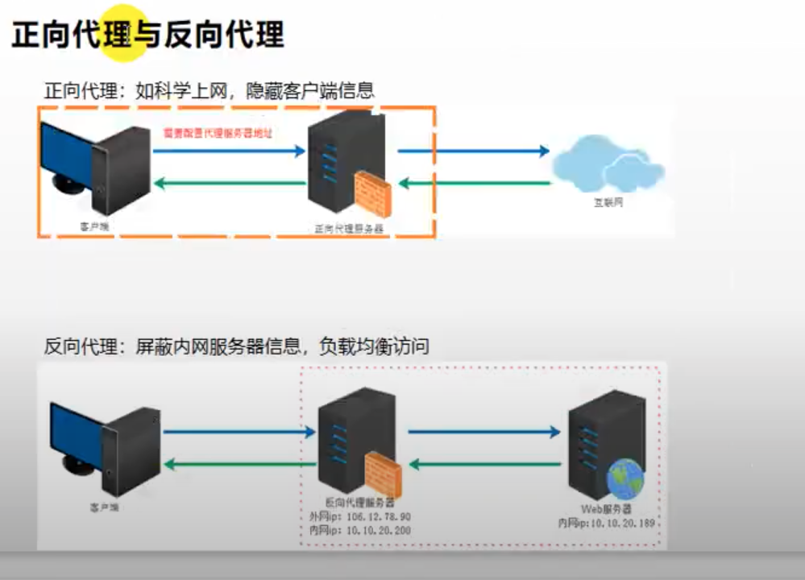</p>
  - <p>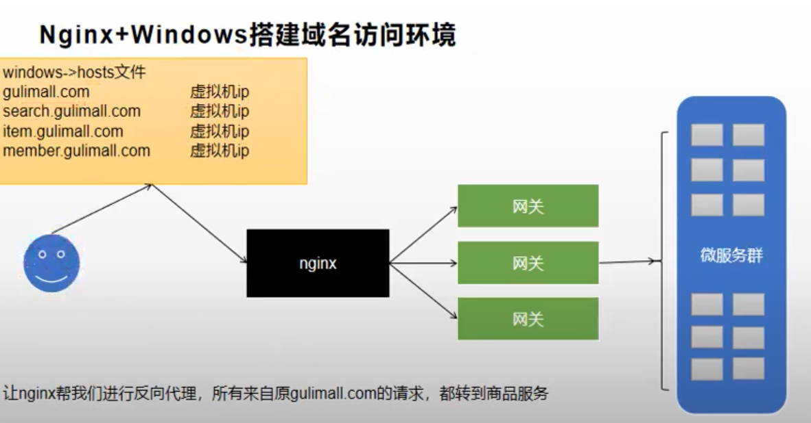</p>

### 20220722
- Mybatis plus
  - queryWrapper
    - https://blog.csdn.net/m0_37034294/article/details/82917234
  - com.baomidou.mybatisplus.extension.service.impl.ServiceImpl
    - https://www.twblogs.net/a/5c8a4f2bbd9eee35cd6a9d76

### 20220719
- Java
  - time zone enum example
    - https://github.com/roth-source/roth-lang/blob/master/roth-lang/src/main/java/roth/lang/TimeZone.java
    - https://www.w3resource.com/java-exercises/datetime/java-datetime-exercise-43.php
    - https://mkyong.com/java/java-display-list-of-timezone-with-gmt/

### 20220718
- Spring boot
  - POJO、PO、DTO、VO、BO
    - brief :
      - PO (persistent object)
      - DTO (Data Transfer Object)
      - VO (value object)
      - DAO (data access object)
      - BO (business object)
    - Ref :
      - https://hackmd.io/@MonsterLee/HJyAdgRBB
      - https://www.cnblogs.com/tooyi/p/13340374.html

### 20220716
- Mybatis grammer
  - dynamic SQL
    - https://mybatis.org/mybatis-3/dynamic-sql.html
- Postman
  - HTTP request to `gray deployment`
    - TODO
- Devop
  - Using Services to Implement Simple Grayscale Release and Blue-Green Deployment
    - https://support.huaweicloud.com/intl/en-us/bestpractice-cce/cce_bestpractice_10002.html
    - https://support.huaweicloud.com/intl/en-us/bestpractice-cce/cce_bestpractice_10003.html

### 20220715
- Java
  - map Enum type to DB
    - https://vladmihalcea.com/the-best-way-to-map-an-enum-type-with-jpa-and-hibernate/
    - https://www.baeldung.com/jpa-persisting-enums-in-jpa
    - https://thorben-janssen.com/hibernate-tips-map-enum-database-column/

### 20220709
- Mybatis paging (分頁)
  - https://www.cnblogs.com/tanghaorong/p/14017180.html
  - https://tw.gitbook.net/mybatis/mybatis_pagination.html
  - https://blog.csdn.net/feinifi/article/details/88769101
  - https://juejin.cn/post/6996303139540467749
  - https://aijishu.com/a/1060000000023074
  - https://www.google.com/search?q=mybatis+%E5%88%86%E9%A0%81&rlz=1C5CHFA_enTW908TW908&oq=mybatis+%E5%88%86%E9%A0%81&aqs=chrome..69i57j0i5i30j0i8i30.3887j0j7&sourceid=chrome&ie=UTF-8
  - code
    - https://github.com/yennanliu/SpringPlayground/blob/dev-017-prod-api-group-sub-group/springEcommerceGuli/backend/EcommerceGuli/gulimall-product/src/main/java/com/yen/gulimall/product/config/MybatisConfig.java
    - https://github.com/yennanliu/SpringPlayground/tree/dev-017-prod-api-group-sub-group/springBasics/PaginationDemo

### 20220708
- Mybatis
  - #{} VS ${}
    - https://www.w3cschool.cn/mybatis/mybatis-yta93bpj.html
  - w3school
    - https://www.w3cschool.cn/mybatis/mybatis-dyr53b5w.html

### 20220705
- Mysql
  - insert update update if duplicate
    - https://www.alibabacloud.com/help/en/analyticdb-for-mysql/latest/insert-on-duplicate-key-update
    - https://www.mysqltutorial.org/mysql-insert-or-update-on-duplicate-key-update/
    - https://blog.csdn.net/u011066470/article/details/100098626

### 20220703
- Spring Boot
  - Spring Data JPA
    - https://www.gss.com.tw/blog/spring-data-jpa-1#:~:text=Spring%20Data%20JPA%20%E6%98%AFSpring,%E4%BD%A0%E5%AF%A6%E4%BD%9C%E5%85%B6%E5%8A%9F%E8%83%BD%E3%80%82
    - https://ithelp.ithome.com.tw/articles/10194906

### 20220701
- Spring Boot
  - `@Configuration` annotation
    - https://blog.csdn.net/loongkingwhat/article/details/105752446
    - https://juejin.cn/post/7034421582034370597
    - https://iter01.com/580722.html

### 20220629
- Spring boot
  - `Error creating bean with name 'dataSource' defined in class path resource`
    - https://blog.csdn.net/wcc27857285/article/details/90679424
  - `@RequestBody VS @RequestParam`
    - https://blog.csdn.net/weixin_38004638/article/details/99655322
    - https://www.gushiciku.cn/pl/pnqB/zh-tw
  - POSTMAN sends user-defined-class with `@RequestParam` via GET request
    - https://www.twblogs.net/a/5eeec3017301656afddacbd8/?lang=zh-cn

### 20220627
- Micro service
  - CircuitBreaker (服務熔斷)
    - https://martinfowler.com/bliki/CircuitBreaker.html
    - https://youtu.be/FOHjhgdc6tw?t=371
- Spring boot
  - Paging
    - https://hackmd.io/@KaiChen/HJEN-mMVw
    - https://rumenz.com/java-topic/spring-boot2/pagination-sorting-example/index.html
    - https://matthung0807.blogspot.com/2019/09/spring-data-jpa-pagination-and-sorting.html
  - Unit test
    - https://kucw.github.io/blog/2020/2/spring-unit-test-mockito/
    - https://www.tpisoftware.com/tpu/articleDetails/1256
    - https://spring.io/guides/gs/testing-web/
    - https://www.baeldung.com/spring-boot-testing
    - [ref code](https://github.com/yennanliu/LambdaHelloWorld/blob/master/lab2/simple-handler/src/test/java/com/yen/SimpleHandlerTest.java) : unit test with mockito
    - [ref code2](https://github.com/yennanliu/JavaHelloWorld/blob/main/src/test/java/MockitoDemo/MyClassTest.java)

### 20220624
- MyBatis
  - mapper.xml, java bean - JDBC table col name mapping
    - https://youtu.be/4wWM7MmfxXw?t=1171
    - https://github.com/yennanliu/SpringPlayground/blob/main/springCloud1/cloud-provider-payment8001/src/main/resources/mapper/PaymentMapper.xml
  - enable camel style (java bean <-> SQL fields)
    - https://www.cnblogs.com/gavincoder/p/10140562.html
- `Pom.xml`
  - scope (e.g. `<scope>compile</scope>`, `<scope>provided</scope>`...)
    - https://blog.csdn.net/mccand1234/article/details/60962283
    - https://blog.csdn.net/kimylrong/article/details/50353161
    - https://segmentfault.com/a/1190000038594247

### 20220622
- Mybatis
  - `Error:java: Can‘t generate mapping method with primitive return type.`
    - https://www.cnblogs.com/andjieran/p/15974630.html
    - https://www.cnblogs.com/mike-mei/p/15792360.html
- Mybatis plus
  - BaseMapper
    - https://walkonnet.com/archives/452416
    - https://blog.csdn.net/qq924862077/article/details/81774958

- mysql insert with increment id
  - https://www.fooish.com/sql/auto-increment.html

### 20220621
- Maven (pom.xml)
  - `dependencyManagement VS dependency`
    - https://youtu.be/uG_UKEa41-s?t=51
    - https://kknews.cc/zh-tw/code/bmyyy4j.html
    - https://blog.csdn.net/vtopqx/article/details/79034835
    - https://www.796t.com/content/1546777827.html
- Mybatis dynamic SQL
  - https://mybatis.org/mybatis-3/dynamic-sql.html
- spring-cloud-starter-feign
  - https://spring-cloud-wiki.readthedocs.io/zh_CN/latest/pages/feign.html#:~:text=Feign%E6%98%AF%E4%B8%80%E4%B8%AA%E5%A3%B0%E6%98%8E%E5%BC%8F,%E6%9C%8D%E5%8A%A1%E8%AF%B7%E6%B1%82%E5%8F%8A%E7%9B%B8%E5%85%B3%E5%A4%84%E7%90%86%E3%80%82
  - https://tw511.com/a/01/26332.html

### 20220617
- Spring boot
  - @RestController VS @Controller
    - 如果返回 String 或者 json 的話就直接類上用 @RestController
    - 如果想要頁面跳轉的話，就使用 @Controller
    - 如果只有在某方法上返回 json，其他方法跳轉頁面，則在類上新增 @Controller，在需要返回 String 和 json 的方法上新增 @ResponseBody 註解
    - https://www.796t.com/content/1546330804.html
    - https://blog.csdn.net/ld1170813335/article/details/78690713

### 20220615
- Spring boot/cloud
  - use user-defined modules
    - https://blog.csdn.net/liaomingwu/article/details/122442649
    - https://blog.51cto.com/u_15239532/5144312
    - https://blog.csdn.net/qq_29718835/article/details/120828561
  - Download API code example
    - https://www.callicoder.com/spring-boot-file-upload-download-rest-api-example/
    - http://www.mastertheboss.com/jboss-frameworks/resteasy/using-rest-services-to-manage-download-and-upload-of-files/
    - https://www.devglan.com/spring-boot/spring-boot-file-upload-download#:~:text=Spring%20Boot%20File%20Download%20from%20Local%20File%20System&text=It%20is%20a%20simple%20GET,as%20application%2Foctet%2Dstream.
  - Spring Boot + AWS S3 Download Bucket File
    - https://www.techgeeknext.com/cloud/aws/amazon-s3-springboot-download-file-in-s3-bucket
    - https://codezup.com/upload-download-and-delete-file-from-aws-s3-spring-boot/

### 20220614
- Deployment Strategies: `Blue-Green, Canary (AKA 灰度發布 gray deployment), Red-Black Deployment`
  - https://harness.io/blog/continuous-verification/blue-green-canary-deployment-strategies/
  - https://segmentfault.com/a/1190000040892537/en
  - https://dev.to/mostlyjason/intro-to-deployment-strategies-blue-green-canary-and-more-3a3
  - http://www.uj5u.com/qita/281580.html
  - https://codertw.com/%E7%A8%8B%E5%BC%8F%E8%AA%9E%E8%A8%80/725615/
  - Red-Black Deployment
    - https://www.gushiciku.cn/pl/gUOs/zh-tw

### 20220606
- Spring boot
  - BeanUtils.copyProperties
    - https://www.796t.com/article.php?id=20809
    - https://www.796t.com/p/588001.html
  - Mybatis plus
    - @TableLogic
      - https://blog.csdn.net/qq_39454665/article/details/116199952
      - https://blog.csdn.net/Rm_and_Rf/article/details/106927318
- AWS
  - Redshift API (java)
    - https://docs.aws.amazon.com/zh_tw/redshift/latest/mgmt/data-api.html
    - https://sdk.amazonaws.com/java/api/latest/software/amazon/awssdk/services/redshiftdata/RedshiftDataClient.html

### 20220604
- Spring boot
  - ApplicationRunner VS CommandLineRunner 
    - https://segmentfault.com/a/1190000039421968
    - https://juejin.cn/post/6844903589232508942
    - https://blog.csdn.net/qq_20919883/article/details/111412077
    - https://www.gushiciku.cn/pl/pZxA/zh-tw
    - ApplicationRunner跟CommandLineRunner是區別是在run方法裡接收的參數不同，
      - CommandLineRuner接收的參數是String... args
      - ApplicationRunner的run方法的參數是ApplicationArguments

### 20220603
- Apache Dubbo
  - https://dubbo.apache.org/zh/index.html
  - https://kknews.cc/zh-tw/tech/2nkyamy.html
  - https://www.youtube.com/watch?v=k39CmgKxO3k&list=PLmOn9nNkQxJESDPnrV6v_aiFgsehwLgku&index=31
- Spring Cloud
  - https://www.youtube.com/watch?v=P5o-6Od5cfc&list=PLmOn9nNkQxJESDPnrV6v_aiFgsehwLgku&index=34
  - https://www.gushiciku.cn/pl/pUgh/zh-tw
  - https://ithelp.ithome.com.tw/articles/10192488
  - https://zhuanlan.zhihu.com/p/369125275#:~:text=Spring%20Cloud%E6%98%AF%E4%B8%80%E4%B8%AA%E4%B8%80,%E5%92%8C%E9%9B%86%E7%BE%A4%E7%8A%B6%E6%80%81%E7%AE%A1%E7%90%86%E7%AD%89)%E3%80%82

### 20220601
- DW layer : `ODS,DM,DWD,DWS,DIM`
  - https://help.aliyun.com/apsara/enterprise/v_3_15_0_20210816/dide/enterprise-ascm-user-guide/overview-of-data-warehouse-planning-1.html
  - https://blog.51cto.com/u_15162069/2772331
  - https://blog.csdn.net/pmdream/article/details/113601956
  - https://chowdera.com/2021/12/202112310752342124.html
  - https://www.cnblogs.com/yoyo008/p/15213829.html

### 20220531
- Spring boot
  - `Consider defining a bean of type ‘xxx.mapper.UserMapper‘ in your configuration`
    - https://blog.csdn.net/cnds123321/article/details/118222109
    - https://blog.csdn.net/qq_38974638/article/details/105739795
    - https://blog.csdn.net/cnds123321/article/details/118224473
    - https://stackoverflow.com/questions/70565863/interface-not-recognized-as-a-bean-by-spring-boot
- Project management
  - PRD (business requirements document)
    -  The BRD describes the problems the project is trying to solve and the required outcomes necessary to deliver value.
    -  https://www.lucidchart.com/blog/tips-for-a-perfect-business-requirements-document#:~:text=The%20foundation%20of%20a%20successful,everyone%20on%20the%20same%20page.

### 20220530
- REST request
  - `PUT VS POST`
    - https://blog.51cto.com/u_15301829/3095822#:~:text=%E5%9C%A8http%E4%B8%AD%EF%BC%8Cput%E8%A2%AB,%E7%9A%84%EF%BC%8C%E9%82%A3%E5%B0%B1%E6%98%AF%E5%B9%82%E7%AD%89%E3%80%82
    - https://www.w3help.cc/a/202109/1093210.html
    - https://hackmd.io/@monkenWu/Sk9Q5VoV4/https%3A%2F%2Fhackmd.io%2F%40gen6UjQISdy0QDN62cYPYQ%2FHJh9zOE7V?type=book

### 20220528
- JMS (Java Message Service) VS RabbitMQ
  - https://www.oracle.com/technical-resources/articles/java/intro-java-message-service.html
  - https://openhome.cc/Gossip/EJB3Gossip/JavaMessageService.html
- RabbitMQ
  - https://www.youtube.com/watch?v=IVjsiu0OrfQ&list=PLmOn9nNkQxJESDPnrV6v_aiFgsehwLgku&index=16

### 20220527
- Postman
  - send request via raw paste
    - https://github.com/yennanliu/utility_shell/blob/master/postman/postman_cmd.sh#L1

### 20220526
- Spring boot
  - Flyway : DB migration (version control)
    - https://www.baeldung.com/database-migrations-with-flyway
    - https://iter01.com/504630.html
    - https://www.tpisoftware.com/tpu/articleDetails/2422
 
### 20220523
- Linux
  - tmux
    - https://blog.darkthread.net/blog/tmux/?fbclid=IwAR2TSuzKnqrp_6tZmD_6VZPT83valr_a16RBWD7Kg2wtdsd9FY8mBLYt_9cg

### 20220522
- Spring boot
  - webflux : sync, async request
    - https://medium.com/swlh/spring-boot-webclient-cheat-sheet-5be26cfa3e
- Data
  - data validation
    - Integrity
    - Uniqueness
    - Consistency
    - Accuracy
    - Delay

### 20220521
- Internet
  - `cert驗證機制 `
    - https://ithelp.ithome.com.tw/articles/10193095 
  - API cert ? (SSL relative)
    - API gateway
      - https://docs.aws.amazon.com/zh_tw/apigateway/latest/developerguide/getting-started-client-side-ssl-authentication.html
      - https://docs.microsoft.com/zh-tw/azure/api-management/api-management-howto-mutual-certificates-for-clients
  - DNS
    - https://aws.amazon.com/tw/route53/what-is-dns/#:~:text=DNS%EF%BC%8C%E4%B9%9F%E5%B0%B1%E6%98%AF%E7%B6%B2%E5%9F%9F,%E4%BE%8B%E5%A6%82%EF%BC%8C192.0.2.44)%E3%80%82
    - https://www.nss.com.tw/domain-name-system/

- Spring boot
  - mybatis plus
  - JPA

### 20220519
- Spring boot
  - mybatis
    - https://autoposter.pixnet.net/blog/post/121469360
- DW/DB
  - starrocks
    - https://docs.starrocks.com/zh-cn/main/quick_start/Create_table

### 20220514
- Spring boot
  - `@bean`
    - https://chikuwa-tech-study.blogspot.com/2021/05/spring-boot-bean-introduction.html
    - https://chikuwa-tech-study.blogspot.com/2021/05/spring-boot-construct-bean-programmatically.html
    - https://zhuanlan.zhihu.com/p/60256169
    - https://iter01.com/609191.html
    - https://ithelp.ithome.com.tw/articles/10268064
  - `@Autowired`
    - https://walkonnet.com/archives/464370
    - https://iter01.com/558676.html
    - http://tw511.com/20/238/8850.html
  - 透過AppConfig元件進行建立兩項Bean類別元件，當我們服務啟動的時候，會自動將Bean載入Spring IoC容器中，故我們亦可透過ApplicationContext方式取得Bean類別，亦可透過註解方式(@Autowired)獲取Bean類別

### 20220426
- CS general
  - recent backend interview questions
    - https://angelswengineer.medium.com/2021%E5%BA%95-2022%E5%88%9D-backend-software-engineer-interview-%E5%B8%B8%E8%A6%8B%E8%80%83%E9%A1%8C-92d5c6ba384c

### 20220425
- Java Spring
  - https://www.baeldung.com/spring-cloud-netflix-eureka : Introduction to Spring Cloud Netflix
  - https://netflix.github.io/ :  netflix oss
  - https://spring.io/projects/spring-cloud-netflix : Spring Cloud Netflix
- CS general topics
  - https://hexus.net/tech/tech-explained/ram/702-ddr-ii-how-it-works/ : DDR II : how it works
  - https://en.wikipedia.org/wiki/Round-robin_scheduling : round robin scheduling
  - https://en.wikipedia.org/wiki/C10k_problem : c10k problem

### 20220418
- GraphQL
  - Scala
    - Caliban
      - https://www.youtube.com/watch?v=lgxUKsOH65k
      - https://www.youtube.com/channel/UCKvhw2CPR-0S4XZ1bNlihnw

### 20220406
- GraphQL
  - Scala 
    - server
      - https://github.com/sangria-graphql/sangria
      - https://github.com/ghostdogpr/caliban
    - client
      - https://github.com/ghostdogpr/caliban
  - Python
    - https://graphql.org/code/#python
  - Ref
    - https://graphql.cn/code/#scala


### 20220401
- DB
  - Hbase
  - dynamoDB
  - column based VS row based storage

### 20220323
- GraphQL
  - intro
    - https://ithelp.ithome.com.tw/articles/10200678
    - https://graphql.cn/learn/
    - https://hackmd.io/@dennySORA/GraphQL
### 20220322
- Scala
  - make GraphQL API call with scala
    -  https://sysgears.com/articles/how-to-create-a-graphql-api-with-scala-and-sangria/
- Java
  - reflection, dynamic Proxy
    - https://dunwu.github.io/javacore/basics/java-reflection.html#_4-%E5%8A%A8%E6%80%81%E4%BB%A3%E7%90%86
- API
  - Comparing API Architectural Styles: SOAP vs REST vs GraphQL vs RPC
    - https://www.altexsoft.com/blog/soap-vs-rest-vs-graphql-vs-rpc/

### 20220321
- Java
  - JVM error handling
  - how to config different apps run with different conf in SAME JVM
    - different spring aps run in the same JVM for example
### 20220314
- webSocket
  - https://hoohoo.top/blog/gain-an-in-depth-understanding-of-websocket-protocols-common-attack-techniques-and-protection-strategies/
  - https://hackmd.io/@dez/rJRxmO2qS

### 20220313
- Hexo : tool for static personnel site
  - https://hsins.github.io/blog/2018/01/04/Built-Personal-Website-with-Hexo/

### 20220223
- Python
  - Sorting time complexity
    - quick sort : O(NlogN) ~ O(N**2)
    - merge sort : O(NlogN) ~ O(N**2)
  - arr.sort() # time complexity ? -> use quick sort by default
  - py OOP
    - https://learn.markteaching.com/%E3%80%90python-%E6%95%99%E5%AD%B8%E3%80%91oop-%E7%B9%BC%E6%89%BF-%E5%B0%81%E8%A3%9D-%E5%A4%9A%E5%9E%8B-%E5%9F%BA%E6%9C%AC%E7%94%A8%E6%B3%95-example/
    - https://www.learncodewithmike.com/2020/01/python-class.html
    - https://june.monster/python-101-object-oriented-programming/

### 20220209
- Scala/Java
  - MockConsumer : for kafka unit test
    - https://www.baeldung.com/kafka-mockconsumer

### 20220208
- Scala
  - if, and logic in pattern match
    - https://www.codenong.com/17034404/
    - https://stackoverflow.com/questions/17034404/matching-on-class-members-error-not-found-value
    - https://alvinalexander.com/scala/how-to-use-if-then-expressions-guards-in-case-statements-scala/
- Python
  - sum() time compmexity : O(N)
  - https://blog.finxter.com/python-sum/#:~:text=Report%20Ad-,Python%20sum()%20Time%20Complexity,touch%E2%80%9D%20every%20iterable%20element%20once.
  - https://stackoverflow.com/questions/20135093/what-is-the-time-complexity-of-sum-in-python

### 20220207
- Spark
  - Shuffle system
    - https://books.japila.pl/apache-spark-internals/shuffle/
    - https://www.slideshare.net/databricks/apache-spark-at-scale-in-the-cloud

### 20220125
- Kafka
  - get offset (per topic, partition)
  - https://gist.github.com/erhwenkuo/019ada38e645b4b76862918fe5205c9c
  - https://gist.github.com/erhwenkuo/bc4020112367af7abb78357963306ce0
- Flink
  - kafka client
    - https://github.com/yennanliu/scala-kafka-client/blob/master/akka/src/main/scala/cakesolutions/kafka/akka/TrackPartitions.scala
    - https://github.com/yennanliu/KafkaHelloWorld/tree/master/src/main/scala/Consumer
    - https://github.com/yennanliu/KafkaHelloWorld/blob/master/src/main/scala/common/KafkaProducerRecord.scala

### 20220124
- Flink
  - implement `FlinkKafkaConsumer` read kafka traffic in `defined period`
    - https://blog.csdn.net/qq_42164959/article/details/109295530?spm=1001.2101.3001.6661.1&utm_medium=distribute.pc_relevant_t0.none-task-blog-2%7Edefault%7ECTRLIST%7ERate-1.pc_relevant_default&depth_1-utm_source=distribute.pc_relevant_t0.none-task-blog-2%7Edefault%7ECTRLIST%7ERate-1.pc_relevant_default&utm_relevant_index=1
    
### 20220120
- Flink
  - bugs : `org.apache.flink.runtime.fs.hdfs.HadoopRecoverableFsDataOutputStream.safelyTruncateFile`
    - https://issues.apache.org/jira/browse/FLINK-18592
    - https://issues.apache.org/jira/browse/FLINK-18592
    - https://www.saoniuhuo.com/question/detail-1935177.html
    - example code
      - https://xie.infoq.cn/article/4106f684280aa60ac7cb7c269
  - kafka consumer with custom offset
    - https://nightlies.apache.org/flink/flink-docs-release-1.12/dev/connectors/kafka.html

### 20220115
- Python
  - py memory management
    - https://realpython.com/python-memory-management/
    - https://docs.python.org/zh-tw/3.7/c-api/memory.html
    - https://www.itread01.com/content/1546061954.html
- Java
  - java memory management
    - https://dzone.com/articles/java-memory-management
    - https://docs.oracle.com/cd/E13150_01/jrockit_jvm/jrockit/geninfo/diagnos/garbage_collect.html
    - https://www.geeksforgeeks.org/java-memory-management/
    - https://www.javatpoint.com/memory-management-in-java

### 20220105
- Spark
  - write to HDFS setting
    - https://spark.apache.org/docs/2.3.0/configuration.html
    - https://www.cnblogs.com/chhyan-dream/p/13492589.html
    - If you plan to read and write from HDFS using Spark, there are two Hadoop configuration files that should be included on Spark’s classpath:
      - hdfs-site.xml, which provides default behaviors for the HDFS client.
      - core-site.xml, which sets the default filesystem name.
    - The location of these configuration files varies across Hadoop versions, but a common location is inside of /etc/hadoop/conf. Some tools create configurations on-the-fly, but offer a mechanism to download copies of them. To make these files visible to Spark, set HADOOP_CONF_DIR in $SPARK_HOME/conf/spark-env.sh to a location containing the configuration files.

### 20211221
- Flink
  - Flink internal memory model
    - https://www.codetd.com/en/article/12787053

### 20211215
- Scala
  - package object
    - https://docs.scala-lang.org/zh-cn/tour/package-objects.html
    - https://www.jianshu.com/p/9d6facd14472
    - https://blog.csdn.net/lovehuangjiaju/article/details/47022989

### 20211208
- Spark3
  - https://spark.apache.org/docs/latest/monitoring.html : Monitoring and Instrumentation

### 20211207
- Flink
  - Rolling policy
  - file sink cycle
  - conf checks

### 20211203
- Flink
  - flink memory management ref
    - https://nightlies.apache.org/flink/flink-docs-master/docs/deployment/memory/mem_setup_tm/
    - https://nightlies.apache.org/flink/flink-docs-release-1.12/deployment/memory/mem_setup.html#configure-total-memory
    - https://www.modb.pro/db/142743
    - https://www.gushiciku.cn/pl/abdS/zh-hk
    - https://jxeditor.github.io/2020/12/14/Flink%E7%B3%BB%E7%BB%9F%E9%85%8D%E7%BD%AE%E5%8F%82%E6%95%B0%E4%B8%80%E8%A7%88/
### 20211110
- Java
  - java.lang.OutOfMemoryError: unable-to-create-new-native-thread
    - https://www.baeldung.com/java-outofmemoryerror-unable-to-create-new-native-thread

- Spark stream foreachRDD
  - https://blog.allegro.tech/2015/08/spark-kafka-integration.html
  - https://spark.apache.org/docs/latest/streaming-programming-guide.html
  - https://stackoverflow.com/questions/46015704/spark-streaming-on-yarn-there-is-insufficient-memory-for-the-java-runtime-envi

### 20211109
- Spark
  - SF : Understanding Spark serialization
    - https://stackoverflow.com/questions/40818001/understanding-spark-serialization?fbclid=IwAR3r4HcbOf0wQnPUg7UcKyTYkIMeaxUMGpgSsQJIKI6kXrGGpurCVKDfVg0
    
### 20211108
- Spark
  - Serialization issues part 1 & 2
    - https://www.waitingforcode.com/apache-spark/serialization-issues-part-1/read
    - https://www.waitingforcode.com/apache-spark/serialization-issues-part-2/read
    - https://github.com/bartosz25/spark-scala-playground
### 20211026
- Scala
  - Shapeless
    - https://jto.github.io/articles/getting-started-with-shapeless/
    - https://github.com/milessabin/shapeless

  - HList
    - https://www.baeldung.com/scala/generic-programming

- Spark
  - Spark Standalone Mode
    - https://spark.apache.org/docs/2.3.1/spark-standalone.html#cluster-launch-scripts

### 20210923
- Python
  - Deep copy VS shallow copy
    - https://www.runoob.com/w3cnote/python-understanding-dict-copy-shallow-or-deep.html
    - https://iter01.com/578999.html

### 20210912
- ETL
  - [Top 8 Best Practices for High-Performance ETL Processing Using Amazon Redshift](https://aws.amazon.com/tw/blogs/big-data/top-8-best-practices-for-high-performance-etl-processing-using-amazon-redshift/)

### 20210908
- Python
  - `if __name__ == '__main__'`
    - http://blog.castman.net/%E6%95%99%E5%AD%B8/2018/01/27/python-name-main.html
- Java
  - heap, off-heap
    - https://www.itread01.com/content/1549478361.html
  - spark tune heap, off-heap memory
    - https://www.waitingforcode.com/apache-spark/apache-spark-off-heap-memory/read
    - https://stackoverflow.com/questions/43330902/spark-off-heap-memory-config-and-tungsten
  
### 20210722
- Scala
  - generic type
  - upper/lower bound
  
### 20210720
- Java
  - mini progrject : Employer system
- Scala
  - flat map `transform to` for
  - design pattern
    - proxy
    - decorator
- Flink
  - SQL, Table API
  - status programming
    - exactly once

### 20210717
- Java
  - RMI VS RCP
    - [ref1](https://www.geeksforgeeks.org/difference-between-rpc-and-rmi/)
  - RMI in java
    - [ref1](https://www.tutorialspoint.com/java_rmi/java_rmi_introduction.htm)
- Flink
  - Exactly one when `sink`
    - Idempotent writes (冪等寫入)
      - [ref](https://stackoverflow.com/questions/2597876/how-to-make-write-operation-idempotent)
    - Transactional write (事務寫入)
      - Either all success or all fail
      - DB ACID
        - [ref](https://oldmo860617.medium.com/database-transaction-acid-156a3b75845e)
- Spark
  - make Spark CAN coneect to remote HIVE
    - put core-site.xml .... in main/resources -> 

- Scala
  - RMI in Scala
  - FP map filter and remove
    - [code](https://github.com/yennanliu/utility_Scala/blob/master/src/main/scala/AkkaDemo4SparkMasterWorker/master/SparkMaster.scala#L72-L77)

### 20210716
- Java
  - Hadoop filesystem for HDFS IO

### 20210703
- Java
  - SPRING VS Sprting MVC VS SPRING BOOT
    - [ref1](https://codertw.com/%E4%BC%BA%E6%9C%8D%E5%99%A8/141111/)
    - [ref2](https://kknews.cc/zh-tw/code/rlqroa4.html)
  - Spring IOC
    - Inversion Of Control
    - [ref1](https://ithelp.ithome.com.tw/articles/10156571)
    - [ref2](https://www.itread01.com/content/1550530454.html)
  - Spring DI
    - Dependency Injection
    - [ref1](https://iter01.com/520833.html)
  - java pojo
    - Plain old Java object
    - [ref1](https://www.baeldung.com/java-pojo-class)
    - [ref2](https://programdoubledragon.blogspot.com/2017/12/javabean-pojo.html)
- Scala
  - Design pattern : factory
  - Design pattern : abstract factory 


### 20210702
- Java
  - [java native memory tunnning](https://docs.oracle.com/javase/8/docs/technotes/guides/troubleshoot/tooldescr007.html)
- Spark
  - combineByKey
- Flink
  - Window API

### 20210629
- Spark
  - spark.speculation (Boolean)
    - `If set to "true", performs speculative execution of tasks. This means if one or more tasks are running slowly in a stage, they will be re-launched.`
    - https://spark.apache.org/docs/2.3.0/configuration.html
    - https://stackoverflow.com/questions/45265682/speculative-execution-mapreduce-spark

### 20210624
- Spark stream
  - spark stream save offset (in java)
    - https://blog.csdn.net/xueba207/article/details/50381821
  - spark stream Spark Streaming `numRecords must not be negative` error
    - https://blog.csdn.net/xueba207/article/details/51135423?utm_medium=distribute.pc_relevant.none-task-blog-2%7Edefault%7EBlogCommendFromMachineLearnPai2%7Edefault-3.baidujs&depth_1-utm_source=distribute.pc_relevant.none-task-blog-2%7Edefault%7EBlogCommendFromMachineLearnPai2%7Edefault-3.baidujs

### 20210612
- https://medium.com/erens-tech-book/%E7%90%86%E8%A7%A3-process-thread-94a40721b492
- https://docs.python.org/zh-tw/3.8/library/collections.html#collections.defaultdict

### 20210531
- Flink
  - keyedStream and its op
  - datastream -> keyedStream
  - datastream op

### 20210530
- Scala
  - AKKA mini project : yellow chicken messenger
    - AKKA internet programming (via pcpip)
    - closure, curry review
- Java
  - abstract class, method, examples
  - polymorphism, downcasting review
- Spring framework
  - search twitter via controller
    - [ref](https://github.com/yennanliu/JavaHelloWorld/blob/main/SpringTwitter/src/main/java/com/yen/tweet/controller/TweetController.java)
  - code review
- Flink
  - DataStream API : basics
  - DataStream API : transformation
  - DataStream API : aggregation
  - user defined source
- Hadoop
  - file IO upload (via java client)
  - file IO download (via java client)
  - check file or directory (via java client)
- Django
  - ListView, DetailView

### 20210517
- Flink
  - slot
  - parallelism
  - combine 2 "missions" into one mission : if
    - one to one
    - parallelism are the same
    -  [ref1](https://www.youtube.com/watch?v=pYJsPxfytrY&list=PLmOn9nNkQxJGLnTsoWaHfvXrfpWiihoxV&index=14)
    - [ref2](https://www.youtube.com/watch?v=pYJsPxfytrY&list=PLmOn9nNkQxJGLnTsoWaHfvXrfpWiihoxV&index=15)
  - job DAG in taskmanager, workmanager, actual implementation step
- Spark
  - aggregatedBykey -> foldedBykey -> reducedBykey
- Java
  - block : more examples (static block, regular block)

### 20210516
- Hadoop
  - java client app : more file IO demos
  
### 20210515
- Hadoop
  - java client app : file IO, file delete, repartition
- Spark
  - reducebyKey VS groupby
  - map source code
- Scala
  - AKKA intro
  - AKKA factory
  - AKKA actror
  - async
- Java
  - singleton use cases
  - "餓漢式" VS "懶漢式" and its demo code

### 20210512
- Flink
  - Rolling policy
    - Row-encoded Formats
      - Custom RollingPolicy : Rolling policy to override the DefaultRollingPolicy
      - bucketCheckInterval (default = 1 min) : Millisecond interval for checking time based rolling policies
    - Bulk-encoded Formats
      - Bulk Formats can only have `OnCheckpointRollingPolicy`, which rolls (ONLY) on every checkpoint. 
    - [ref1](https://www.gushiciku.cn/pl/pdso/zh-tw)
    - [ref2](https://min.news/tech/e3d77943f8784d74b2d6eca0545a3ec3.html)
    - [ref3](https://ci.apache.org/projects/flink/flink-docs-release-1.13/docs/connectors/datastream/streamfile_sink/)
    - [ref4](http://jacobs.wanhb.cn/2018/12/20/Flink%E5%AE%9E%E6%88%98%E6%80%BB%E7%BB%93/)
- Hadoop
  - distcp command argument
    - [ref1](https://hadoop.apache.org/docs/current/hadoop-distcp/DistCp.html)

### 20210511
- Scala
  - build.sbt shadow dependency when assembly to jar
    - [ref1](https://stackoverflow.com/questions/57521738/how-to-solve-sbt-dependency-problem-with-spark-and-whisklabs-docker-it-scala)

### 20210510
- Java
  - static intro
  - static method, use example, use case
- Spark
  - zip
- Hadoop
  - java client install, intro

### 20210509
- Django
  - use `base.html` (html patten) and extend it in other htmls
    - [base.html](https://github.com/yennanliu/dj-restaurants/blob/main/mysite/templates/base.html)
    - [menu.html](https://github.com/yennanliu/dj-restaurants/blob/main/mysite/templates/menu.html)
- Flink
  - submit jobs
  - stand alone VS yarn
  - stand alone VS yarn architecture
  - Note : only stand alone mood has `flink UI` (or will use yarn UI)
  - flink CLI
  - core cocept : task manager, job manager, resource manager task slot... ( may different in stand alone VS yarn mood)

### 20210508
- AWS EMR
  - basics : master node, task node, worker node ..
  - how namenode, datanode installed in EMR clusters
  - minimum requirement for a working EMR clusters
  - hive : basics
  - hive 1.x over mapreduce VS hive 2.x on tez
    - [ref](https://www.infoq.cn/article/apache-tez-saha-murthy?fbclid=IwAR3LpojhZRbUYWHBRX97CDLOhr0BpzgNsbL_IzqLOznPrOOBkEdSZMc8SDI)
  - beestream 

### 20210507
- HDFS
  - more basic commands : 
    - check file size : hdfs dfs -du, hdfs dfs -du -h, hdfs dfs -du -h -s
    - file permission : -chgrp, chmod, -chown
      - [example](https://github.com/yennanliu/utility_shell/blob/master/hadoop/hadoop_command.sh#L205)
  - HDFS RM API
    - [example](https://github.com/yennanliu/utility_shell/blob/master/hadoop/hadoop_command.sh#L218)
- Spark
  - union, intersect, Cartesian product

### 20210506
- Flink
  - save kafka event to HDFS
    - [code](https://github.com/yennanliu/flinkhelloworld/blob/master/src/main/scala/streamKafkaToHDFS/streamKafkaToHDFSV1.scala)

### 20210505
- Flink
  - process from socket
  - process from kafka
  - process from socket and save to HDFS
  - submit job command to local job manager
  - stand alone mood VS job manager- task manager - worker mode
- Spark
  - source code : repartition VS coalesce
  - source code : filter
  - source code : distinct
  - process stream from multiple kafaka topic and save to different HDFS bucket
    - [code](https://github.com/yennanliu/KafkaSparkPoc/blob/main/spark/src/main/scala/com/yen/streamKafkaToHDFS/streamKafkaToHDFSV2.scala)

### 20210503
- Java
  - class Encapsulation
- Spark
  - RDD partition, map, flatMap source code go through
- Hadoop
  - hdfs architecture
    - basic
    - HA
  - data block & size  -> default block size : 128 MB
  - common hdfs issues
  - factors affect HDFS IO speed
    - partition
    - block size
    - file counts
    - hard disk speed (data transmission)
    - metastore

### 20210501
- DynamoDB
  - read capacity unit (RCU)
  - write capacity unit (WCU)
  - architecture
  - index, secondary index
  - sorting key
  - partition
  - read/write consistency
  - basic commands

### 20210430
- Scala
  - mini project : customer system - modify/delete customer
- Java
  - unit-test intro
  - toString, equals re-write
- Django
  - user permission, comment permission
  - local auth, comment auth

### 20210429
- Spark
  - mapPartition - define partition explicitly
  - "nearby rules" ( mapping with anonymous func)
    - [ref](https://www.youtube.com/watch?v=TVWJ-YBfKWQ&list=PLmOn9nNkQxJF-qlCCDx9WsdAe6x5hhH77&index=33)


### 20210427
- Scala
  - [parallel collections](https://github.com/yennanliu/utility_Scala/blob/master/src/main/scala/ScalaAdvance/parallel_Demo_1.scala)
  - [operaor](https://github.com/yennanliu/utility_Scala/blob/master/src/main/scala/ScalaBasic/Operator_demo1.scala)
- Java
  - [extends intro](https://github.com/yennanliu/JavaHelloWorld/blob/main/src/main/java/Basics/Extends_demo1)

### 20210426
- Spark
  - add watermark to stream strcture df
    - [code](https://github.com/yennanliu/KafkaSparkPoc/blob/main/spark/src/main/scala/com/yen/streamSocketToHDFS/streamSocketEventToHDFSV4.scala)
  - load stream with schema
    - [code](https://github.com/yennanliu/KafkaSparkPoc/blob/main/spark/src/main/scala/com/yen/streamSocketToHDFS/streamSocketEventToHDFSV3.scala)
- Scala
  - mini project : customer system - adding customer
- Java
  - `==` VS equals
  - re-write `equals`
- Hadoop
   - hadoop source code intro
   - compile Hadoop source code
- Flink
  - submit task, and test
  
### 20210425
- Java
  - `==` intro
  - `equals` intro

### 20210424
- Java
  - object's finalize() method
  - java's gc (garbage collection) mechanism
- Spark
  - spark core source code visit
  - ways create RDD
  - defince RDD partition explicitly
- Hadoop
   - sync time within clusters
   
### 20210421
- Scala
  - [try - catch example](https://github.com/yennanliu/utility_Scala/blob/master/src/main/scala/ScalaBasic/ExceptionDemo3.scala)
- Java
  - polymorphism upcasting
  - polymorphism downcasting

### 20210418
- Hadoop
  - Thing to note when lanuch hadoop cluster in "distributed" mood

### 20210417
- Django
  - form model (generate form from Django class)
    - [example](https://github.com/yennanliu/dj-restaurants/blob/main/mysite/restaurants/views.py#L25)
  - login auth
- Scala
  - DatetimeUtils
- Java
  - polymorphism examples
- Spark
  - stand alone VS yarn VS local
  - spark yarn mood job history config setup

### 20210416
- Java
  - polymorphism intro
- Scala
  - "control abstraction"
    - [video](https://www.youtube.com/watch?v=wxF1PWk7U4E&list=PLmOn9nNkQxJEqCNXBu5ozT_26xwvUbHyE&index=172)

### 20210415
- Spark
  - case class -> RDD -> df (?)
  - Array -> RDD -> df
  - df -> Parquet (append mood)

### 20210413
- Python
  - multi processing
    - [multi parallel process via multiprocessing](https://stackabuse.com/parallel-processing-in-python/)
    - [multi process via threading](https://realpython.com/intro-to-python-threading/)
  - multi threading
    - [code](https://github.com/yennanliu/utility_Python/blob/master/multi_treading/multi_thread2.py)

### 20210410
- Django
  - form interact with views, urls and DB
    - [commit](https://github.com/yennanliu/dj-restaurants/commit/ea148eca550de9dba416b2958c799937914af4a9)
- Scala
  - Currying Function
  - closure
    - [ref](https://www.tutorialspoint.com/scala/scala_closures.htm#:~:text=A%20closure%20is%20a%20function,variables%20declared%20outside%20this%20function.&text=Now%20factor%20has%20a%20reference,its%20current%20value%20each%20time.)
- Java
  - steps by stpes : children class instantiation
- Spark
  - SparkYarnCluster running mode intro

### 20210409
- MapReduce
  - MapReduce OOM exception (out of memory)
    - [ref1](https://community.cloudera.com/t5/Support-Questions/Map-and-Reduce-Error-Java-heap-space/td-p/45874)
- Hadoop Streaming
  - [ref1](https://blog.csdn.net/baichoufei90/article/details/82861440)
- Java
  - super call attr, methods...
  - super call constructor
- Spark
  - - SparkYarnStandAlone running mode intro

### 20210408
- Zookeeper
  - [zk cli](http://www.corejavaguru.com/bigdata/zookeeper/cli)

### 20210407
- Scala
  - [future](https://docs.scala-lang.org/overviews/scala-book/futures.html)

### 20210406
- Java
  - override details 

### 20210405
- Scala
  - anonymous function
- Java
  - debug in Eclipse
  - debug in Eclipse in a project
- Saprk
  - spark stand alone architecture
  - spark stand alone env setup/build

### 20210404
- Scala
  - partialFunction
- Django
  - model
  - admin app

### 20210401
- gRPC intro : [ref](https://pjchender.blogspot.com/2021/03/grpc-golang.html?fbclid=IwAR3xhGHhRQHLYm0I7Z3A42-PSU5CYRqRI4ioP0Gc0hq3vZtWNH0ky--k2nc)
- Java
  - Spring
    - cache
- Hadoop 
  - checksum
    - [ref1](http://hadoop.apache.org/docs/current/hadoop-project-dist/hadoop-common/FileSystemShell.html#checksum)
    - [ref2](https://blog.csdn.net/lb812913059/article/details/79718303)
    - [ref3](https://community.cloudera.com/t5/Community-Articles/Comparing-checksums-in-HDFS/ta-p/248617)
  - FileSystem javs class
    - [hadoop/fs/FileSystem](https://hadoop.apache.org/docs/r2.8.2/api/org/apache/hadoop/fs/FileSystem.html)
    - [hadoop/fs/FileStatus](https://hadoop.apache.org/docs/r2.8.2/api/org/apache/hadoop/fs/FileStatus.html)

### 20210331
- Scala
  - pattern matching "nest structure" 1
- Java
  - Inheritance intro
- Spark-stream
  - [streaming-kafka-integration](http://spark.apache.org/docs/latest/streaming-kafka-integration.html)
  - [streaming-programming-guide](http://spark.apache.org/docs/latest/streaming-programming-guide.html)

### 20210330
- Scala
  - pattern matching "inner" expression :  ```case first::second::rest => println(first, second, rest.length)```
- Java
  - mini project : CMutility
    - project summary
- Hadoop
  - scp
  -  sudo chown give file permission from root to user : [code](https://github.com/yennanliu/utility_shell/blob/master/hadoop/hadoop_command.sh#L14)
- Docker support file system

### 20210329
- Scala
  - case class
- Java
  - mini project : CMutility
    - "CustomView" delete client 
- Distcp
  - what if file already existed in the "destination path" ?
    - https://hadoop.apache.org/docs/current/hadoop-distcp/DistCp.html
    - By default, files already existing at the destination are skipped (i.e. not replaced by the source file). A count of skipped files is reported at the end of each job, but it may be inaccurate if a copier failed for some subset of its files, but succeeded on a later attempt.
  - atomic commit
    - https://hadoop.apache.org/docs/current/hadoop-distcp/DistCp.html
    - `-atomic {-tmp <tmp_dir>}`
    - `-atomic instructs DistCp to copy the source data to a temporary target location, and then move the temporary target to the final-location atomically. Data will either be available at final target in a complete and consistent form, or not at all. Optionally, -tmp may be used to specify the location of the tmp-target. If not specified, a default is chosen. Note: tmp_dir must be on the final target cluster. `

### 20210328
- Scala
  - var match pattern
  - for loop match pattern
  - Nest class (inner, outer) review
- Java
  - mini project : CMutility
    - "CustomView" delete/modify client
- Django
  - [restaurants app](https://github.com/yennanliu/dj-restaurants)
    - views, urls, db model, db migration

### 20210326
- Scala
  - pattern match with tuple
- Java
  - mini project : CMutility
    - "CustomView" development
- Flink
  - env set up (config, scripts) intro

### 20210325
- Airflow
  - [dynamic-task-definition-in-airflow](https://stackoverflow.com/questions/48825335/dynamic-task-definition-in-airflow)
  - [airflow-trigger-schedule-dag-rerun-on-completion-file-sensor](https://stackoverflow.com/questions/44770070/apache-airflow-trigger-schedule-dag-rerun-on-completion-file-sensor)
  - [hdfs_sensor](https://airflow.apache.org/docs/apache-airflow/1.10.4/_modules/airflow/sensors/hdfs_sensor.html#HdfsSensor)

### 20210324
- Scala
  - pattern match with List, class array
- Airflow
  - [retrieve a value in xcom pushed via BashOperator](https://groups.google.com/g/airbnb_airflow/c/-5WvigVS0ks/m/90b41NaMAQAJ)

### 20210323
- Airflow
  - [Airflow 2.0: DAG Authoring Redesigned : XCom, XComArg, @task decorator, Custom XCom backends](https://medium.com/apache-airflow/airflow-2-0-dag-authoring-redesigned-651edc397178)
  - [example_xcom](https://github.com/apache/airflow/blob/master/airflow/example_dags/example_xcom.py)
  - [xom example1](https://towardsdatascience.com/elementals-of-airflow-part-1-6e4ce1de4dfb)
- Hadoop
  - Hadoop run jar (built from scala)

### 20210322
- Scala
  - value with pattern match
- Spark-streaming
  - updateStatusBykey more examples

### 20210321
- Airflow
  - dynamic workflows in DAG
    - [ref1](https://stackoverflow.com/questions/41517798/proper-way-to-create-dynamic-workflows-in-airflow)
- Scala
  - pattern match "daemon"
  - pattern match more examples
- Java
  - import
  - MVC more understanding

### 20210320
- Scala
  - GENERIC CLASSES
    - [ref1](https://docs.scala-lang.org/tour/generic-classes.html)
    - [ref2](https://www.jianshu.com/p/caca1ba8976e)
  - match intro (pattern match)
- Java
  - package intro
  - MVC intro
- Spark-streaming
  - transform
  - updateStatusBykey

### 20210319
- Server
  - generate public key so can ssh connect to remote server : [ref](https://cloud.ibm.com/docs/ssh-keys?topic=ssh-keys-generating-and-using-ssh-keys-for-remote-host-authentication) : useful for airflow
- Unix
  - [unix file permission](https://www.elated.com/understanding-permissions/)
- Hadoop
  - [Hadoop Delegation Token 1](https://www.athemaster.com/resources/47)
  - [Hadoop Delegation Token 2](https://www.athemaster.com/resources/48)

### 20210318
- Scala
  - group op : stream, view, concurrent 
- Java
  - `this` example, `this` call constructor

### 20210311
- Java
   - Encapsulation basic usage
- Scala
  - flatMap, filter (functional programming)
- Spark
  - executor memory
  - executor OOM
  - groupBykey
  - cache VS persist

### 20210310
- Java
  - [Java Class Modifiers](https://www.w3schools.com/java/java_modifiers.asp)
- Scala 
  - Map operation (functional programming)
  - high order function intro
    - [ref](https://docs.scala-lang.org/tour/higher-order-functions.html)
    - Functions that accept functions

### 20210309
- Hive
  - make db, create table, load jar, load data, add partition : [ref code](https://github.com/yennanliu/utility_shell/blob/master/hive/hive_command.sql)
- Bash
  - split string by value
    - [code1](https://github.com/yennanliu/utility_shell/blob/master/text/split_string1.sh)
    - [code2](https://github.com/yennanliu/utility_shell/blob/master/text/split_string2.sh)
- Scala
  - set
- Java
  - Encapsulation implementation (getter, setter)

### 20210308
- HDFS
  - `filter` : exclude files with pattern when copy via distcp
    - [ref1](https://sapser.github.io/bigdata/2016/09/30/distcp-filters-usage)
    - [ref2](https://cloudera.ericlin.me/2016/01/how-to-use-filters-to-exclude-files-when-in-distcp/)
- Java
  - anonymous object implementation
    - [ref1](https://github.com/yennanliu/JavaHelloWorld/blob/main/src/main/java/Basics/AnonymousObject1.java)
    - [ref2](https://github.com/yennanliu/JavaHelloWorld/blob/main/src/main/java/Basics/AnonymousObject2.java)

### 20210307
- Java
  - Encapsulation intro
- Scala
  - Map (immuatable, mutable)
  - Map create, get values from Map
  - go through Map, add/delete elements from Map
- HDFS
  - [Unable to close file because the last block does not have enough number of replicas](https://blog.csdn.net/u013289115/article/details/105220663/?utm_medium=distribute.pc_relevant.none-task-blog-baidujs_title-0&spm=1001.2101.3001.4242)
  - [understanding-hdfs-recovery-processes pt.1](https://blog.cloudera.com/understanding-hdfs-recovery-processes-part-1/)
  - [understanding-hdfs-recovery-processes pt.2](https://clouderatemp.wpengine.com/blog/2015/03/understanding-hdfs-recovery-processes-part-2/)
  - [appendDesign3](https://github.com/yennanliu/data_science_repo/blob/master/book/hadoop/appendDesign3.pdf)
- Flink
  - [Unable to close file because the last block does not have enough number of replicas](https://blog.csdn.net/knowledgeaaa/article/details/103117868)
  - [bulk-format](https://ci.apache.org/projects/flink/flink-docs-stable/dev/connectors/streamfile_sink.html#bulk-encoded-formats)

### 20210306
- Scala
  - either : left, right
    - [ref1](https://alvinalexander.com/scala/scala-either-left-right-example-option-some-none-null/)
    - [ref2](https://www.scala-lang.org/api/2.12.0/scala/util/Either.html)

  - option : some, none

- Spark-streaming
  - digest from kafka (low level api)
    - [ref](https://www.youtube.com/watch?v=sDytAIL7CJY&list=PLmOn9nNkQxJF-qlCCDx9WsdAe6x5hhH77&index=100)

- Hadoop
  - RM : resource manager : manage resources : [ref](https://hadoop.apache.org/docs/current/hadoop-yarn/hadoop-yarn-site/ResourceManagerHA.html)
  - NM : node manager : manager for single node : [ref](https://hadoop.apache.org/docs/r3.1.1/hadoop-yarn/hadoop-yarn-site/NodeManager.html)

### 20210305
- Spark-streaming
  - Kafka integration : spark-streaming-kafka jar
    - KafkaUtils : read stream from kafka
    - KafkaCluster : save the offset
  - mainly using kafka `low level` API
    - low level : Direct Dstrean
    - high level : Receiver Dstream
  - [ref](https://www.youtube.com/watch?v=kBvFSbXjKD4&list=PLmOn9nNkQxJF-qlCCDx9WsdAe6x5hhH77&index=97)
- Scala
  - Queue op : enqueue, dequeue, last, head...
- Java
  - class design part 2, class in-memory (stack, heap)
  - Spring with css, jquery
- Apache Flume : 
  - Apache Flume is a distributed, reliable, and available system for efficiently collecting, aggregating and moving large amounts of log data from many different sources to a centralized data store.
  - [ref1](https://flume.apache.org/FlumeUserGuide.html)
  - [ref2](https://data-flair.training/blogs/apache-flume-installation-tutorial/)
  - [ref3](https://blog.csdn.net/qq_39521554/article/details/81194772)
- Kafka:
  - kafka connect:
    - https://www.confluent.io/blog/kafka-connect-deep-dive-converters-serialization-explained/
    - https://www.confluent.io/blog/kafka-connect-deep-dive-error-handling-dead-letter-queues/
    - https://talks.rmoff.net/DQkDj3#sw2vXks
    - https://www.instaclustr.com/apache-kafka-connect-architecture-overview/
- Big Data SMACK:  `Apache Spark, Mesos, Akka, Cassandra, and Kafka`
  - https://bigdata-madesimple.com/smackspark-mesos-akka-kafka/

### 20210304
- Scala
  - Queue : basic ops
- Spark
  - spark read ORC data : [ref](https://sparkbyexamples.com/spark/spark-read-orc-file-into-dataframe/)
```python
# pyspark
orc_data = spark.read.orc(orc_path)
orc_data.createOrReplaceTempView("orc_table")
```
  
### 20210303
- Scala
  - List basics ops 1-3
  - tuple
  - Scala object <--> Java object
- Java
  - recursion
  - method pass dynamic param

### 20210302
- Scala
  - apply re-visit
  - case class VS case class instance
- HDFS
  - stale datanode

### 20210301
- Java
  - value transfer : basic data structure
  - value transfer : reference class/array
- Scala
  - Java collections <--> Scala collections
  - 1-D, N-D (dimension) array
  - tuple
  - list
  - update list method : (1), (2)

### 20210228
- Scala
  - dynamic array
  - 1-D  (dimension) array
  - immutable, mutable relation

### 20210225
- Java
  - Lambda function
  - array class in-memory

- Scala
  - immutable and mutable
  - immutable and mutable layer

### 20210224
- Spark
  - [ScalaReflection](https://github.com/apache/spark/blob/master/sql/catalyst/src/main/scala/org/apache/spark/sql/catalyst/ScalaReflection.scala)
- Scala
  - Option:
    - [ref1](https://blog.csdn.net/JasonDing1354/article/details/46788787)
    - [ref2](https://www.tutorialspoint.com/scala/scala_options.htm)

### 20210223
- Scala
  - companion
  - Object VS class : [ref](https://github.com/yennanliu/utility_Scala/blob/master/src/main/scala/ScalaBasic/Class_VS_Object_2.scala)

- Java
  - static method/value....

### 20210221
- Flink
  - flink save to HDFS
  - flink api with scala 2.12.X (to fix)
    - [scala versions](https://www.scala-lang.org/download/)
- Luigi
  - allocate workers to jobs
- Airflow
  - default config, init DB get DAG reloaded
- Java
  - object, class in-momory
  - Spring RESTful
- Scala
  - implicit value
  - implicit class
  - implicit method
  - implicit transformation
  - "class in class"
- SBT
  - allocate more resources on scala/sbt build server : [ref](https://github.com/yennanliu/utility_shell/blob/master/intellij/intellij_command.sh)

### 20210217
- Hadoop
  - [QoS (quality of service)](https://tech.ebayinc.com/engineering/quality-of-service-in-hadoop/) : use Qos deal with namenode slowdown

### 20210215
- Java
  - class im-memory
    -[ref](https://github.com/yennanliu/CS_basics/tree/master/doc/pic/java)
  - class basics
  
### 20210214
- Flink
  - scala example implementation
    - [GroupedProcessingTimeWindowExample.scala](https://github.com/yennanliu/flinkhelloworld/blob/master/src/main/scala/examples/GroupedProcessingTimeWindowExample.scala)
    - [TopSpeedWindowing.scala](https://github.com/yennanliu/flinkhelloworld/blob/master/src/main/scala/examples/TopSpeedWindowing.scala)
- Scala
  - review : super in parent, children class, constructor
    
### 20210210
- Hadoop
  - Hadoop rebalancing
    - [ref1](https://www.informit.com/articles/article.aspx?p=2755708&seqNum=5)
  - Hadoop NN active, standby (HA)
  - Hadoop config
  - Hadoop pseudo mode
  - HDFS formatting
  - Hadoop MR (map reduce) job (wordcount)
  - Hadoop check logs
- Scala
  - trait (sth similar to java interface)
  - trait basics, trait "dynamic import"
  - trait implementation
- Java
  - interface
- Git
  - git stash, git stash apply
    - [ref code](https://github.com/yennanliu/utility_shell/blob/master/git_github/git_command.sh#L91)

### 20210201
- Scala
  - Companion, Singleton
  - Anonymity sub class
  - abstract class
- Hadoop
  - HDFS trash
  - "small files" in Namenode
  - copy files
- Java
  - Bit operation   (>>, <<, ..)
  - logic operation (||, &&, |, &, ^, ...)

### 20210129
- Hadoop
  - kerberos, core-site.xml...
- Airflow
  - ssh to local machine (via insert setting to connections table in DB)
  - [example](https://github.com/DataEngDev/airflow_in_docker_compose/blob/master/docs/quick_start_airflow.md)
- Scala
  - super method, re-write method

### 20210125
- Hadoop
  - hadoop streaming concept
  - hadoop streaming arguments
  - hadoop streaming output
  - hadoop streaming avoid key as prefix :
    - [ref](https://stackoverflow.com/questions/7153087/hadoop-compress-file-in-hdfs/9572706)
  - [ref1](http://hadoop.apache.org/docs/r1.2.1/streaming.html#:~:text=Hadoop%20streaming%20is%20a%20utility,mapper%20and%2For%20the%20reducer.)
- Scala
  - super method in class
  - transform class type
  - rewrite method
- Spark streaming
  - left, right join

### 20210124
- Hadoop kerberos
   - [ref1](https://www.twblogs.net/a/5c3608aabd9eee35b21d35ed)
- Hadoop realms

### 20210123
- Java Visibility of Variables and Methods
  -  Visibility modifiers
    - default, public , protected, private
  - [ref1](https://www.oreilly.com/library/view/learning-java-4th/9781449372477/ch06s04.html#:~:text=Private%20members%20are%20not%20visible,other%20classes%20in%20the%20package.&text=The%20protected%20modifier%20allows%20special%20access%20permissions%20for%20subclasses.&text=Methods%20and%20variables%20are%20always,doesn't%20address%20that%20scope.)
  - [ref2](https://www.runoob.com/java/java-modifier-types.html)
  - [ref3](https://www.youtube.com/watch?v=t0rVwF5AF4E&list=PLmOn9nNkQxJEqCNXBu5ozT_26xwvUbHyE&index=69)

### 20210120
- Scala
  - import packages
  - OOP design 1st part
  
- Hadoop
  - namespace intro
  - connection between namenode, datanode
  - set up namespace in datanode
  - white, black list
  
- Spark stream
  - join stream
  
- Airflow
  - docker-compose airflow
  
### 20210114
- Hadoop
  - [NS2](https://hadoop.apache.org/docs/r2.7.0/hadoop-project-dist/hadoop-hdfs/HDFSHighAvailabilityWithQJM.html)
- Java
  - [Stack](https://www.javatpoint.com/java-stack)

### 20210112
- Scala
  - constructor parameter, attribution
  - @BeanProperty
  - Scala class create steps
- Java
  - basic data type revisit : char, double, float...
  - variable
  - operator

### 20210111
- Spark-streaming
  - joining streaming to static source
  
### 20210110
- System design
  - GFS (google file system)
  - big table
- Scala
  - constructor
- Java
  - constructor
- Hadoop
  - haddop 1 VS hadoop 2
  - hadoop version
  - hadoop ecosystem (in layers)
  - hadoop architecture

### 20210108
- Java
  - JDK, JRE, JVM
  - JDK : java development kit (for java program development), including JRE.
  - JRE : java runtime environment (offer environment for java program running), including JVM.
  - JVM : java virtual machine (the virtual machine that runs java program).
  - summary:
    - JDK = JRE + development kit ( e.g. javac ..)
    - JRE = JVM + JAVA SE library
  - [ref](https://www.youtube.com/watch?v=JMqb_VP_Myw&list=PLmOn9nNkQxJH0qBIrtV6otI0Ep4o2q67A&index=27)
- Scala
  - default value, class, class Polymorphism, more OOP
- Spark-streaming
  - sliding window VS tumbling window
- Hadoop
  - `NameNode (nn)` : storage metadata for data, e.g. : created_time, doc name, doc structure, partition, access level ..
  - `DataNode (dn)` : storage data (data block) and data block information
  - `Secondary NameNode (2nn)` : monitor hadoop backend processing, do snapshot on hadoop data 

### 20210107
- Scala
  - class attribute value, class member value
  - default value must with explicit type 
    - [video](https://www.youtube.com/watch?v=_4nmcvaB3Tg&list=PLmOn9nNkQxJEqCNXBu5ozT_26xwvUbHyE&index=53)
- Java
  - getter, setter : 
    - the way encapsulation for field in the object.
    - The `public access interface` for `private values/field` interaction
    - In OOP, we want to keep some values "private", prevent them from changed by others, so we use `setter` set up the values, and `getter` get the values
    - [ref](https://pydoing.blogspot.com/2011/05/java-getter-and-setter.html)
    - [ref2](https://dotblogs.com.tw/law1009/2012/01/06/64665)
- Hadoop
  - [BZIP2 is splittable in hadoop](https://stackoverflow.com/questions/14820450/best-splittable-compression-for-hadoop-input-bz2)
  - [Spark process BZIP2](https://www.waitingforcode.com/apache-spark/bzip2-compression-apache-spark/read)
- Spark-streaming
  - watermarking on windows
  - watermarking on output modes (append..)

### 20210106
- Spark-streaming
  - watermark
  - watermark with window
- Scala
  - error handling
  - exception
    - try-catch-finally
  - Scala OOP
    - everything in Scala is "object"

### 20210105
- Kubernetes
  - [Kubernetes Tutorial for Beginners [FULL COURSE in 4 Hours]](https://www.youtube.com/watch?v=X48VuDVv0do)
### 20210104
- Hadoop
  - klist
  - kinit
  - hadoop client connect to clusters
  - hadoop compress
- Flink
  - value broadcast
  - cache
  - distributed cache
  - [ref code](https://github.com/yennanliu/flinkhelloworld/blob/master/src/main/scala/examples/BatchDemoDistributedCache.scala)

### 20210103
- Hadoop
  - keytab & Kerberos
    - ref : https://codertw.com/%E7%A8%8B%E5%BC%8F%E8%AA%9E%E8%A8%80/585988/
  - hadoop-streaming
    - ref : https://hadoop.apache.org/docs/r1.2.1/streaming.html#:~:text=Hadoop%20streaming%20is%20a%20utility,mapper%20and%2For%20the%20reducer
- Spark-streaming
  - Tumbling window VS sliding window
    - Tumbling window : `Non-overlap` window
    - Sliding window : `Overlap` window
    
### 20210102
- Scala
  - recursion
  - function 
    - without return : Unit
    - type inference
    - case class
- Spark-streaming
  - working with kafka
  - kafka stream serialization & deserialization
  - kafka AVRO sinks 
  - kafka AVRO sources
  - Stateless VS Stateful
- Hive
  - general intro
  - architecture
  
### 20201226
- Java
  - Ternary Operator
    - [ref1](https://yubin551.gitbook.io/java-note/basic_java_programming/operator/ternary_instanceof)
- Scala
  - Control logic
  
### 20201225
- Spark
  - Streaming basic
  - Streaming config
  - Streaming from port

### 20201224
- Scala
  - `Implicit`
    - `implicit` is the way that you dont need to pass parameters explicitly in functions in Scala, but Scala will be able to find them from the `implitict scope` once you defined them. Use implicit can make your function more general and easy to import/deal with different cases per pattern
    - [ref](https://docs.scala-lang.org/tour/implicit-parameters.html)
  - Scala `control logic` (if else..)
- HDFS
  - compression HDFS file
    - [ref](https://dev.classmethod.jp/articles/compress-output-of-hadoop-streaming-on-emr/)
- Flink
  - java code exmaple
  - pipeline workflow
  - clusters build doc
  - build project with maven
  
- Airflow
  - work with macro, timestamp

### 20201223
- Scala
  - run object method directly in application scala
  - Scala read std in from CLI
  - Scala read args in from CLI
    - [ref](https://www.youtube.com/watch?v=L5guBZlFsU8&list=PLmOn9nNkQxJEqCNXBu5ozT_26xwvUbHyE&index=31)
    - [ref code : read args](https://github.com/yennanliu/utility_Scala/blob/master/src/main/scala/ScalaBasic/ScalaReadCLIArgs_Demo1.scala)
    - [ref code : read std](https://github.com/yennanliu/utility_Scala/blob/master/src/main/scala/ScalaBasic/ScalaReadCLIArgs_Demo1.scala)

- Hive
  - [Metastore](https://jaceklaskowski.gitbooks.io/mastering-spark-sql/spark-sql-hive-metastore.html)
  - [Catelog](https://docs.cloudera.com/csa/1.2.0/flink-sql-table-api/topics/csa-hive-catalog.html)

### 20201222
- Alluxio
  - HDFS cache
  - [Alluxio](https://www.alluxio.io/)
- HDFS
  - compression
  - file type
- Scala
  - akka intro : [ref](https://www.yangbajing.me/scala-web-development/)

### 20201217
- git
  - git stash
  - git stash list
  - git stash pop stash@{2}
  - git stash pop ( = git stash pop stash@{0})
  - git stash apply stash@{0} ( = git stash pop stash@{0} )
  - git stash drop stash@{0}
  - [ref](https://gitbook.tw/chapters/faq/stash.html)
  
- hadoop distcp arguments
- Scala
  - implicits
  - partial function
  - partial apply function
  
### 20201216
- sbt
  - sbt docker
    - [poc project](https://github.com/yennanliu/sbtDockerPOC)
    - [spark-jobserver](https://github.com/yennanliu/spark-jobserver)
- Scala
  - Typeconfig
  - load different config
  
### 20201211
- Hadoop
  - hadoop distcp
    - atomic
    - update
    - replace
- SBT
  - sbt-docker
  - sbt publish
- Scala
  - AppConfig
  - Configfactory

### 20201210
- Kafka
  - Confluent examples
    - https://kafka-tutorials.confluent.io/kafka-connect-datagen-local/kafka.html
    - https://kafka-tutorials.confluent.io/create-tumbling-windows/ksql.html

### 20201209
- Kafka
  - consumer low level API
  - source code go through
- Scala
  - Any, AnyValue, AnyRef
  - implicit transform
  - can give "low level" dtype to "high level" dtype, but not vice versa
- Hive
  - alter table command
  - update schema
  - external VS internal table
  - ddl build, alter table
- sbt
  - build-info
  - sbt version
  - sbt assembly, sbt plugin

### 20201125
- Scala
  - comment -> auto generate API doc
  - var, val point to storage space
  - how scala use/re-write part of java lib as well as write itself one
  - sbt publish
    - [ref](https://www.itdaan.com/tw/7467238dd6d1)
- Hive
  - repartition
- [Apache ORC](https://orc.apache.org/)
  - the smallest, fastest columnar storage for Hadoop workloads.
- Jenkins
  - check `.git` when specific branch is merged/... then run
  
### 20201124
- Spark
  - dataframe concat 2 / multitple columns
  - saveToTable/save partition by list of columns
  - data skew consideration (per executor)
- Hive
  - external table
  - partition
  - create table from parquet file
- Airflow
  - run hive distcp
  - run spark

### 20201124
- Kafka
  - Producer hive level API implementation
    - [ProducerHighLevelAPI](https://github.com/yennanliu/KafkaHelloWorld/blob/master/KafkaJava/src/main/java/KafkaCourse/ProducerHighLevelAPI.java)
  - kafka stream
  - source code
- Scala
  - scala compile process
  - scala basic syntax/style revisit
  - scala VS java
- Java
  - Spring RESTful API dev
    - [/src/main/java/com/yen/payrollREST](https://github.com/yennanliu/JavaHelloWorld/tree/main/SpringRESTService/src/main/java/com/yen/payrollREST)

### 20201116
- Kafka
  - high level API
  - low level API
  - re-write method
  - re-load method
  - Java API consumer
  - Java API producer
- Zookeeper
  - zookeeper file structure (storage for meta)
- Apache Flume
  - https://flume.apache.org/
- Apache Nifi
  - https://nifi.apache.org/
- Spark
  - RM (resource manager)
  - AM (application manager)

### 20201115
- Kafka
  - Java API consumer source code
  - Java API producer source code
  
### 20201111
- Hive
  - save partitioned hive tabl
  - insert file/HDFS file to existing hive table

- Spark
  - set up metastore, warehouse path for hive IO
  - write df to hive with option

### 20201107
- Redis 
  - 5 main data structure
    - Strings
    - Lists
    - Sets
      - can save "offset" of kafka consumer, avoid "duplicated consuming" issue
    - Hashes
    - Sorted sets
    - Bitmaps and HyperLogLogs (also supports)
    - ref
      - https://redis.io/topics/data-types
      - https://redis.io/topics/data-types-intro
- Java
  - project naming
    - "domain name inverse" + "project name" + "module" + "program type"
    - example:
      - com.yen + bigdata.spark + services + aaa.java
    -  "module" : controller, service, bin...
  - Multi-threading
  - Multi-process
    - thread
    - runnable
    - callable
  - process cycle
    - NEW
    - RUNNABLE
      - READY
      - RUNNING
    - BLOCKED
    - WATING
    - TIMED_WATING
    - TERMINATED
  - process priority
  - process sleep
  - process yield
- Flink
  - Watermark
    - ordering stream
    - non-ordering stream
    - multi-thread stream
  - Window

### 20201106
- Luigi
  - luigi.Task
  - luigi basic concepts review
  - luigi get arg, config...
- Hadoop
  - discp
- Hive
  - hive partitioned table
  - spark save to hive partitioned table
- Docker
  - spark/hadoop physical/pseudo memory using setting
    - [example](https://github.com/yennanliu/data_infra_repo/commit/f74da253e5d159c853bd832aeab46e9092ac54f4)
- Spark
  - run via yarn/client...
- Python args
  - [example](https://github.com/yennanliu/utility_Python/blob/master/args_kwargs/args_kwargs_demo_2.py)

### 20201030
- SBT
  - [sbt-docker](https://index.scala-lang.org/regis-leray/sbt-docker/sbt-docker/0.6.0?target=_2.12_1.0)
    - [sbt-docker repo](https://github.com/marcuslonnberg/sbt-docker)
- Spark
  - Dataframe filter
    - `df.filter("col1 not like 'MSL%' and col2 not like 'HCP%'").show`
    - https://stackoverflow.com/questions/42951905/spark-dataframe-filter

- Hadoop-Spark set up via Docker-compose
  - [repo](https://github.com/yennanliu/data_infra_repo/tree/master/hadoop_yarn_spark)

### 20201028
- Shell
  - run 1 shell func inside the other shell func
    - [example](https://github.com/yennanliu/utility_shell/blob/master/export_var_func.sh)
- Spark
  - Spark-submit tuning : memory usage caculation
  - network traffic 
    -  more data size -> more traffic -> cost more time

### 20201027
- Spark
  - Spark-submit config
  - Spark-submit tuning
  - Spark-submit with different env
- Java
  - build project with maven
  - maven commands
  - [pom.xml set up](https://github.com/yennanliu/JavaHelloWorld/blob/main/pom.xml)
  - add dependency in  pom.xml
  - unit test in java

### 20201026 
- Kafka 
  - partition mode
  - offset background concept
  - load data with load

### 20201020
- Flink
  - Broadcast VS accumulator
- MongoDB
  - PyMongo API : find, find_one

- Design pattern
  - [intro video](https://www.youtube.com/watch?v=pkm5jQfnKGs&feature=youtu.be&fbclid=IwAR0lJWhN4ZivfrrYs9cI1L80EuZNQ61Byaj897irXtHFq4g5tyXRSxmLe4s)
  - [book](https://www.books.com.tw/products/0010750585?fbclid=IwAR3wCw19RRmz9-pMovdwvYE1f2LS-sovTLbYcgxafiSCLgushx2sXjFC4zU)
  - [example repo in java](https://github.com/skyyen999/bigTalkDesignPatternJava?fbclid=IwAR22te7g9hUwLfwXD0jL8omYWGGcJPfKn5Mow4wsOf8rSyTBW6WGQmbXU5w)
  - [blog](https://skyyen999.gitbooks.io/-study-design-pattern-in-java/content/?fbclid=IwAR2Cc4m1v0X1jwquD7K61ER3G88g58Cg6clsF0syOLI7PNagnY8O9PCPrio)

### 20201018
- Flink
  - Broadcast (in DataStream/Flink)
- Java
  - Random access files
  - serialize/deserialize
    - transform data into binary for 
      - transmission
      - storage
  - Buffer
  - NIO

### 20201017
- Scala
  - Class VS Object
    - [example](https://github.com/yennanliu/utility_Scala/blob/master/src/main/scala/ScalaBasic/Class_VS_Object_1.scala)

- Distributed system
  - Load balancer -> "register center", e.g. Zookeeper
    - [video](https://www.youtube.com/watch?v=JUq1N8NClcg&list=PLmOn9nNkQxJEDjzl0iBYZ3WuXUuUStxZl&index=2&fbclid=IwAR1LZf_G0hMF2oqAFKk7wYLjPmwyR36nLX6XtlrZ0EW20u1a-3dxfLNgJ_M)
  - Kafka
    - Message center dispense within multiple distributed system
    - [Leanring resource](https://www.youtube.com/watch?v=HLSQDk2asjY&list=PLmOn9nNkQxJEDjzl0iBYZ3WuXUuUStxZl&index=1&fbclid=IwAR15KewM8y7CdrrvdO3WaRaPOIpK8Ub-tZ-1JClHTQmE95vdyJyd9rymdxE)
- Java
  - File IO
  - stream transformation
  - Spring framework 

- Flink
  - Table api, SQL api
  - [Leanring resource](https://www.youtube.com/watch?v=SmqmIvgqp5M&list=PLmOn9nNkQxJGLnTsoWaHfvXrfpWiihoxV&index=1&fbclid=IwAR2wIc2BGMiA-JTi41X_YDd3EVrdO0NQCG4VnGPRVNJScHON40CmKGIvCSY)
- Zookeeper
  - as "information center, can do some cache"
  - python zookeeper client :
    - [kazoo](https://kazoo.readthedocs.io/en/latest/)
  - Load balancer -> Zookeeper

### 20201014
- Python
  - multi - processing
    - tuning
    - get pid, parent pid..
    - start, join
    - [example](https://github.com/yennanliu/utility_Python/blob/master/multiprocessing/multi_process_6.py)
- HDFS
  - REST http API
  - webhdfs check
- Hadoop
  - kerberos
  - core-default.xml
  - connection auth

### 20201008
- HDFS
  - client connect to HDFS (file IO)
    - webhdfs -> simpe file move/OP
    - pyarrow -> lot of files, heavy OP, or serializatio
  - Java connect to HDFS

### 20201006
- Java
  - Stream
  - Array List
- Flink
  - Batch, Sink API
- Spark
  - custom Spark shell port in config
- Kafka
  - [acks](https://medium.com/better-programming/kafka-acks-explained-c0515b3b707e)
    - acks=0 —the write is considered successful the moment the request is sent out. No need to wait for a response.
    - acks=1 — the leader must receive the record and respond before the write is considered successful.
    - acks=all — all online in sync replicas must receive the write. If there are less than min.insync.replicas online, then the write won’t be processed.

### 20201004
- Kafka
  - Asyc producer (sending msg)
  - serializer - deserializer
- Flink
  - [SocketWindowCount](https://github.com/yennanliu/flinkhelloworld/blob/master/src/main/scala/examples/SocketWindowWordCount.scala)
- Java
  - Map, HashMap, HashMapTree...

### 20200930
- HDFS
  - hdfs copy, create directory, check file size
    - [ref](https://github.com/yennanliu/utility_shell/blob/master/hadoop/hadoop_command.sh)
  - do above OP via python (subprocess, queue...)

### 20200929
- Scala
  - Try orElse getOrElse
  - Try catch excaption
  - Try[Unit]
  - Any
- HDFS
  - file op, compress, ls, mv...
- Python
  - subprocess
    - check_output
  - [persist-queue](https://pypi.org/project/persist-queue/)
    - persist-queue implements a file-based queue and a serial of sqlite3-based queues
    
### 20200928
- RabbitMQ
  - Scala examples
    - [ref](https://github.com/rabbitmq/rabbitmq-tutorials)
  - RPC (Remote procedure call) example
- API
  - GRPC
  - REST VS GRPC VS GRAPHQL VS OPENAPI...
    - [ref](https://medium.com/@sankar.p/how-grpc-convinced-me-to-chose-it-over-rest-30408bf42794)
- Java
  - for each
  - HashSet
  - MapSet
  - Map
  - sorting
- Git
  - git squash
    - [example](http://jiduanyaoji.logdown.com/hints/2015/05/14/how-to-commit-into-a-multiple)
  - git log 

### 20200927
- Flink
  - config on Hadoop, Yarn
  - run flink via Hadoop, stand alone
  - scala Flink shell
- Hadoop
  - Build hadoop namenode-datanode
  - set up zookeeper
  - think about HA

### 20200926
- Kafaka
  - kfaka stream
    - join 
    - transformation
    - group by
  - kafka unit test

### 20200924
- RabbitMQ
  - config
  - inport/export queue setting
- Elasticsearch
  - Define logging dtype
  - dtype

### 20200923
- RabbitMQ
  - intro
  - simple sender, receiver model
  - working queue
  - broker (exchanger)
  - publish/subscribe

### 20200920
- Flink
  - cluster mood
    - standalone
    - Flink on yarn
  - Flink works with HDFS/yarn..

### 20200919
- Java
  - System & Runtime class
  - Math & Random class
  - Java basic data strcture class (byte char short long int Boolean float double )
- Scala
  - logger (log4j)
- Kafka
  - Partitioner

### 20200918
- Scala
  - date format
  - long
  - log4j 
  - joda-time
  - json4s

### 20200915
- SBT
  - [sbt Resolvers](https://www.scala-sbt.org/1.x/docs/Resolvers.html)
  - [sbt shading](https://github.com/rallyhealth/sbt-shading)
  - [sbt exclude](https://www.scala-sbt.org/1.x/docs/Library-Management.html)
- Java
  - [netty](https://netty.io/)
  - Common lib (java.lang)

### 20200913
- ES
  - [REST command](https://github.com/yennanliu/utility_shell/blob/master/elasticsearch/elasticsearch_command.sh)
  - ES api command
  - ES general concepts
- Java
  - garbage collection (GC)

### 20200911
- Java
  - Error handling
    - error 
    - exception
  - try{} catch{Exception e}
  - throws
  - finally

### 20200910
- Scala
  - Some
  - Future  (in JS as well ?)
  - Finagle (lib for API/http call)
  - import, re-write class, trait, method...
  - Getters, Setters 

### 20200909
- Scala
  - [type](https://hongjiang.info/scala-type-system-type-keyword/?fbclid=IwAR0W9k3M3jaraNihrOVbD2Wsmxaj8LLzZAH7SVXcls7f2y-8XxS1dTtjNNc)
  - option
  - [`::`](https://hongjiang.info/scala-pitfalls-5/?fbclid=IwAR0W9k3M3jaraNihrOVbD2Wsmxaj8LLzZAH7SVXcls7f2y-8XxS1dTtjNNc)
  - [implicit - 1](http://icejoywoo.github.io/2018/12/29/scala-implicit.html?fbclid=IwAR0W9k3M3jaraNihrOVbD2Wsmxaj8LLzZAH7SVXcls7f2y-8XxS1dTtjNNc),
  [implicit- 2](https://docs.scala-lang.org/zh-cn/overviews/core/implicit-classes.html?fbclid=IwAR0W9k3M3jaraNihrOVbD2Wsmxaj8LLzZAH7SVXcls7f2y-8XxS1dTtjNNc)

### 20200908
- Scala
  - option
  - this
  - Future
  - [sbt-buildinfo](https://github.com/sbt/sbt-buildinfo) 
- RabbitMQ
- Spark
  - regex expression in spark 

### 20200907
- Scala
  - case class
  - Sealed Class
  - import from compiled jar
  - [json4s](https://github.com/json4s/json4s)
- Spark
  - send df to ES

### 20200906
- Flink
  - intro
  
### 20200905
- Java
  - Lambda internal class
  - Lambda function
  - functional programming

### 20200904
- Dev-op
  - Ansible
- IntelliJ
  - ctrl + ctrl (in IntelliJ console) => find "main" script
- Scala
  - Twitter-server
- SBT
  - sbt run

### 20200903
- Git
  - [`git fetch` VS `git clone`](https://gitbook.tw/interview#:~:text=%E4%B8%8D%E9%81%8E%EF%BC%8Cfetch%20%E6%8C%87%E4%BB%A4%E5%8F%AA%E5%81%9A,%E4%B8%A6%E4%B8%8D%E6%9C%83%E9%80%B2%E8%A1%8C%E5%90%88%E4%BD%B5%E3%80%82&text=pull%20%E6%8C%87%E4%BB%A4%E5%85%B6%E5%AF%A6%E5%81%9A%E7%9A%84,fetch%20%E5%8A%A0%E4%B8%8Amerge%20%E6%8C%87%E4%BB%A4%E3%80%82)
    - `git clone` = git fetch + git merge
    - git fetch : only copy files from remote branch to local branch, NO MERGE
    - git clone : copy files from remote branch to local branch, AND MERGE
  - [git merge](https://git-scm.com/book/zh-tw/v2/%E4%BD%BF%E7%94%A8-Git-%E5%88%86%E6%94%AF-%E5%88%86%E6%94%AF%E5%92%8C%E5%90%88%E4%BD%B5%E7%9A%84%E5%9F%BA%E6%9C%AC%E7%94%A8%E6%B3%95) 
  - git cherry-pick
  - git rebase
  - [examples](https://github.com/yennanliu/utility_shell/blob/master/git_github/git_command.sh)

- Java 
  - Polymorphism
- Scala
  - implicit
- BQ
  - AMZ Leadership Principles
  
### 20200830
- Scala
  - Implicit
- Dev-op
  - Ansible playbook
- Invest
  - Stock exposure

### 20200829
- Java
  - abstract
  - interface
- Python
  - [Design pattern](https://refactoring.guru/design-patterns/python)
    - [example code](https://github.com/yennanliu/python-patterns)

### 20200828
- [Druid simple query](https://druid.apache.org/)
- [twitter-server](https://github.com/twitter/twitter-server)

### 20200827
- Spark
  - load parquet 

### 20200826
- Java
  - object class
  - rewrite method
  - final
- Scala 
  - UpperCass
  - option
  - find
  - Some
  - exists
  - contains
  - isDefined

### 20200825
- Git
  - `git rebase`
  - `git rebase --continue`
  - `git rebase --abort`
    - ref : [rebase step by step](http://gitforteams.com/resources/rebasing.html#:~:text=git%2Frebase%2Dapply%2Fpatch,%22git%20rebase%20%2D%2Dabort%22.)
  -  git pull = git clone + git merge
  
### 20200823
- Tech
  - [RPC](https://blog.csdn.net/yjp198713/article/details/79410521)
  - [GRPC](https://colobu.com/2017/04/06/dive-into-gRPC-streaming/#:~:text=gRPC%E6%98%AF%E4%B8%80%E4%B8%AA%E9%AB%98%E6%80%A7%E8%83%BD,%E4%B8%94%E6%94%AF%E6%8C%81%E4%BC%97%E5%A4%9A%E5%BC%80%E5%8F%91%E8%AF%AD%E8%A8%80%E3%80%82)
- Product Development
  - Agile
    - [Kanban](https://dotblogs.com.tw/mystic_pieces/2019/03/12/223533)
    - [Scrum](https://medium.com/doflowy/%E4%BB%80%E9%BA%BC%E6%98%AFscrum-%E4%B8%8D%E6%98%AF%E5%B7%A5%E7%A8%8B%E5%B8%AB%E4%B9%9F%E8%83%BD%E6%87%82%E7%9A%84scrum%E5%85%A5%E9%96%80%E6%95%99%E5%AD%B8-1cc6683575f8)
      - [Scrum guide](https://www.scrumguides.org/scrum-guide.html)
    - Lean
    - [Kanban VS scrum](http://teddy-chen-tw.blogspot.com/2013/08/scrum-kanban.html)
  - Waterfall
- Java
  - Class extends
  - Class method `rewrite`
  - `super`
- Scala
  - `super`
  - [Finatra HTTP Server](https://github.com/yennanliu/FinatraHelloWorld/blob/master/doc/progress.md)
- Python 
- Invest
  - Basic Financial statements
    - Profit and Loss Account
    - Balance Sheet
    - Cash Flow Statement
    - Statement of Stockholders Equity
  - [Apple inc. 2019 Q4 financial report](https://www.apple.com/newsroom/pdfs/Q4%20FY19%20Consolidated%20Financial%20Statements.pdf)
  - [Apple inc. financial report (yahoo finance)](https://hk.finance.yahoo.com/quote/AAPL/financials/)
### 20200822
- Java
  - [Method reload](https://github.com/yennanliu/utility_Java/blob/master/src/java/main/JavaBasics/ConstructorOverload.java) 
  - Method iteration
  - Method construct
  - [`this`](https://github.com/yennanliu/utility_Java/blob/master/src/java/main/JavaBasics/ThisDemo.java)
  - [`static` var](https://github.com/yennanliu/utility_Java/blob/master/src/java/main/JavaBasics/StaicVar.java)
  - [`static` method](https://github.com/yennanliu/utility_Java/blob/master/src/java/main/JavaBasics/StaicMethod.java)
  - `static` code
- Scala
  - [`this`](https://docs.scala-lang.org/tour/self-types.html)
  - [`implicit`](https://docs.scala-lang.org/tour/implicit-parameters.html)
- Python 
- Invest
  - [Risk VS uncertainty](https://www.motilaloswal.com/blog-details/Understanding-difference-between-risk-and-uncertainty-in-investing../1835)
  - [margin of safety](https://www.investopedia.com/terms/m/marginofsafety.asp#:~:text=Margin%20of%20safety%20is%20a,is%20the%20margin%20of%20safety.)
  - [Rate of return](https://www.investopedia.com/terms/r/rateofreturn.asp)
  - [investopedia](https://www.investopedia.com/)  
